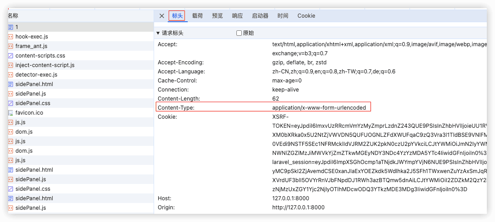
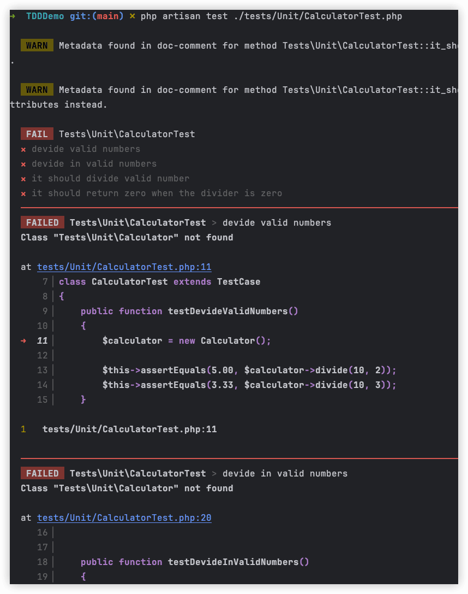

# Laravel


# Laravel 文档

https://learnku.com/docs/laravel/10.x

https://learnku.com/laravel/wikis

`example-app`学习Laravel时的项目

## 1 前言

### 10.x发行说明


### 升级指南


### 贡献导引

#### Laravel相关应用

[Laravel Application](https://github.com/laravel/laravel)

- [Laravel Art](https://github.com/laravel/art)
- [Laravel Documentation](https://github.com/laravel/docs)
- [Laravel Dusk](https://github.com/laravel/dusk)
- [Laravel Cashier Stripe](https://github.com/laravel/cashier)
- [Laravel Cashier Paddle](https://github.com/laravel/cashier-paddle)
- [Laravel Echo](https://github.com/laravel/echo)
- [Laravel Envoy](https://github.com/laravel/envoy)
- [Laravel Framework](https://github.com/laravel/framework)
- [Laravel Homestead](https://github.com/laravel/homestead)
- [Laravel Homestead Build Scripts](https://github.com/laravel/settler)
- [Laravel Horizon](https://github.com/laravel/horizon)
- [Laravel Jetstream](https://github.com/laravel/jetstream)
- [Laravel Passport](https://github.com/laravel/passport)
- [Laravel Pennant](https://github.com/laravel/pennant)
- [Laravel Pint](https://github.com/laravel/pint)
- [Laravel Sail](https://github.com/laravel/sail)
- [Laravel Sanctum](https://github.com/laravel/sanctum)
- [Laravel Scout](https://github.com/laravel/scout)
- [Laravel Socialite](https://github.com/laravel/socialite)

- [Laravel Telescope](https://github.com/laravel/telescope)
- [Laravel Website](https://github.com/laravel/laravel.com-next)


#### 代码风格


## 2 入门

### 2.1 安装

```sh
composer create-project laravel/laravel example-app
# 指定版本
composer create-project laravel/laravel example-app 10.x


composer global require laravel/installer
laravel new example-app
```


```sh
php artisan serve
```


#### Laravel 全栈框架

Laravel 可以作为一个全栈框架。全栈框架意味着你将使用 Laravel 将请求路由到你的应用程序，并通过 Blade 模板 或像 Inertia 这样的单页应用混合技术来渲染你的前端。这是使用 Laravel 框架最常见的方式，在我们看来，这也是使用 Laravel 最高效的方式。


如果你使用 Laravel 作为全栈框架，我们也强烈建议你学习如何使用 [Vite](https://learnku.com/docs/laravel/10.x/vite) 编译应用程序的 CSS 和 JavaScript 。


#### Laravel API 后端

Laravel 也可以作为 JavaScript 单页应用程序或移动应用程序的 API 后端。

 [路由](https://learnku.com/docs/laravel/10.x/routing)，[Laravel Sanctum](https://learnku.com/docs/laravel/10.x/sanctum) 和 [Eloquent ORM](https://learnku.com/docs/laravel/10.x/eloquent) 

### 2.2 配置信息

Laravel所有配置文件都在 config 目录。

```
php artisan about

php artisan about --only=environment

php artisan config:show database
```


#### 环境配置

 Laravel 利用[DotEnv](https://github.com/vlucas/phpdotenv)库加载配置文件`.env`中的配置。 


> `.env` 文件不应该提交到版本管理器中


获取当前环境配置: `App::environment()`


##### 环境文件加密🔖

```sh
php artisan env:encrypt [--key=3UVsEgGVK36XN82KKeyLFMhvosbZN1aF]

php artisan env:encrypt --env=staging

php artisan env:decrypt [--key=3UVsEgGVK36XN82KKeyLFMhvosbZN1aF] [--cipher=AES-128-CBC]
```


#### 访问配置值

`config('app.timezone')`


#### 配置缓存

`php artisan config:cache`


#### 调试模式

对于本地开发，你应该将 APP_DEBUG 环境变量设置为 true。 在你的生产环境中，此值应始终为 false。 如果在生产环境中将该变量设置为 true，你可能会将敏感的配置值暴露给应用程序的最终用户。


#### 维护模式

```sh
php artisan down [--refresh=15] [--retry=60]

# 将指示浏览器在指定秒数后自动刷新页面
php artisan down --refresh=15

php artisan up
```

##### 绕过维护模式


##### 预渲染维护模式视图🔖


##### 重定向维护模式请求

维护模式，指示 Laravel 重定向所有请求到一个特定的 URL

```sh
php artisan down --redirect=/
```


### 2.3 目录结构


默认的 Laravel 应用程序结构旨在为大型和小型应用程序提供一个良好的起点。但是你可以自由地组织你的应用程序。Laravel 几乎不会限制任何给定类的位置 —— **只要Composer可以自动加载类即可**。


### 2.4 前端 

在使用 Laravel 构建应用时，有两种主要的方式来解决前端开发问题，选择哪种方式取决于你是否想通过 PHP 或使用像 Vue 和 React 这样的 JavaScript 框架来构建前端。

#### 使用 PHP

Blade


#### Livewire 🔖

[Laravel Livewire](https://laravel-livewire.com/) 是一个用于构建 Laravel 前端的框架，具有与使用现代 JavaScript 框架（如 Vue 和 React ）构建的前端一样的动态、现代和生动的感觉。

[《Livewire 中文文档》](https://learnku.com/docs/livewire/3.x)

 [Alpine.js](https://alpinejs.dev/) 


#### 使用 Vue / React


[Inertia](https://inertiajs.com/) 可以桥接你的 Laravel 应用程序和现代 Vue 或 React 前端，使你可以使用 Vue 或 React 构建完整的现代前端，同时利用 Laravel 路由和控制器进行路由、数据注入和身份验证 - 所有这些都在单个代码存储库中完成。使用这种方法，你可以同时享受 Laravel 和 Vue / React 的全部功能，而不会破坏任何一种工具的能力。

🔖


##### 服务器端渲染

服务器端渲染（Server-Side Rendering，简称SSR）是一种在服务器端生成HTML页面的技术。在这种模式下，当用户请求一个页面时，服务器会处理请求，并将渲染好的HTML页面发送给客户端。客户端（如用户的浏览器）只需接收并显示这个已经渲染好的页面，而无需再执行任何JavaScript代码来生成页面内容。

与客户端渲染（Client-Side Rendering，简称CSR）相比，服务器端渲染有以下一些优点：

1. **更快的首屏加载时间**：由于HTML页面是在服务器端渲染完成的，所以用户可以更快地看到页面的内容，这对于那些需要快速呈现内容或搜索引擎优化（SEO）的网站来说尤其重要。
2. **更好的兼容性**：由于HTML是在服务器端生成的，所以不必担心JavaScript在不同浏览器上的兼容性问题。
3. **减轻客户端负担**：服务器端渲染将大部分渲染工作转移到了服务器上，从而减轻了客户端（如浏览器）的负担。

然而，服务器端渲染也有一些缺点：

1. **服务器压力**：由于每个页面请求都需要服务器进行渲染，所以在高并发的情况下，服务器可能会面临较大的压力。
2. **交互性受限**：服务器端渲染通常只能生成静态的HTML页面，对于需要复杂交互的页面来说，可能不太适用。
3. **不利于单页应用（SPA）**：对于那些需要频繁更新页面内容而不重新加载整个页面的单页应用来说，服务器端渲染可能不是最佳选择。

一些流行的服务器端渲染框架和库包括Nuxt.js（基于Vue.js）、Next.js（基于React）和Gatsby（基于React和GraphQL）等。这些工具提供了方便的方式来构建和部署服务器端渲染的应用。

总的来说，选择服务器端渲染还是客户端渲染取决于具体的应用场景和需求。在某些情况下，结合两者使用（如首屏服务器端渲染，后续页面客户端渲染）也是一个不错的选择。


#### 打包资源

无论你选择使用 Blade 和 Livewire 还是 Vue/React 和 Inertia 来开发你的前端，你都可能需要将你的应用程序的 CSS 打包成生产就绪的资源。当然，如果你选择用 Vue 或 React 来构建你的应用程序的前端，你也需要将你的组件打包成浏览器准备好的 JavaScript 资源。

默认情况下，Laravel 利用 [Vite](https://vitejs.dev/) 来打包你的资源。Vite 在本地开发过程中提供了闪电般的构建时间和接近即时的热模块替换（HMR）。


### 2.5 起步套件

#### Laravel Breeze

[Laravel Breeze](https://github.com/laravel/breeze) 是 Laravel 的 ==认证功能== 的一种简单、最小实现，包括登录、注册、密码重置、电子邮件验证和密码确认。此外，Breeze 还包括一个简单的「个人资料」页面，用户可以在该页面上更新其姓名、电子邮件地址和密码。

```sh
composer require laravel/breeze --dev
```


### 2.6 部署

如果你需要管理服务器，请考虑使用官方的 Laravel 服务器管理和部署服务，如 [Laravel Forge](https://forge.laravel.com/)。

#### nginx


```nginx
server {
    listen 80;
    listen [::]:80;
    server_name example.com;
    root /srv/example.com/public;

    add_header X-Frame-Options "SAMEORIGIN";
    add_header X-Content-Type-Options "nosniff";

    index index.php;

    charset utf-8;

    location / {
        try_files $uri $uri/ /index.php?$query_string;
    }

    location = /favicon.ico { access_log off; log_not_found off; }
    location = /robots.txt  { access_log off; log_not_found off; }

    error_page 404 /index.php;

    location ~ \.php$ {
        fastcgi_pass unix:/var/run/php/php8.1-fpm.sock;
        fastcgi_param SCRIPT_FILENAME $realpath_root$fastcgi_script_name;
        include fastcgi_params;
    }

    location ~ /\.(?!well-known).* {
        deny all;
    }
}
```

Web 服务器将所有请求指向应用程序的 public/index.php 文件。永远不要尝试将 index.php 文件移动到项目的根目录，因为从项目根目录为应用提供服务会将许多敏感配置文件暴露到公网。


#### 使用 Forge / Vapor 部署


[Laravel Vapor](https://vapor.laravel.com) 是一个由 AWS 提供支持的基于无服务器概念的 Laravel 部署平台。在 Vapor 上启动你的 Laravel 基础架构，并爱上无服务器的可扩展简单性。Laravel Vapor 由 Laravel 的创作者进行了精细调校，以便与框架无缝协作，因此你可以像以前一样继续编写 Laravel 应用程序。


## 3 核心架构

### 3.1 请求周期 

1. web 服务器（Apache/Nginx）配置定向

2. `public/index.php`

加载 Composer 生成的自动加载器定义；

从 bootstrap/app.php 中检索 Laravel 应用程序的实例

3. HTTP内核/Console内核 `Illuminate\Foundation\Http\Kernel`

该类定义了一个将在执行请求之前运行的 `bootstrappers` 数组。这些引导程序用来**配置异常处理、配置日志、检测应用程序环境，并执行在实际处理请求之前需要完成的其他任务**。

HTTP 内核还定义了一个 **HTTP中间件列表**，所有请求在被应用程序处理之前都必须通过该列表。这些中间件处理读写 HTTP 会话 ，确定应用程序是否处于维护模式， 校验 CSRF 令牌 , 等等。


最重要的内核引导操作之一是为==应用程序加载服务提供者== 。应用程序的所有服务提供程序都在 config/app.php 文件中的 providers 数组。


### 3.2 服务容器

Laravel服务容器是一个用于==管理类依赖以及实现依赖注入==的强有力工具。依赖注入这个名词表面看起来花哨，实质上是指：**通过构造函数，或者某些情况下通过「setter」方法将类依赖「注入」到类中。**


#### 绑定

##### 基础绑定

- 简单绑定

几乎所有的服务容器绑定都会在服务提供者中注册。

在服务提供者中，你总是可以通过 $this->app 属性访问容器。我们可以使用 bind 方法注册一个绑定，将我们希望注册的类或接口名称与返回类实例的闭包一起传递:

```php
use App\Services\Transistor;
use App\Services\PodcastParser;
use Illuminate\Contracts\Foundation\Application;

$this->app->bind(Transistor::class, function (Application $app) {
    return new Transistor($app->make(PodcastParser::class));
});
```

- 单例的绑定

`singleton` 方法将类或接口绑定到只应解析一次的容器中。解析单例绑定后，后续调用容器时将返回相同的对象实例：

```php
use App\Services\Transistor;
use App\Services\PodcastParser;
use Illuminate\Contracts\Foundation\Application;

$this->app->singleton(Transistor::class, function (Application $app) {
    return new Transistor($app->make(PodcastParser::class));
});
```

- 绑定作用域单例

`scoped` 方法将一个类或接口绑定到容器中，该容器只应在给定的 Laravel 请求 / 作业生命周期内解析一次。虽然该方法与 singleton 方法类似，但是当 Laravel 应用程序开始一个新的「生命周期」时， 使用 scoped 方法注册的实例 将被刷新。


- 绑定实例

`instance`


##### 将接口绑定实例


##### 上下文绑定

所谓「上下文绑定」就是根据上下文进行动态的绑定，指依赖的上下文关系。


##### 绑定原语


##### 绑定变长参数类型 🔖


变长参数的关联标签

##### 标签

```php
$this->app->tag([CpuReport::class, MemoryReport::class], 'reports');
```

```php
$this->app->bind(ReportAnalyzer::class, function (Application $app) {
    return new ReportAnalyzer($app->tagged('reports'));
});
```

##### 继承绑定

extend 方法允许修改已解析的服务。例如，解析服务时，可以运行其他代码来修饰或配置服务。extend 方法接受闭包，该闭包应返回修改后的服务作为其唯一参数。闭包接收正在解析的服务和容器实例：

```php
$this->app->extend(Service::class, function (Service $service, Application $app) {
    return new DecoratedService($service);
});
```


#### 解析

##### make方法


##### 自动注入


#### 方法调用和注入


#### 容器事件

服务容器每次解析对象时都会触发一个事件。你可以使用 `resolving` 方法监听此事件：

```php
use App\Services\Transistor;
use Illuminate\Contracts\Foundation\Application;

$this->app->resolving(Transistor::class, function (Transistor $transistor, Application $app) {
    // 当容器解析「Transistor」类型的对象时调用...
});

$this->app->resolving(function (mixed $object, Application $app) {
    // 当容器解析任何类型的对象时调用...
});
```


#### PSR-11


### 3.3 服务提供者

`Illuminate\Support\ServiceProvider`

服务提供者是所有 Laravel 应用程序的引导中心。你的应用程序，以及通过服务器引导的 Laravel 核心服务都是通过服务提供器引导。

#### 编写服务提供者

所有的服务提供者都会继承 `Illuminate\Support\ServiceProvider` 类。大多服务提供者都包含一个 register 和一个 boot 方法。

```
php artisan make:provider xxxxServiceProvider
```

##### 注册方法


##### 引导方法


#### 注册服务提供者

所有服务提供者都是通过配置文件 config/app.php 进行注册。该文件包含了一个列出所有服务提供者名字的 providers 数组，默认情况下，其中列出了所有核心服务提供者，这些服务提供者启动 Laravel 核心组件，比如邮件、队列、缓存等等。

要注册提供器，只需要将其添加到数组。


#### 延迟加载提供者

如果你的服务提供者 只 在 服务容器中注册，可以选择延迟加载该绑定直到注册绑定的服务真的需要时再加载，延迟加载这样的一个提供者将会提升应用的性能，因为它不会在每次请求时都从文件系统加载。

Laravel 编译并保存延迟服务提供者提供的所有服务的列表，以及其服务提供者类的名称。因此，只有当你在尝试解析其中一项服务时，Laravel 才会加载服务提供者。

要延迟加载提供者，需要实现 `\Illuminate\Contracts\Support\DeferrableProvider` 接口并置一个 provides 方法。这个 provides 方法返回该提供者注册的服务容器绑定。


### 3.4 Facades

#### 简介

在整个 Laravel 文档中，你将看到通过 Facades 与 Laravel 特性交互的代码示例。Facades 为应用程序的服务容器中可用的类提供了==「静态代理」==。**在Laravel这艘船上有许多 Facades，提供了几乎所有 Laravel 的特征**。

Laravel Facades充当服务容器中底层类的「静态代理」，提供简洁、富有表现力的好处，同时保持比传统静态方法更多的**可测试性和灵活性**。

Laravel 的所有 Facades 都在 `Illuminate\Support\Facades` 命名空间中定义。

通过`@method static`声明静态方法，具体实现通过`Facade`的`__callStatic`方法：

```php
/**
* @method static bool move(string $path, string $target)
* ...
*/
class File extends Facade
{
    protected static function getFacadeAccessor()
    {
        return 'files';
    }
}

abstract class Facade
{
    /**
     * The application instance being facaded.
     *
     * @var \Illuminate\Contracts\Foundation\Application|null
     */
    protected static $app;
  
  	.....
      
    public static function __callStatic($method, $args)
    {
        $instance = static::getFacadeRoot();

        if (! $instance) {
            throw new RuntimeException('A facade root has not been set.');
        }

        return $instance->$method(...$args);
    }
}
```


##### 辅助函数

[辅助函数文档](https://learnku.com/docs/laravel/10.x/helpers)

为了补充 Facades，Laravel 提供了各种全局 「助手函数」，使它更容易与常见的 Laravel 功能进行交互。可以与之交互的一些常用助手函数有 view, response, url, config 等。


#### 何时使用Facades

Facades 有很多好处。它们提供了简洁、易记的语法，让你可以使用 Laravel 的功能而不必记住必须手动注入或配置的长类名。此外，由于它们独特地使用了 PHP 的动态方法，因此它们易于测试。

类的「作用域泄漏」

##### Facades 与 依赖注入

依赖注入的主要好处之一是**能够替换注入类的实现**。这在测试期间很有用，因为你可以注入一个模拟或存根并断言各种方法是否在存根上调用了。

通常，真正的静态方法是不可能 mock 或 stub 的。无论如何，由于 Facades 使用动态方法对服务容器中解析出来的对象方法的调用进行了代理， 我们也可以像测试注入类实例一样测试 Facades。


##### Facades Vs 助手函数


🔖 测试


#### Facades 工作原理

Facade 基类使用 `__callStatic()` 魔术方法将来自 Facade 的调用推迟到从容器解析出对象后。

例如调用了 Laravel 缓存系统 `Cache::get('user:'.$id)`，

`Illuminate\Contracts\Cache\Factory`


#### 实时 Facades 🔖


## 4 基础功能

### 4.1 路由

一个 URI 和一个闭包

#### 1 基础路由

##### 默认路由文件

所有 Laravel 路由都定义在你的路由文件中，它位于 routes 目录。这些文件会被你的应用程序中的 `App\Providers\RouteServiceProvider` 自动加载。

`routes/web.php` 文件用于定义 web 界面的路由。这些路由被分配给 web 中间件组，它提供了 会话状态和 CSRF 保护等功能。

定义在 `routes/api.php` 中的路由都是无状态的，并且被分配了 api 中间件组。在这个路由组内，将自动应用 `/api` URI 前缀，所以你无需手动将其应用于文件中的每个路由。你可以通过修改 RouteServiceProvider 类来修改前缀和其他路由组选项。

##### 可用的路由方法

```php
Route::get($uri, $callback);
Route::post($uri, $callback);
Route::put($uri, $callback);
Route::patch($uri, $callback);
Route::delete($uri, $callback);
Route::options($uri, $callback);

Route::match(['get', 'post'], '/', function () {
    // ...
});

Route::any('/', function () {
    // ...
});
```

##### 依赖注入

你可以在路由的回调方法中，以形参的方式声明路由所需要的任何依赖项。

🔖

##### CSRF 保护

请记住，任何指向 POST、PUT、PATCH 或 DELETE 路由 (在 web 路由文件中定义) 的 HTML 表单都应该包含 CSRF 令牌字，否则请求会被拒绝。

```html
<form method="POST" action="/profile">
    @csrf
    ...
</form>
```

##### 重定向路由

`Route::redirect()`

##### 视图路由

如果你的路由只需返回一个视图，你可以使用 Route::view 方法。

```php
Route::view('/welcome', 'welcome');
// 第三个参数数组中不能使用view、data, status 及 headers
Route::view('/welcome', 'welcome', ['name' => 'Taylor']);
```

##### route:list 命令

```sh
php artisan route:list
# 显示分配给路由的中间件信息
php artisan route:list -v
# 指定url开头
php artisan route:list --path=api
# 隐藏由第三方包定义的任何路由
php artisan route:list --except-vendor
#
php artisan route:list --only-vendor
```


#### 2 路由参数

##### 必需参数

`{}`

##### 必填参数


##### 可选参数

```php
'/user/{name?}'
```

##### 正则表达式约束

where 方法接受参数的名称和定义如何约束参数的正则表达式：

```php
Route::get('/user/{name}', function (string $name) {
    // ...
})->where('name', '[A-Za-z]+');

Route::get('/user/{id}', function (string $id) {
    // ...
})->where('id', '[0-9]+');

// 一些常用的正则表达式模式具有相关方法
Route::get('/user/{id}/{name}', function (string $id, string $name) {
    // ...
})->whereNumber('id')->whereAlpha('name');

Route::get('/user/{name}', function (string $name) {
    // ...
})->whereAlphaNumeric('name');

Route::get('/user/{id}', function (string $id) {
    // ...
})->whereUuid('id');
```

##### 全局约束

如果你希望路由参数始终受给定正则表达式的约束，你可以使用 pattern 方法。 你应该在 App\Providers\RouteServiceProvider 类的 boot 方法中定义这些模式：

```php
/**
 * 定义路由模型绑定、模式筛选器等。
 */
public function boot(): void
{
    Route::pattern('id', '[0-9]+');
}
```

一旦定义了模式，它就会自动应用到使用该参数名称的所有路由：

```php
Route::get('/user/{id}', function (string $id) {
    // 仅当 {id} 是数字时执行。。。
});
```


#### 3 命名路由

通过将 name 方法链接到路由定义上，可以指定路由的名称：

```php
Route::get('/user/profile', function () {
    // ...
})->name('profile');
```

##### 生成命名路由的 URL

一旦你为给定的路由分配了一个名字，你可以在通过 Laravel 的 route 和 redirect 辅助函数生成 URL 或重定向时使用该路由的名称：

```php
// 生成URL。。。
$url = route('profile');

// 生成重定向。。。
return redirect()->route('profile');

return to_route('profile');
```

如果命名路由定义了参数，你可以将参数作为第二个参数传递给 route 函数。 给定的参数将自动插入到生成的 URL 的正确位置：

```php
Route::get('/user/{id}/profile', function (string $id) {
    // ...
})->name('profile');

$url = route('profile', ['id' => 1]);
```

如果你在数组中传递其他参数，这些键 / 值对将自动添加到生成的 URL 的查询字符串中：

```php
Route::get('/user/{id}/profile', function (string $id) {
    // ...
})->name('profile');

$url = route('profile', ['id' => 1, 'photos' => 'yes']);

// /user/1/profile?photos=yes
```

##### 检查当前路由

如果你想确定当前请求是否路由到给定的命名路由，你可以在 Route 实例上使用 named 方法。 例如，你可以从路由中间件检查当前路由名称：

```php
public function handle(Request $request, Closure $next): Response
{
    if ($request->route()->named('profile')) {
        // ...
    }

    return $next($request);
}
```


#### 4 路由组

路由组允许你共享路由属性，例如中间件，而无需在每个单独的路由上定义这些属性。

嵌套组尝试智能地将属性与其父组 “合并”。中间件和 where 条件合并，同时附加名称和前缀。 URI 前缀中的命名空间分隔符和斜杠会在适当的地方自动添加。

##### 路由中间件


##### 控制器

如果一组路由都使用相同的 控制器 , 你可以使用 controller 方法为组内的所有路由定义公共控制器。然后，在定义路由时，你只需要提供它们调用的控制器方法。

##### 子域路由

路由组也可以用来处理子域路由。子域可以像路由 uri 一样被分配路由参数，允许你捕获子域的一部分以便在路由或控制器中使用。子域可以在定义组之前调用 domain 方法来指定:

```php
Route::domain('{account}.example.com')->group(function () {
    Route::get('user/{id}', function (string $account, string $id) {
        // ...
    });
});
```

> 注意：为了确保子域路由是可以访问的，你应该在注册根域路由之前注册子域路由。这将防止根域路由覆盖具有相同 URI 路径的子域路由。

##### 路由前缀

prefix 方法可以用给定的 URI 为组中的每个路由做前缀。

```php
Route::prefix('admin')->group(function () {
    Route::get('/users', function () {
        // 对应 "/admin/users" 的 URL
    });
});
```

##### 路由名称前缀

name 方法可以用给定字符串作为组中的每个路由名的前缀。

```php
Route::name('admin.')->group(function () {
    Route::get('/users', function () {
        // 被分配的路由名为："admin.users"
    })->name('users');
});
```


#### 5 路由模型绑定 🔖

##### 隐式绑定


##### 隐式枚举绑定


##### 显式绑定


#### 6 Fallback路由

没有其他路由匹配传入请求时将执行的路由


#### 7 速览限制


#### 8 伪造表单方法


#### 9 访问当前路由


#### 10 跨域资源共享 (CORS)


### 4.2 中间体

中间件提供了一种方便的机制来**检查和过滤**进入应用程序的==HTTP请求==。

例如，Laravel 包含一个中间件，用于验证应用程序的用户是否经过身份验证。如果用户未通过身份验证，中间件会将用户重定向到应用程序的登录屏幕。 但是，如果用户通过了身份验证，中间件将允许请求进一步进入应用程序。

例如，日志中间件可能会将所有传入请求记录到你的应用程序。

所有这些中间件都位于 `app/Http/Middleware` 目录中。


最好将中间件设想为一系列「层」HTTP 请求在到达你的应用程序之前必须通过。每一层都可以检查请求，甚至完全拒绝它。

> 技巧：所有中间件都通过 服务容器 解析，因此你可以在中间件的构造函数中键入提示你需要的任何依赖项。

#### 1️⃣定义中间件

```sh
php artisan make:middleware xxxxx
```

##### 中间件和响应


#### 2️⃣注册中间件

##### 全局中间件

 `app/Http/Kernel.php` 类的 `$middleware` 属性中列出中间件类。 🔖

##### 将中间件分配给路由

```php
use App\Http\Middleware\Authenticate;

Route::get('/profile', function () {
    // ...
})->middleware(Authenticate::class);
```


- 排除中间件


##### 中间件组

 HTTP 内核的 `$middlewareGroups` 属性

##### 排序中间件

app/Http/Kernel.php 文件的 `$middlewarePriority` 属性指定中间件优先级。

#### 3️⃣中间件参数

中间件也可以接收额外的参数。例如，如果你的应用程序需要在执行给定操作之前验证经过身份验证的用户是否具有给定的「角色」，你可以创建一个 `EnsureUserHasRole` 中间件，该中间件接收角色名称作为附加参数。

额外的中间件参数将在 $next 参数之后传递给中间件：

```php
<?php

namespace App\Http\Middleware;

use Closure;
use Illuminate\Http\Request;
use Symfony\Component\HttpFoundation\Response;

class EnsureUserHasRole
{
    /**
     * 处理传入请求。
     *
     */
    public function handle(Request $request, Closure $next, string $role): Response
    {
        if (! $request->user()->hasRole($role)) {
            // 重定向。。。
        }
        return $next($request);
    }
}
```

在定义路由时，可以指定中间件参数，方法是使用 : 分隔中间件名称和参数。多个参数应以逗号分隔：

```php
Route::put('/post/{id}', function (string $id) {
    // ...
})->middleware('role:editor');
```


#### 4️⃣可终止的中间件

如果你在中间件上定义了一个 terminate 方法，并且你的 Web 服务器使用 FastCGI，则在将响应发送到浏览器后会自动调用 terminate 方法。


### 4.3 CSRF保护 🔖

跨站点请求伪造是一种恶意利用，利用这种手段，代表经过身份验证的用户执行未经授权的命令。

Laravel 可以轻松保护您的应用程序免受[跨站点请求伪造](https://en.wikipedia.org/wiki/Cross-site_request_forgery)（CSRF）攻击。


```php
// CSRF 保护 测试
Route::get('task/{id}/delete', function ($id) {
    return '<form method="post" action="' . route('task.delete', [$id]) . '">
                <input type="hidden" name="_method" value="DELETE">
                <button type="submit">删除任务</button>
            </form>';
});
Route::delete('task/{id}', function ($id) {
    return 'Delete Task ' . $id;
})->name('task.delete');
```

报错，419

为了安全考虑，Laravel 期望所有路由都是「只读」操作的（对应请求方式是 GET、HEAD、OPTIONS），如果路由执行的是「写入」操作（对应请求方式是 POST、PUT、PATCH、DELETE），则需要传入一个隐藏的 Token 字段（`_token`）以避免[跨站请求伪造攻击]（CSRF）。在我们上面的示例中，请求方式是 DELETE，但是并没有传递 `_token` 字段，所以会出现异常。

避免跨站请求伪造攻击的措施就是对写入操作采用非 GET 方式请求，同时在请求数据中添加校验 Token 字段，Laravel 也是这么做的，这个 Token 值会在渲染表单页面时通过 Session 生成，然后传入页面，在每次提交表单时带上这个 Token 值即可实现安全写入，因为第三方站点是不可能拿到这个 Token 值的，所以由第三方站点提交的请求会被拒绝，从而避免 CSRF 攻击。

在 Laravel 中，和表单方法伪造一样，支持通过 HTML 表单隐藏字段传递这个值：

```php
Route::get('task/{id}/delete', function ($id) {
    return '<form method="post" action="' . route('task.delete', [$id]) . '">
                <input type="hidden" name="_method" value="DELETE"> 
                <input type="hidden" name="_token" value="' . csrf_token() . '">
                <button type="submit">删除任务</button>
            </form>';
});
```

> **Request Payload（载荷）**
>
> 
>
> 


### 4.4 控制器

将所有业务逻辑一股脑放到控制器听起来挺不错，但是控制器更适合承担的角色其实是负责对 HTTP 请求进行路由，因为还有很多其他访问应用的方式，比如 Artisan 命令、队列、调度任务等等，控制器并非唯一入口，所以不适合也不应该将所有业务逻辑封装于此，过度依赖控制器会对以后应用的扩展带来麻烦。所以，你应该具备这样的意识：控制器的主要职责就是获取 HTTP 请求，进行一些简单处理（如验证）后将其传递给真正处理业务逻辑的职能部门，如 Service。

> 注：当然，如果是非常简单的应用，比如只是简单的数据库增删改查或数据渲染，放到控制器里面也无妨，但是如果后续需要调用控制器方法才能完成某个功能，那么是时候将这个控制器方法里的业务逻辑拆分到 Service 里面了。


#### 1️⃣编写控制器

##### 基本控制器

```shell
php artisan make:controller XxxController
```


> 控制器并不是必需继承基础类。如果控制器没有继承基础类，你将无法使用一些便捷的功能，比如 middleware 和 authorize 方法。

##### 单动作控制器

`__invoke` 方法：

```php
class ProvisionServer extends Controller
{
    /**
     * 设置新的web服务器。
     */
    public function __invoke()
    {
        // ...
    }
}
```


```sh
php artisan make:controller ProvisionServer --invokable
```

#### 2️⃣控制器中间件

中间件可以在路由文件中分配给控制器的路由：

```php
Route::get('profile', [UserController::class, 'show'])->middleware('auth');
```

也可以在控制器的构造函数中指定中间件：

```php
class UserController extends Controller
{
    public function __construct()
    {
        $this->middleware('auth');
        $this->middleware('log')->only('index');
        $this->middleware('subscribed')->except('store');
    }
}
```


#### 3️⃣资源控制器

如果你将应用程序中的每个 Eloquent 模型都视为资源，那么通常对应用程序中的每个资源都执行相同的操作。例如，假设你的应用程序中包含一个 Photo 模型和一个 Movie 模型。用户可能可以创建，读取，更新或者删除这些资源。

Laravel 的资源路由通过单行代码即可将典型的增删改查（“CURD”）路由分配给控制器。首先，我们可以使用 Artisan 命令 make:controller 的 --resource 选项来快速创建一个控制器:

```sh
php artisan make:controller PhotoController --resource
```

这个命令将会生成一个控制器 app/Http/Controllers/PhotoController.php。其中包括每个可用资源操作的方法。接下来，你可以给控制器注册一个资源路由：

```php
use App\Http\Controllers\PhotoController;

Route::resource('photos', PhotoController::class);
```

这个单一的路由声明创建了多个路由来处理资源上的各种行为。生成的控制器为每个行为保留了方法，而且你可以通过运行 Artisan 命令 `route:list` 来快速了解你的应用程序。

你可以通过将数组传参到 resources 方法中的方式来一次性的创建多个资源控制器：

```php
Route::resources([
    'photos' => PhotoController::class,
    'posts' => PostController::class,
]);
```

###### 资源控制器方法列表

| HTTP请求方式 | URL            | 控制器方法 | 路由命名    | 业务逻辑描述                 |
| ------------ | -------------- | ---------- | ----------- | ---------------------------- |
| GET          | post           | index()    | post.index  | 展示所有文章                 |
| GET          | post/create    | create()   | post.create | 发布文章表单页面             |
| POST         | post           | store()    | post.store  | 获取表单提交数据并保存新文章 |
| GET          | post/{post}    | show()     | post.show   | 展示单个文章                 |
| GET          | post/{id}/edit | edit()     | post.edit   | 编辑文章表单页面             |
| PUT          | post/{id}      | update()   | post.update | 获取编辑表单输入并更新文章   |
| DELETE       | post/{id}      | destroy()  | post.desc   | 删除单个文章                 |

###### 自定义缺失模型行为

```php
Route::resource('photos', PhotoController::class)
        ->missing(function (Request $request) {
            return Redirect::route('photos.index');
        });
```

###### 软删除模型

```php
Route::resource('photos', PhotoController::class)->withTrashed();
```

###### 指定资源模型

```sh
php artisan make:controller PhotoController --model=Photo --resource
```

###### 生成表单请求

```
php artisan make:controller PhotoController --model=Photo --resource --requests
```

##### 部分资源路由

```php
Route::resource('photos', PhotoController::class)->only([
    'index', 'show'
]);

Route::resource('photos', PhotoController::class)->except([
    'create', 'store', 'update', 'destroy'
]);
```

###### API资源路由

```php
Route::apiResource('photos', PhotoController::class);
```


##### 嵌套资源🔖

```php
Route::resource('photos.comments', PhotoCommentController::class);
```

```
/photos/{photo}/comments/{comment}
```

###### 嵌套资源的范围

###### 浅嵌套


##### 命名资源路由

```php
Route::resource('photos', PhotoController::class)->names([
    'create' => 'photos.build'
]);
```


##### 命名资源路由参数

默认情况下，Route::resource 会根据资源名称的「单数」形式创建资源路由的路由参数。你可以使用 parameters 方法来轻松地覆盖资源路由名称。传入 parameters 方法应该是资源名称和参数名称的关联数组：

```php
use App\Http\Controllers\AdminUserController;

Route::resource('users', AdminUserController::class)->parameters([
    'users' => 'admin_user'
]);
```


##### 限定范围的资源路由


##### 本地化资源URIs


##### 补充资源控制器


##### 单例资源控制器


#### 4️⃣依赖注入和控制器

> 依赖注入
>
> 正如前面介绍的 `Input` 门面一样，Laravel 中的门面为 Laravel 代码库中的大部分类提供了简单的接口调用，通过门面你可以轻松从当前获取各种请求数据，比如用户输入、Session、Cookie 等，但不是所有的类都有对应的门面（当前的映射关系可以查看[门面列表](https://laravelacademy.org/post/9536.html#toc-6)），对于这些类提供的方法我们可以通过更底层的依赖注入来调用，本质上来看，门面仅仅是一种设计模式，是对底层复杂 API 的上层静态代理，主要目的在于简化代码调用，所以可以用门面调用的方法肯定可以用依赖注入来实现，而可以通过依赖注入实现的功能不一定可以通过门面来调用，除非你自定义实现这个门面。
>
> 提到依赖注入，就绕不开[服务容器](https://laravelacademy.org/post/9534.html)，关于服务容器后面我们会单独讲解，而现在你只需了解服务容器是一个绑定多个接口与具体服务实现类的容器，而依赖注入则是在代码编写时以接口（或者叫做类型提示）方式作为参数，不必传入具体实现类，在代码运行时会根据配置从服务容器获取接口对应的实现类执行具体的接口方法，从而极大提高了代码的可维护性和可扩展性。
>
> 在 Laravel 中所有的控制器方法（包括构造函数）都会在服务容器中进行解析，这意味着所有方法中传入的可以被容器解析的接口/类型提示对应服务实现都会被自动注入，我们将这个过程称之为依赖注入。我们上面演示的通过 `$request` 对象获取用户请求数据就是采用依赖注入的方式。
>
> 在日常开发中，推荐大家使用依赖注入而非门面来获取用户输入数据，除此之外，还可以通过 `$request` 对象获取 Session、Cookie 数据。

##### 构造函数注入


##### 方法注入


### 4.4 请求

`Illuminate\Http\Request`

#### 1️⃣与请求交互

##### 访问请求

##### 依赖注入和路由参数


##### 请求路径，主机和方法


###### 检索请求路径

###### 检查请求路径/路由

###### 检索请求URL

###### 获取请求主机

###### 获取请求方法


##### 请求头

```php
$value = $request->header('X-Header-Name');
$value = $request->header('X-Header-Name', 'default');

if ($request->hasHeader('X-Header-Name')) {
    // ...
}
// 从 Authorization 标头检索授权标记
$token = $request->bearerToken();
```


##### 请求IP地址


##### 内容协商

Laravel 提供了几种方法，通过 Accept 标头检查传入请求的请求内容类型。

```php
// 
$contentTypes = $request->getAcceptableContentTypes();

if ($request->accepts(['text/html', 'application/json'])) {
    // ...
}
// 确定给定内容类型数组中的哪种内容类型由请求最具优势。如果请求未接受任何提供的内容类型，则返回 null。
$preferred = $request->prefers(['text/html', 'application/json']);
// 确定传入请求是否期望获得 JSON 响应
if ($request->expectsJson()) {
    // ...
}
```


##### PSR-7

请求 [PSR-7 标准](https://www.php-fig.org/psr/psr-7/)指定了 HTTP 消息的接口，包括请求和响应。如果您想获取 PSR-7 请求的实例而不是 Laravel 请求，您需要先安装一些库。Laravel 使用 Symfony HTTP 消息桥组件将典型的 Laravel 请求和响应转换为与 PSR-7 兼容的实现：

```sh
composer require symfony/psr-http-message-bridge
composer require nyholm/psr7
```


#### 2️⃣输入

##### 检索输入

###### 检索所有输入数据

###### 检索输入值

###### 从查询字符串获取输入

###### 取回 JSON 输入值

###### 获取 Stringable 输入值

###### 获取布尔输入值

###### 检索日期输入值

###### 检索枚举输入值

###### 通过动态属性检索输入

###### 检索输入数据的一部分


##### 判断输入是否存在

```php
if ($request->has('name')) {
    // ...
}

$request->whenHas('name', function (string $input) {
    // ...
});

if ($request->hasAny(['name', 'email'])) {
    // ...
}

if ($request->filled('name')) {
    // ...
}

$request->whenFilled('name', function (string $input) {
    // ...
});

if ($request->missing('name')) {
    // ...
}

$request->whenMissing('name', function (array $input) {
    // "name" 值缺失...
}, function () {
    // "name" 值存在...
});
```


##### 合并附加输入

```php
$request->merge(['votes' => 0]);
$request->mergeIfMissing(['votes' => 0]);
```


##### 旧输入


##### Cookies


##### 输入修整和规范化

禁用输入规范化


#### 3️⃣文件

##### 检索上传的文件

```php
$file = $request->file('photo');
$file = $request->photo;

if ($request->hasFile('photo')) {
    // ...
}

```


##### 验证上传是否成功

```php
if ($request->file('photo')->isValid()) {
    // ...
}
```

##### 文件路径和扩展名

```php
$path = $request->photo->path();

$extension = $request->photo->extension();
```


##### 其他文件方法


##### 存储上传的文件

```php
$path = $request->photo->store('images');
$path = $request->photo->store('images', 's3');


$path = $request->photo->storeAs('images', 'filename.jpg');
$path = $request->photo->storeAs('images', 'filename.jpg', 's3');
```


#### 4️⃣配置受信任代理

`Illuminate\Http\Middleware\TrustProxies`

信任所有代理


#### 5️⃣配置互信主机


### 4.5 响应 🔖

#### 1️⃣创建响应


添加响应头


添加响应 Cookies


Cookies & 加密

#### 2️⃣重定向

重定向到命名路由


重定向到控制器方法


重定向到外部域名


重定向并使用闪存的 Session 数据

#### 3️⃣其它响应类型

视图响应


JSON 响应


文件下载


文件响应

#### 4️⃣响应宏


### 4.6 视图

在实际开发中，除了 API 路由返回指定格式数据对象外，大部分 Web 路由返回的都是视图，以便实现更加复杂的页面交互。

在 Laravel 中，支持三种格式的视图文件解析：CSS 文件，原生 PHP 和 Blade模板（Blade引擎底层逻辑：`ViewServiceProvider`）。

Laravel 在解析视图时是通过实时解析文件后缀名再调用相应的引擎进行处理的，视图文件位于 `resources/views` 目录下，对于多级子目录以「`.`」号分隔，并且引用时不带文件后缀名。


#### 视图返回与参数传递


在某个服务提供者如 `AppServiceProvider` 的 `boot` 方法中定义共享的视图变量：

```php
view()->share('siteName', 'Laravel学院');
view()->share('siteUrl', 'https://xueyuanjun.com');
```


```php
页面ID: {{ $id }}
<hr>
By <a href="{{ $siteUrl }}">{{ $siteName }}</a>
```


#### 在视图间共享变量


### 4.7 Blade模版

Blade 是 Laravel 提供的一个简单而又强大的模板引擎。 和其他流行的 PHP 模板引擎不同，Blade 并不限制你在视图中使用原生 PHP 代码。实际上，所有 Blade 视图文件都将被编译成原生的 PHP 代码并缓存起来，除非它被修改，否则不会重新编译，这就意味着 Blade 基本上不会给你的应用增加任何负担。Blade 模板文件使用 .`blade.php` 作为文件扩展名，被存放在 resources/views 目录。

```php
<h1>{{ $group->title }}</h1> 
{!! $group->imageHtml() !!} 
@forelse ($users as $user) 
    {{ $user->username }} {{ $user->nickname }}<br> 
@empty 
    该组中没有任何用户 
@endforelse
```

Blade 模板引擎有三种常见的语法：

- 通过 `{{ }}` 渲染 PHP 变量（最常用）
- 通过 `{!! !!}` 渲染原生 HTML 代码（用于富文本数据渲染）
- 通过以 `@` 作为前缀的 Blade 指令执行一些控制结构和继承、引入之类的操作


### 4.8 Vite编译Assets 🔖

Vite 是一款现代前端构建工具，提供极快的开发环境并将你的代码捆绑到生产准备的资源中。在使用 Laravel 构建应用程序时，通常会使用 Vite 将你的应用程序的 CSS 和 JavaScript 文件绑定到生产环境的资源中。


#### 选择 Vite 还是 Laravel Mix


### 4.9 生成URL

Laravel 提供了几个辅助函数来为应用程序生成 URL。主要用于在模板和 API 响应中构建 URL 或者在应用程序的其它部分生成重定向响应。

#### 基础

```php
// 生成基础URLs
$post = App\Models\Post::find(1);
echo url("/posts/{$post->id}");
// http://example.com/posts/1


// 访问当前URL
// 获取当前 URL 没有 query string...
echo url()->current();
// 获取当前 URL 包括 query string...
echo url()->full();
// 获取上个请求 URL
echo url()->previous();
```


#### 命名路由的 URLs

```php
Route::get('/post/{post}', function (Post $post) {
    // ...
})->name('post.show');
echo route('post.show', ['post' => 1]);
// http://example.com/post/1


Route::get('/post/{post}/comment/{comment}', function (Post $post, Comment $comment) {
    // ...
})->name('comment.show');
echo route('comment.show', ['post' => 1, 'comment' => 3]);
// http://example.com/post/1/comment/3


// 任何与路由定义参数对应不上的附加数组元素都将添加到 URL 的查询字符串中：
echo route('post.show', ['post' => 1, 'search' => 'rocket']);
// http://example.com/post/1?search=rocket
```


#### 签名 URLs


#### 控制器行为的 URLs

```php
$url = action([HomeController::class, 'index']);
```


#### 默认值


### 4.10 会话

由于 HTTP 驱动的应用程序是无状态的，Session 提供了一种在多个请求之间存储有关用户信息的方法，这类信息一般都存储在后续请求可以访问的持久存储 / 后端中。
Laravel 通过同一个可读性强的 API 处理各种自带的后台驱动程序。支持诸如比较热门的 Memcached、 Redis 和数据库。


### 4.11 表单验证 🔖


### 4.12 错误处理


#### 1️⃣配置

#### 2️⃣异常处理

##### 异常报告

##### 异常日志级别

##### 忽略指定类型异常

##### 渲染异常

##### Reportable & Renderable 异常

#### 3️⃣HTTP 异常

自定义 HTTP 错误页面


### 4.13 日志

Laravel 提供了强大的日志记录服务，允许您将日志记录到文件、系统错误日志，甚至记录到Slack以通知您的整个团队。

Laravel 日志基于「 通道 」。 每个通道代表一种写入日志信息的特定方式。 例如，single 通道是将日志写入到单个日志文件中。而 slack 通道是将日志发送到 Slack 上。 基于它们的重要程度，日志可以被写入到多个通道中去。

在底层，Laravel 利用 Monolog 库，它为各种强大的日志处理程序提供了支持。 Laravel 使配置这些处理程序变得轻而易举，允许您混合和匹配它们，以自定义应用程序的方式完成日志处理。


#### 1️⃣配置

config/logging.php

默认情况下，Laravel 在记录日志消息时使用 `stack` 频道。`stack` 频道用于将多个日志频道聚合到一个频道中。

##### 有效通道驱动列表

| 名称         | 描述                                                         |
| ------------ | ------------------------------------------------------------ |
| `stack`      | 用于创建「多通道」通道的聚合器                               |
| `single`     | 基于单文件/路径的日志通道（`StreamHandler`）                 |
| `daily`      | 基于 `RotatingFileHandler` 的 Monolog 驱动，以天为维度对日志进行分隔 |
| `slack`      | 基于 `SlackWebhookHandler` 的 Monolog 驱动                   |
| `papertrail` | 基于 `SyslogUdpHandler` 的 Monolog 驱动                      |
| `syslog`     | 基于 `SyslogHandler` 的 Monolog 驱动                         |
| `errorlog`   | 基于 `ErrorLogHandler` 的 Monolog 驱动                       |
| `monolog`    | Monolog 改成驱动，可以使用所有支持的 Monolog 处理器          |
| `custom`     | 调用指定改成创建通道的驱动                                   |
| `null`       | 一个丢弃所有日志消息的驱动                                   |

> 


##### 通道预备知识


##### 日志记录警告


#### 2️⃣构建日志堆栈


#### 3️⃣入日志信息

##### 上下文信息

##### 写入指定通道

#### 4️⃣Monolog 通道定制

##### 为通道自定义 Monolog

##### 创建 Monolog 处理器通道

##### 通过工厂创建通道


## 5 继续深入

### 5.1 Artisan命令行


### 5.2 广播系统 🔖

在许多现代 Web 应用程序中，WebSockets 用于实现实时的、实时更新的用户界面。当服务器上的某些数据更新时，通常会发送一条消息到 WebSocket 连接，以由客户端处理。WebSockets 提供了一种更有效的替代方法，可以**连续轮询应用程序服务器以反映UI中应该反映的数据更改**。

举个例子，假设你的应用程序能够将用户的数据导出为 CSV 文件并通过电子邮件发送给他们。但是，创建这个 CSV 文件需要几分钟的时间，因此你选择在队列任务中创建和发送 CSV。当 CSV 文件已经创建并发送给用户后，我们可以使用事件广播来分发 App\Events\UserDataExported 事件，该事件由我们应用程序的 JavaScript 接收。一旦接收到事件，我们可以向用户显示消息，告诉他们他们的 CSV 已通过电子邮件发送给他们，而无需刷新页面。

为了帮助你构建此类特性，Laravel 使得在 WebSocket 连接上 “广播” 你的服务端 Laravel 事件变得简单。广播你的 Laravel 事件允许你在你的服务端 Laravel 应用和客户端 JavaScript 应用之间共享相同的事件名称和数据。

广播背后的核心概念很简单：客户端在前端连接到命名通道，而你的 Laravel 应用在后端向这些通道广播事件。这些事件可以包含任何你想要向前端提供的其他数据。


### 5.3 缓存系统

Laravel 为各种缓存后端提供了富有表现力且统一的 API，以便你利用它们极快的查询数据来加快你的应用。

#### 配置

驱动程序前提条件

#### 缓存用法

获取一个缓存实例
从缓存中检索项目
将项目存储在缓存中
从缓存中删除项目
缓存助手

#### 缓存标签

存储带有标签的缓存项
访问带有标签的缓存项
删除带标签的缓存项
修剪过期的缓存标签

#### 原子锁

驱动程序先决条件
管理锁
跨进程管理锁定

#### 添加自定义缓存驱动程序

编写驱动程序
注册驱动程序

#### 事件


### 5.4 集合

`Illuminate\Support\Collection` 类为处理数据数组提供了一个流畅、方便的包装器。

使用 `collect` 助手从数组中创建一个新的集合实例，对每个元素运行 `strtoupper` 函数，然后删除所有空元素：

```php

$collection = collect(['taylor', 'abigail', null])->map(function (?string $name) {
    return strtoupper($name);
})->reject(function (string $name) {
    return empty($name);
});
```


### 5.5 契约（Contract）

Laravel 的「契约（Contract）」是一组接口，它们定义由框架提供的核心服务。

Laravel 的「契约（Contract）」是一组接口，它们定义由框架提供的核心服务。例如，`illuste\Contracts\Queue\Queue` Contract 定义了队列所需的方法，而 illuste\Contracts\Mail\Mailer Contract 定义了发送邮件所需的方法。

每个契约都有由框架提供的相应实现。

#### Contract 对比 Facade

Laravel 的 Facade 和辅助函数提供了一种利用 Laravel 服务的简单方法，无需类型提示并可以从服务容器中解析 Contract。在大多数情况下，每个 Facade 都有一个等效的 Contract。

和 Facade（不需要在构造函数中引入）不同，Contract 允许你为类定义显式依赖关系。一些开发者更喜欢以这种方式显式定义其依赖项，所以更喜欢使用 Contract，而其他开发者则享受 Facade 带来的便利。通常，**大多数应用都可以在开发过程中使用 Facade**。

#### 何时使用 Contract

#### 如何使用 Contract

#### Contract 参考


### 5.6 事件系统

Laravel 的事件系统提供了一个简单的观察者模式的实现，允许你能够订阅和监听在你的应用中的发生的各种事件。事件类一般来说存储在 app/Events 目录，监听者的类存储在 app/Listeners 目录。

事件系统可以作为一个非常棒的方式来解耦你的系统的方方面面，因为一个事件可以有多个完全不相关的监听者。例如，你希望每当有订单发出的时候都给你发送一个 Slack 通知。你大可不必将你的处理订单的代码和发送 slack 消息的代码放在一起，你只需要触发一个 App\Events\OrderShipped 事件，然后事件监听者可以收到这个事件然后发送 slack 通知。

#### 注册事件和监听器

生成事件和监听器

手动注册事件

事件发现

#### 定义事件


#### 定义监听器


#### 队列事件监听器

手动与队列

交互队列事件监听器和数据库事务

处理失败的队列


#### 调度事件


#### 事件订阅者

编写事件订阅者注册事件订阅者

#### 测试

模拟一部分事件

作用域事件模拟


### 5.7 文件系统

Laravel 提供了一个强大的文件系统抽象，这要感谢 Frank de Jonge 的 [Flysystem](https://github.com/thephpleague/flysystem) PHP 包。Laravel 的 Flysystem 集成提供了 简单的驱动来处理本地文件系统、SFTP 和 Amazon S3。更棒的是，在你的本地开发机器和生产服务器之间切换这些存储选项是非常简单的，因为每个系统的 API 都是一样的。


#### 配置

本地驱动

公共磁盘

驱动先决要求

分区和只读文件系统

Amazon S3兼容文件系统

#### 获取磁盘实例

按需配置磁盘

#### 检索文件

下载文件

文件URL

临时 URL

文件元数据

#### 保存文件

预置和附加文件

复制和移动文件

自动流式传输

文件上传

文件可见性


#### 删除文件


#### 目录


#### 测试


#### 自定义文件系统


### 5.8 辅助函数

全局 PHP 「辅助」函数，框架本身也大量的使用了这些功能函数。

#### 数组 & 对象

#### 路径

#### 字符串

#### 字符流处理

#### URLs

#### 杂项


### 5.9 HTTP客户端 🔖


### 5.10 本地化

`lang:publish`


### 5.11 发送邮件

Laravel 基于 [Symfony Mailer](https://symfony.com/doc/6.0/mailer.html) 组件提供了一个简洁、简单的邮件 API。Laravel 和 Symfony 为 Mailer SMTP 、Mailgun 、Postmark 、 Amazon SES 、 及 sendmail （发送邮件的方式）提供驱动，允许你通过本地或者云服务来快速发送邮件。


### 5.12 消息通知


### 5.13 扩展包开发

包是向 Laravel 添加功能的主要方式。包可能是处理日期的好方法，例如 [Carbon](https://github.com/briannesbitt/Carbon)，也可能是允许您将文件与 Eloquent 模型相关联的包，例如 Spatie 的 [Laravel 媒体库](https://github.com/spatie/laravel-medialibrary)。

包有不同类型。有些包是独立的，这意味着它们可以与任何 PHP 框架一起使用。 Carbon 和 PHPUnit 是独立包的示例。这种包可以通过 composer.json 文件引入，在 Laravel 中使用。

此外，还有一些包是专门用在 Laravel 中。这些包可能包含路由、控制器、视图和配置，专门用于增强 Laravel 应用。本教程主要涵盖的就是这些专用于 Laravel 的包的开发。


### 5.14 进程管理

Laravel 通过 [Symfony Process](https://symfony.com/doc/current/components/process.html) 组件 提供了一个小而美的 API，让你可以方便地从 Laravel 应用程序中调用外部进程。 Laravel 的进程管理功能专注于提供最常见的用例和提升开发人员体验。

#### 调用过程

进程选项

进程输出

#### 异步进程

进程ID和信号

异步进程输出

#### 并行进程

命名进程池中的进程

进程池进程ID和信号

#### 测试

伪造进程

伪造指定进程

伪造进程序列

伪造异步进程的生命周期

可用的断言

防止运行未被伪造的进程


### 5.15 队列 🔖

Laravel 队列为各种不同的队列驱动提供统一的队列 API，例如 Amazon SQS，Redis，甚至关系数据库。

Laravel 队列的配置选项存储在 config/queue.php 文件中。 在这个文件中，你可以找到框架中包含的每个队列驱动的连接配置，包括数据库， Amazon SQS, Redis， 和 Beanstalkd 驱动，以及一个会立即执行作业的同步驱动（用于本地开发）。还包括一个用于丢弃排队任务的 null 队列驱动。


### 5.16 请求限流

Laravel 包含了一个开箱即用的，基于 缓存 实现的限流器，提供了一个简单的方法来限制指定时间内的任何操作。


### 5.17 任务调度

Laravel 的命令行调度器允许你在 Laravel 中清晰明了地定义命令调度。在使用这个任务调度器时，你只需要在你的服务器上创建单个 Cron 入口。你的任务调度在 app/Console/Kernel.php 的 schedule 方法中进行定义。


## 6 安全相关

### 6.1 用户认证

#### 6.1.1 介绍

Laravel 的身份验证工具的核心是由「==看守器==」（guards）和「==提供器==」（providers）组成的。 

看守器定义如何对每个请求的用户进行身份验证。例如，Laravel 附带了一个 session 守卫，它使用 session 和 cookie 来维护状态。

提供器定义如何从持久存储中检索用户。 Laravel 支持使用 Eloquent 和数据库查询构建器检索用户。不仅如此，你甚至可以根据应用程序的需要自由定制其他提供程序。

应用程序的身份验证配置文件位于 `config/auth.php`. 这个文件包含几个记载了的选项，用于调整 Laravel 身份验证服务的行为。

> 看守器和提供器不应与「角色」和「权限」混淆。

##### 入门套件

[ Laravel 入门套件](https://learnku.com/docs/laravel/10.x/starter-kits/14839)

##### 数据库注意事项


`remember_token`用于为在登录到应用程序时选择「记住我」选项的用户存储令牌。

##### 生态系统概述

###### Laravel内置的浏览器认证服务

1️⃣ [Laravel Breeze](https://learnku.com/docs/laravel/10.x/starter-kits#laravel-breeze) 是 Laravel 所有身份验证功能的简单、最小实现，包括登录、注册、密码重置、电子邮件验证和密码确认。 Laravel Breeze 的视图层由简单的 Blade 模板 组成，样式为 Tailwind CSS。

2️⃣ [Laravel Fortify](https://learnku.com/docs/laravel/10.x/fortify) 是 Laravel 的无 header 身份验证后端，它实现了本文档中的许多功能，包括基于 cookie 的身份验证以及其他功能，如双因素身份验证和电子邮件验证。Fortify 为 Laravel Jetstream 提供身份验证后端，或者可以单独与 Laravel Sanctum 结合使用，为需要使用 Laravel 进行身份验证的 SPA 提供身份验证。

3️⃣ [Laravel Jetstream](https://jetstream.laravel.com/) 是一个强大的应用入门套件，它使用 Tailwind CSS，Livewire 和 / 或 Inertia 提供美观的现代 UI，同时集成和扩展了 Laravel Fortify 的认证服务。Laravel Jetstream 提供了双因素身份验证、团队支持、浏览器 session 管理、个人资料管理等功能，并内置了 Laravel Sanctum 的集成以支持 API 令牌身份验证。接下来我们将讨论 Laravel 的 API 身份验证产品。

###### Laravel的API认证服务

1️⃣ Passport 是一个 OAuth2 身份验证提供程序，提供各种 OAuth2 「授权类型」，允许你发布各种类型的令牌。总的来说，这是一个强大而复杂的 API 身份验证包。但是，大多数应用程序不需要 OAuth2 规范提供的复杂特性，这可能会让用户和开发人员感到困惑。此外，开发人员一直对如何使用 Passport 等 OAuth2 身份验证提供程序对 SPA 应用程序或移动应用程序进行身份验证感到困惑。

2️⃣ [Sanctum](https://learnku.com/docs/laravel/10.x/sanctum/14914)。🔖为了应对 OAuth2 的复杂性和开发人员的困惑，我们着手构建一个更简单、更精简的身份验证包，旨在处理通过令牌进行的第一方 Web 请求和 API 请求。 Laravel Sanctum 发布后，这一目标就实现了。对于除 API 外还提供第一方 web UI 的应用程序，或由单页应用程序（SPA）提供支持的应用程序，或是提供移动客户端的应用程序，Sanctum 是首选推荐的身份验证包。

Laravel Sanctum 是一个**混合了web和API**的身份验证包，它让我们管理应用程序的整个身份验证过程成为可能，因为当基于 Sanctum 的应用程序收到请求时，Sanctum 将首先确定请求是否包含引用已验证 session 的 session cookie。Sanctum 通过调用我们前面讨论过的 Laravel 的内置身份验证服务来实现这一点。如果请求没有通过 session cookie 进行身份验证，Sanctum 将检查请求中的 API 令牌。如果存在 API 令牌，则 Sanctum 将使用该令牌对请求进行身份验证。

###### 方案选择

- 如果你的应用程序将使用浏览器访问，并且你正在构建一个单页面的 Laravel 应用程序，那么你的应用程序可以使用 Laravel 的内置身份验证服务。
- 如果你的应用程序提供将由第三方使用的 API ，你可以在 Passport 或 Sanctum 之间进行选择，为你的应用程序提供 API 令牌身份验证。一般来说，**尽可能选择 Sanctum**，因为它是 API 认证、SPA 认证和移动认证的简单、完整的解决方案，包括对「scopes」或「abilities」的支持。
- 如果你正在构建一个将由 Laravel 后端支持的单页面应用程序（SPA），那么应该使用 Laravel Sanctum。在使用 Sanctum 时，你需要手动实现自己的后端验证路由 或使用 Laravel Fortify 作为无 header 身份验证后端服务，为注册、密码重置、电子邮件验证等功能提供路由和控制器。

- 当应用程序确定必须使用 OAuth2 规范提供的所有特性时，可以选择 Passport。
- 如果你想快速入门，我们很高兴推荐 Laravel Breeze 作为启动新 Laravel 应用程序的快速方法，该应用程序已经使用了我们首选的 Laravel 内置身份验证服务和 Laravel Sanctum 身份验证技术栈。


#### 6.1.2 快速开始用户认证 🔖

##### 安装入门套件

 Laravel Breeze 和 Laravel Jetstream

##### 获取已认证的用户信息

##### 路由保护

##### 登录限流


#### 6.1.3 手动认证用户

不适用上面的入门套件，也可以直接使用 Laravel 身份验证类来管理用户身份验证。

##### 记住用户


##### 其他认证方法


#### 6.1.4 HTTP Basic 认证

##### 无状态 HTTP Basic 认证


#### 6.1.5 注销

##### 使其他设备上的会话无效


#### 6.1.6 密码确认

##### 配置

##### 路由

##### 路由保护


#### 6.1.7 添加自定义看守器

##### 闭包请求看守器


#### 6.1.8 添加自定义用户提供器

##### 用户提供器契约

##### 用户认证契约


#### 6.1.9 社会化用户认证

[Laravel Socialite](https://learnku.com/docs/laravel/10.x/socialite/14916)


#### 6.1.10 事件


### 6.2 用户授权

Laravel提供了一种可以很简单就进行使用的方法，来对用户与资源的授权关系进行管理。 它很安全，即使用户已经通过了「身份验证（authentication)」, 用户也可能无权对应用程序中重要的模型或数据库记录进行删除或更改。**简单、条理化的系统性**，是 Laravel 对授权管理的特性。

Laravel 主要提供了两种授权操作的方法: ==拦截器和策略==。 可以把拦截器（gates）和策略（policies）想象成路由和控制器。拦截器（Gates）提供了一种轻便的基于闭包函数的授权方法，像是路由。而策略（policies)，就像是一个控制器，对特定模型或资源，进行分组管理的逻辑规则。 

你在构建应用程序时，不用为是仅仅使用拦截器（gates）或是仅仅使用策略（policies）而担心，并不需要在两者中进行唯一选择。大多数的应用程序都同时包含两个方法，并且同时使用两者，能够更好的进行工作。拦截器（gates），更适用于**没有与任何模型或资源有关的授权操作**，例如查看管理员仪表盘。与之相反，当你希望为特定的模型或资源进行授权管理时，应该使用策略（policies) 方法。

#### 6.2.1 拦截器

##### 编写拦截器


##### 授权动作


##### 拦截器响应


##### 拦截器拦截检查


##### 内联授权


#### 6.2.2 创建策略

##### 生成策略

策略是围绕特定模型或资源组织授权逻辑的类。例如，如果你的应用程序是博客，可能有一个 App\Models\Post 模型和一个相应的 App\Policies\PostPolicy 来授权用户操作，例如创建或更新帖子。


##### 注册策略

创建了策略类之后，还需要对其进行注册。注册策略是告知 Laravel 在授权针对给定模型类型的操作时使用哪个策略。


##### 策略自动发现


#### 6.2.3 编辑策略

##### 策略方法

注册策略类后，可以为其授权的每个操作添加方法。例如，让我们在 PostPolicy 上定义一个 update 方法，该方法确定给定的 App\Models\User 是否可以更新给定的 App\Models\Post 实例。


##### 策略响应


##### 不使用模型的方法


##### 访客和用户


##### 策略的过滤器


#### 6.2.4 使用策略进行授权操作

##### 通过用户模型


##### 通过控制器辅助函数


##### 通过中间件


##### 通过 Blade 模板


##### 以附加形式提供给上下文调用


### 6.3 Email认证

#### 简介

在开始之前，需要检查你的 App\Models\User 模型是否实现了 `Illuminate\Contracts\Auth\MustVerifyEmail` 契约

users 表必须有一个 `email_verified_at` 字段，用来存储用户邮箱验证的日期和时间。

#### 路由

为了实现完整的电子邮件验证流程，需要定义三个路由。

##### 1️⃣ 邮箱验证通知

向用户显示通知，告诉用户应该点击注册之后， Laravel 向他们发送的验证邮件中的链接。

##### 2️⃣ Email认证处理

处理用户点击邮件中验证链接时发来的请求。

##### 3️⃣ 重新发送Email认证邮件#

如果用户没有收到验证邮件，则需要一路由来重新发送验证邮件。


#### 自定义


#### 事件


### 6.4 加密解密

Laravel 的加密服务提供了一个简单、方便的接口，使用 OpenSSL 所提供的 AES-256 和 AES-128 加密和解密文本。所有 Laravel 加密的结果都会使用消息认证码 (MAC) 进行签名，因此一旦加密，其底层值就不能被修改或篡改。

#### 配置

在使用 Laravel 的加密工具之前，你必须先设置 config/app.php 配置文件中的 key 配置项。该配置项由环境变量 APP_KEY 设定。你应当使用 `php artisan key:generate` 命令来生成该变量的值，key:generate 命令将使用 PHP 的安全随机字节生成器为你的应用程序构建加密安全密钥。通常情况下，在 Laravel 安装 中会为你生成 APP_KEY 环境变量的值。


#### 基本用法


### 6.5 哈希

Laravel `Hash` Facad 为存储用户密码提供了安全的 Bcrypt 和 Argon2 哈希。在默认情况下，Bcrypt 将用于注册和身份验证。

Bcrypt 是哈希密码的绝佳选择，因为它的「加密系数」是可调节的，这意味着随着硬件功率的增加，生成哈希的时间可以增加。当哈希密码时，越慢越好。算法花费的时间越长，恶意用户生成「彩虹表」的时间就越长，该表包含所有可能的字符串哈希值，这些哈希值可能会被用于针对应用程序的暴力攻击中。 🔖

可以在 `config/hashing.php` 配置文件中配置默认哈希驱动程序。

#### 基本用法


### 6.6 重置密码

#### 介绍

大多数 Web 应用程序都提供了一种让用户重置密码的方法。Laravel 已经提供了便捷的服务来发送密码重置链接和安全重置密码，而不需要您为每个应用程序重新实现此功能。

##### 模型准备

App\Models\User 模型必须使用 `Illuminate\Notifications\Notifiable` trait。

`Illuminate\Contracts\Auth\CanResetPassword` 契约。框架中包含的 App\Models\User 模型已经实现了该接口，并使用 `Illuminate\Auth\Passwords\CanResetPassword` 特性来包括实现该接口所需的方法。

##### 数据库准备

必须创建一个表来存储您的应用程序的密码重置令牌。

##### 配置可信主机

默认情况下，无论 HTTP 请求的 `Host` 头的内容是什么，Laravel 都会响应它收到的所有请求。此外，在 Web 请求期间生成应用程序的绝对 URL 时，将使用 Host 标头的值。

通常，您应该将 Web 服务器（例如 Nginx 或 Apache）配置为仅向您的应用程序发送与给定主机名匹配的请求。然而，如果你没有能力直接自定义你的 web 服务器并且需要指示 Laravel 只响应某些主机名，你可以通过为你的应用程序启用 `App\Http\Middleware\TrustHosts` 中间件来实现。当您的应用程序提供密码重置功能时，这一点尤其重要。


#### 路由

要正确实现支持允许用户重置其密码的功能，我们需要定义多个路由。首先，我们需要一对路由来处理允许用户通过其电子邮件地址请求密码重置链接。其次，一旦用户访问通过电子邮件发送给他们的密码重置链接并完成密码重置表单，我们将需要一对路由来处理实际重置密码。

##### 请求密码重置链接

##### 重置密码


#### 删除过期令牌

#### 自定义


## 7 数据库

### 7.1 快速入门

#### 简介

Laravel中开发者可以使用原生SQL，[查询构造器](https://learnku.com/docs/laravel/10.x/queries)，以及 [Eloquent ORM](https://learnku.com/docs/laravel/10.x/eloquent) 等方式与数据库交互。

##### 配置

`config/database.php` 

在此文件中，您可以定义所有数据库连接，并指定默认情况下应使用的连接。此文件中的大多数配置选项由应用程序环境变量的值驱动。

##### 读写分离 🔖

有时候你可能会希望使用一个数据库连接来执行 SELECT 语句，而 INSERT、UPDATE 和 DELETE 语句则由另一个数据库连接来执行。在 Laravel 中，无论你是使用原生 SQL 查询、查询构造器 或是 Eloquent ORM，都能轻松实现读写分离。


#### 运行原生 SQL 查询

DB Facade 为每种类型的查询都提供了相应的方法：select、update、insert、delete 以及 statement。

```php
DB::select('select * from users where active = ?', [1]);
// 选择标量值
$burgers = DB::scalar(
    "select count(case when food = 'burger' then 1 end) as burgers from menu"
);
// 命名绑定
$results = DB::select('select * from users where id = :id', ['id' => 1]);
//
DB::insert('insert into users (id, name) values (?, ?)', [1, 'Marc']);
// 
$affected = DB::update(
    'update users set votes = 100 where name = ?',
    ['Anita']
);
// 
$deleted = DB::delete('delete from users');
// 执行指定的 SQL
DB::statement('drop table users');
// 直接执行SQL，不需要进行 SQL 预处理绑定
DB::unprepared('update users set votes = 100 where name = "Dries"');
```


在事务中使用 `DB::statement($sql)` 与 `DB::unprepared($sql)` 时，你必须要谨慎处理，避免 SQL 语句产生隐式提交。这些语句会导致数据库引擎间接地提交整个事务，让 Laravel 丢失数据库当前的事务级别。下面是一个会产生隐式提交的示例 SQL：创建一个数据库表。

```php
DB::unprepared('create table a (col varchar(1) null)');
```


##### 使用多个数据库连接 🔖


##### 监听查询事件

```php
// 监听数据库
DB::listen(function (QueryExecuted $q) {

    dump($q->sql, $q->bindings, $q->time);
});
```

##### 监控累计查询时间

```php
// 监控，当查询时间超过某个阈值（毫秒）时调用
DB::whenQueryingForLongerThan(500, function (Connection $connection, QueryExecuted $event) {
    dump("查询时间过长，通知开发团队");
});
```


#### 数据库事务  🔖

```php
DB::transaction(function () {
    DB::update('update users set votes = 1');

    DB::delete('delete from posts');
});
```

##### 1️⃣处理死锁

transaction 方法接受一个可选的第二个参数，该参数定义发生死锁时事务应重试的次数。一旦这些尝试用尽，就会抛出一个异常：

```php
DB::transaction(function () {
    DB::update('update users set votes = 1');

    DB::delete('delete from posts');
}, 5);
```

##### 2️⃣手动执行事务

手动处理事务并完全控制回滚和提交:

```php
DB::beginTransaction();

DB::rollBack();

DB::commit();
```


#### 连接到数据库 CLI

```sh
php artisan db
php artisan db mysql
```

#### 检查数据库


```php
php artisan db:show
php artisan db:show --database=pgsql
// 行计数和数据库视图详细信息
php artisan db:show --counts --views  
php artisan db:table users  
```


#### 监控数据库 🔖


```php
php artisan db:monitor --databases=mysql,pgsql --max=100
```


### 7.2 查询构造器

Laravel 查询生成器使用PDO参数绑定来保护你的应用程序免受 SQL 注入攻击。无需清理或净化传递给查询生成器的字符串作为查询绑定。

> 警告：PDO 不支持绑定列名。因此，你不应该允许用户输入来决定查询引用的列名，包括 「order by」 列名。🔖

#### 运行数据库查询

```php
$users = DB::table('users')->get();

$user = DB::table('users')->where('name', 'Andy Ron')->first();

$email = DB::table('users')->where('name', 'Andy Ron')->value('email');

$user = DB::table('users')->find(2);

// 获取某一列的值
$names = DB::table('users')->pluck('name');
foreach ($names as $name) {
  echo $name;
}
```


##### 分块结果


##### 延迟流式处理


##### 结果聚合

 count， max， min，avg 和 sum

##### 判断记录是否存在

exists 和 doesntExist


#### Select语句

```php
$users = DB::table('users')
            ->select('name', 'email as user_email')
            ->get();

$users = DB::table('users')->distinct()->get();


$query = DB::table('users')->select('name');
$users = $query->addSelect('age')->get();
```


#### 原始表达式

```php
$users = DB::table('users')
             ->select(DB::raw('count(*) as user_count, status'))
             ->where('status', '<>', 1)
             ->groupBy('status')
             ->get();
```


```php
$orders = DB::table('orders')
                ->selectRaw('price * ? as price_with_tax', [1.0825])
                ->get();
```

whereRaw 和 orWhereRaw

havingRaw 和 orHavingRaw

orderByRaw

groupByRaw

#### Joins

##### Inner Join

```php
$users = DB::table('users')
            ->join('contacts', 'users.id', '=', 'contacts.user_id')
            ->join('orders', 'users.id', '=', 'orders.user_id')
            ->select('users.*', 'contacts.phone', 'orders.price')
            ->get();
```

##### Left Join/Right Join

```php
$users = DB::table('users')
            ->leftJoin('posts', 'users.id', '=', 'posts.user_id')
            ->get();

$users = DB::table('users')
            ->rightJoin('posts', 'users.id', '=', 'posts.user_id')
            ->get();
```

##### Cross Join

```php
$sizes = DB::table('sizes')
            ->crossJoin('colors')
            ->get();
```

##### 高级Join语句

```php
DB::table('users')
        ->join('contacts', function (JoinClause $join) {
            $join->on('users.id', '=', 'contacts.user_id')
                 ->where('contacts.user_id', '>', 5);
        })
        ->get();
```


##### 子连接查询

```php
// 获取含有用户最近一次发布博客时的 created_at 时间戳的用户集合
$latestPosts = DB::table('posts')
  ->select('user_id', DB::raw('MAX(created_at) as last_post_created_at'))
  ->where('is_published', true)
  ->groupBy('user_id');
$users = DB::table('users')
  ->joinSub($latestPosts, 'latest_posts', function (JoinClause $join) {
    $join->on('users.id', '=', 'latest_posts.user_id');
  })->get();
```

#### Unions

```php
$first = DB::table('posts')->whereNull('is_published');
$unions = DB::table('posts')->whereNotNull('user_id')
  ->union($first)->get();
```


#### 基础Where语句

##### Where语句

```php
$users = DB::table('users')
                ->where('votes', '=', 100)
                ->where('age', '>', 35)
                ->get();

$users = DB::table('users')->where('votes', 100)->get();

$users = DB::table('users')
                ->where('name', 'like', 'T%')
                ->get();

$users = DB::table('users')->where([
    ['status', '=', '1'],
    ['subscribed', '<>', '1'],
])->get();
```

##### Or Where语句

链式调用多个 where 方法的时候，这些「where」语句将会被看成是 and 关系。

用 orWhere 方法来表示 or 关系，它接收的参数和 where 方法接收的参数一样：

```php
$users = DB::table('users')
                    ->where('votes', '>', 100)
                    ->orWhere('name', 'John')
                    ->get();

$users = DB::table('users')
            ->where('votes', '>', 100)
            ->orWhere(function(Builder $query) {
                $query->where('name', 'Abigail')
                      ->where('votes', '>', 50);
            })
            ->get();
```

```sql
select * from users where votes > 100 or (name = 'Abigail' and votes > 50)
```


##### Where Not语句

```php
$products = DB::table('products')
                ->whereNot(function (Builder $query) {
                    $query->where('clearance', true)
                          ->orWhere('price', '<', 10);
                })
                ->get();
```


##### JSON Where语句🔖

Laravel 也支持 JSON 类型的字段查询，前提是数据库也支持 JSON 类型。目前，有 MySQL 5.7+、PostgreSQL、SQL Server 2016 和 SQLite 3.39.0 支持 JSON 类型。可以使用 -> 操作符来查询 JSON 字段：

```php
$users = DB::table('users')
                ->where('preferences->dining->meal', 'salad')
                ->get();

$users = DB::table('users')
                ->whereJsonContains('options->languages', 'en')
                ->get();
```


##### 其它Where语句

whereBetween / orWhereBetween

whereNotBetween / orWhereNotBetween

whereBetweenColumns / whereNotBetweenColumns / orWhereBetweenColumns / orWhereNotBetweenColumns

whereIn / whereNotIn / orWhereIn / orWhereNotIn

whereNull / whereNotNull / orWhereNull / orWhereNotNull

whereDate / whereMonth / whereDay / whereYear / whereTime

whereColumn / orWhereColumn

```php
$users = DB::table('users')
           ->whereBetween('votes', [1, 100])
           ->get();

$patients = DB::table('patients')
                       ->whereBetweenColumns('weight', ['minimum_allowed_weight', 'maximum_allowed_weight'])
                       ->get();

$users = DB::table('users')
                ->whereDate('created_at', '2016-12-31')
                ->get();
$users = DB::table('users')
                ->whereMonth('created_at', '12')
                ->get();

// 比较两个给定字段的值是否相等
$users = DB::table('users')
                ->whereColumn('first_name', 'last_name')
                ->get();
```


##### 逻辑分组

有时你可能需要将括号内的几个「where」子句分组，以实现查询所需的逻辑分组。实际上应该将 orWhere 方法的调用分组到括号中，以避免不可预料的查询逻辑误差。因此可以传递闭包给 where 方法：

```php
$users = DB::table('users')
           ->where('name', '=', 'John')
           ->where(function (Builder $query) {
               $query->where('votes', '>', 100)
                     ->orWhere('title', '=', 'Admin');
           })
           ->get();
```

```sql
select * from users where name = 'John' and (votes > 100 or title = 'Admin')
```


#### 高级Where语句

##### Where Exists语句

```php
$users = DB::table('users')
           ->whereExists(function (Builder $query) {
               $query->select(DB::raw(1))
                     ->from('orders')
                     ->whereColumn('orders.user_id', 'users.id');
           })
           ->get();
```

```sql
select * from users
where exists (
    select 1
    from orders
    where orders.user_id = users.id
)
```


##### 子查询Where语句

```php
// 检索最后一次「会员」购买记录是「Pro」类型的所有用户
$users = User::where(function (Builder $query) {
    $query->select('type')
        ->from('membership')
        ->whereColumn('membership.user_id', 'users.id')
        ->orderByDesc('membership.start_date')
        ->limit(1);
}, 'Pro')->get();
```

##### 全文Where子句

需要字段有全文搜索

```php
$posts = DB::table('posts')
            ->whereFullText('content', 'Quam')
            ->get();
```


#### 排序、分组、限制和偏移量

```php
$users = DB::table('users')
                ->orderBy('name', 'desc')
                ->orderBy('email', 'asc')
                ->get();

$user = DB::table('users')
                ->latest()
                ->first();

// 随机排序
$randomUser = DB::table('users')
                ->inRandomOrder()
                ->first();

// 移除已存在的排序
$query = DB::table('users')->orderBy('name');
$unorderedUsers = $query->reorder()->get();
```


```php
$users = DB::table('users')
                ->groupBy('account_id')
                ->having('account_id', '>', 100)
                ->get();

$report = DB::table('orders')
                ->selectRaw('count(id) as number_of_orders, customer_id')
                ->groupBy('customer_id')
                ->havingBetween('number_of_orders', [5, 15])
                ->get();
```


限制和偏移量

```php
$users = DB::table('users')
                ->offset(10)
                ->limit(5)
                ->get();
```

 limit 和 offset 方法等同于 take 和 skip

#### 条件语句

根据另一个条件将某些查询子句应用于查询。例如，当传入 HTTP 请求有一个给定的值的时候你才需要使用一个 where 语句。你可以使用 when 方法去实现:

```php
$role = $request->string('role');

$users = DB::table('users')
                ->when($role, function (Builder $query, string $role) {
                    $query->where('role_id', $role);
                })
                ->get();
```

when 方法只有当第一个参数为 true 时才执行给定的闭包。如果第一个参数是 false ，闭包将不会被执行。因此，在上面的例子中，只有在传入的请求包含 role 字段且结果为 true 时，when 方法里的闭包才会被调用。
你可以将另一个闭包作为第三个参数传递给 when 方法。这个闭包则旨在第一个参数结果为 false 时才会执行。为了说明如何使用该功能，我们将使用它来配置查询的默认排序：

```php
$sortByVotes = $request->boolean('sort_by_votes');

$users = DB::table('users')
                ->when($sortByVotes, function (Builder $query, bool $sortByVotes) {
                    $query->orderBy('votes');
                }, function (Builder $query) {
                    $query->orderBy('name');
                })
                ->get();
```


#### 插入语句

```php
DB::table('users')->insert([
    'email' => 'kayla@example.com',
    'votes' => 0
]);

DB::table('users')->insert([
    ['email' => 'picard@example.com', 'votes' => 0],
    ['email' => 'janeway@example.com', 'votes' => 0],
]);

// 重复记录插入的错误和其他类型的错误都将被忽略，这取决于数据库引擎
DB::table('users')->insertOrIgnore([
    ['id' => 1, 'email' => 'sisko@example.com'],
    ['id' => 2, 'email' => 'archer@example.com'],
]);

DB::table('pruned_users')->insertUsing([
    'id', 'name', 'email', 'email_verified_at'
], DB::table('users')->select(
    'id', 'name', 'email', 'email_verified_at'
)->where('updated_at', '<=', now()->subMonth()));

// 获取自增ID 
$id = DB::table('users')->insertGetId(
    ['email' => 'john@example.com', 'votes' => 0]
);
```


##### 更新插入 🔖

upsert 方法是是插入不存在的记录和为已经存在记录更新值。

第一个参数包含要插入或更新的值，

第二个参数列出了在关联表中唯一标识记录的列。 

第三个参数是一个列数组，如果数据库中已经存在匹配的记录，则应该更新这些列。

```php
DB::table('flights')->upsert(
    [
        ['departure' => 'Oakland', 'destination' => 'San Diego', 'price' => 99],
        ['departure' => 'Chicago', 'destination' => 'New York', 'price' => 150]
    ],
    ['departure', 'destination'],
    ['price']
);
```

在上面的例子中，Laravel 会尝试插入两条记录。如果已经存在具有相同 departure 和 destination 列值的记录，Laravel 将更新该记录的 price 列。


#### 更新语句

##### 更新JSON列


##### 自增和自减


#### 删除语句

delete方法返回受影响的行数。

truncate 方法将从表中删除所有记录并将自动递增 ID 重置为零。

#### 悲观锁 🔖

```php
DB::table('users')
        ->where('votes', '>', 100)
        ->sharedLock()
        ->get();

DB::table('users')
        ->where('votes', '>', 100)
        ->lockForUpdate()
        ->get();
```


#### 调试

dd方法将显示调试信息，然后停止执行请求。 dump 方法将显示调试信息，但允许请求继续执行：

```php
DB::table('users')->where('votes', '>', 100)->dd();

DB::table('users')->where('votes', '>', 100)->dump();
```


### 7.3 分页


### 7.4 数据库迁移

迁移就像数据库的版本控制，允许你的团队定义和共享应用程序的数据库架构定义。 如果你曾经不得不告诉团队成员在从代码控制中拉取更新后手动添加字段到他们的本地数据库，那么你就遇到了数据库迁移解决的问题。
Laravel Schema facade 为所有 Laravel 支持的数据库系统的创建和操作表提供了不依赖于数据库的支持。通常情况下，迁移会使用 facade 来创建和修改数据表和字段。

#### 生成迁移

每个迁移文件名都包含一个时间戳来使 Laravel 确定迁移的顺序：

```sh
php artisan make:migration create_flights_table
```

Laravel 将使用迁移文件的名称来猜测表名以及迁移是否会创建一个新表。如果 Laravel 能够从迁移文件的名称中确定表的名称，它将在生成的迁移文件中预填入指定的表，或者，你也可以直接在迁移文件中手动指定表名。

#### 整合迁移

在构建应用程序时，可能会随着时间的推移积累越来越多的迁移。这可能会导致你的 database/migrations 目录因为数百次迁移而变得臃肿。你如果愿意的话，可以将迁移「压缩」到单个 SQL 文件中。如果你想这样做，请先执行 schema:dump 命令：

```sh
php artisan schema:dump

# 转储当前数据库架构并删除所有现有迁移...
php artisan schema:dump --prune
```

#### 迁移结构

迁移类继承至`Illuminate\Database\Migrations\Migration`，包含两个方法：up 和 down 。up 方法用于向数据库中添加新表、列或索引，而 down 方法用于撤销 up 方法执行的操作。.

```php
<?php

use Illuminate\Database\Migrations\Migration;
use Illuminate\Database\Schema\Blueprint;
use Illuminate\Support\Facades\Schema;

return new class extends Migration
{
    /**
     * 执行迁移
     */
    public function up(): void
    {
        Schema::create('flights', function (Blueprint $table) {
            $table->id();
            $table->string('name');
            $table->string('airline');
            $table->timestamps();
        });
    }

    /**
     * 回滚迁移
     */
    public function down(): void
    {
        Schema::drop('flights');
    }
};
```

##### 设置迁移连接

$connection属性：

#### 执行迁移

```sh
php artisan migrate

# 查看目前已经执行了哪些迁移
php artisan migrate:status

# 在不实际运行迁移的情况下看到将被执行的 SQL 语句
php artisan migrate --pretend
```


##### 在隔离的环境中执行迁移

如果你在多个服务器上部署你的应用程序，并在部署过程中运行迁移，你可能不希望两个服务器同时尝试迁移数据库。为了避免这种情况，你可以在调用 migrate 命令时使用 isolated 选项。

当提供 isolated 选项时，Laravel 将使用你的应用程序缓存驱动获得一个原子锁，然后再尝试运行你的迁移。所有其他试图运行 migrate 命令的尝试在锁被持有时都不会执行；然而，命令仍然会以成功的退出状态码退出:
`php artisan migrate --isolatedCopy`

> 注意要使用这个功能，你的应用程序必须使用 memcached / redis / dynamodb / database / file  或 array 缓存驱动作为你应用程序的默认缓存驱动。此外，所有的服务器必须与同一个中央缓存服务器进行通信。


##### 在生产环境中执行强制迁移

```sh
php artisan migrate --force
```

##### 回滚迁移


```sh
# 回滚最后一次迁移操作
php artisan migrate:rollback

# 回滚最后五个迁移
php artisan migrate:rollback --step=5

php artisan migrate:rollback --batch=3

php artisan migrate:reset
```


##### 使用单个命令同时进行回滚和迁移操作

```sh
php artisan migrate:refresh

# 重置数据库，并运行所有的 seeds...
php artisan migrate:refresh --seed

php artisan migrate:refresh --step=5
```

##### 删除所有表然后执行迁移

```sh
php artisan migrate:fresh

php artisan migrate:fresh --seed
```


#### 数据表

##### 创建

```php
use Illuminate\Database\Schema\Blueprint;
use Illuminate\Support\Facades\Schema;

Schema::create('users', function (Blueprint $table) {
    $table->id();
    $table->string('name');
    $table->string('email');
    $table->timestamps();
  
  	$table->engine = 'InnoDB';
  	$table->charset = 'utf8mb4';
    $table->collation = 'utf8mb4_unicode_ci';
  
  	$table->temporary();  // 临时表仅对当前连接的数据库会话可见，当连接关闭时会自动删除
  
  	$table->comment('Business calculations');
});


```


```php
if (Schema::hasTable('users')) {
    // 「users」表存在...
}
if (Schema::hasColumn('users', 'email')) {
    // 「users」表存在，并且有「email」列...
}
```

##### 更新

```php
Schema::table('users', function (Blueprint $table) {
    $table->integer('votes');
});
```

##### 重命名 / 删除表

```php
Schema::rename($from, $to);

Schema::drop('users');

Schema::dropIfExists('users');
```


#### 字段


#### 索引

```php
$table->string('email')->unique();

$table->unique('email');

// 复合（或合成）索引
$table->index(['account_id', 'created_at']);

// 自定义索引名称
$table->unique('email', 'unique_email');
```


| 命令                                            | 描述                                           |
| ----------------------------------------------- | ---------------------------------------------- |
| `$table->primary('id')`                         | 添加一个主键。                                 |
| `$table->primary(['id', 'parent_id'])`          | 添加复合主键。                                 |
| `$table->unique('email')`                       | 添加一个唯一索引。                             |
| `$table->index('state')`                        | 添加一个普通索引。                             |
| `$table->fullText('body')`                      | 添加一个全文索引（仅适用于MySQL/PostgreSQL）。 |
| `$table->fullText('body')->language('english')` | 添加指定语言的全文索引（仅适用于PostgreSQL）。 |
| `$table->spatialIndex('location')`              | 添加一个空间索引（SQLite除外）。               |


#### 事件 🔖

为方便起见，每个迁移操作都会触发一个事件。以下所有事件都扩展了基础`Illuminate\Database\Events\MigrationEvent` 类：

| 类                                             | 描述                       |
| ---------------------------------------------- | -------------------------- |
| `Illuminate\Database\Events\MigrationsStarted` | 要执行一批迁移。           |
| `Illuminate\Database\Events\MigrationsEnded`   | 一批迁移已完成。           |
| `Illuminate\Database\Events\MigrationStarted`  | 要执行单个迁移。           |
| `Illuminate\Database\Events\MigrationEnded`    | 单个迁移已完成。           |
| `Illuminate\Database\Events\SchemaDumped`      | 数据库模式转储已完成。     |
| `Illuminate\Database\Events\SchemaLoaded`      | 已加载现有数据库模式转储。 |


### 7.5 数据填充

Laravel 内置了一个可为你的数据库填充测试数据的数据填充类。所有的数据填充类都应该放在 `database/seeds` 目录下。Laravel 默认定义了一个 DatabaseSeeder 类。通过这个类，你可以用 call 方法来运行其他的 seed 类，从而控制数据填充的顺序。

#### 编写 Seeders

```sh
php artisan make:seeder UserSeeder
```

🔖

#### 运行 Seeders

```sh
php artisan db:seed

php artisan db:seed --class=UserSeeder
```


### 7.6 Redis


## 8 Eloquent ORM

### 8.1 快速入门

使用 Eloquent 时，数据库中每张表都有一个相对应的” 模型” 用于操作这张表。除了能从数据表中检索数据记录之外，Eloquent还可以更新和删除这对应表中的数据。

#### 生成模型类

```sh
php artisan make:model Flight

php artisan make:model Flight --migration


# 生成模型和 Flight 工厂类...
php artisan make:model Flight --factory
php artisan make:model Flight -f

# 生成模型和 Flight 数据填充类...
php artisan make:model Flight --seed
php artisan make:model Flight -s

# 生成模型和 Flight 控制器类...
php artisan make:model Flight --controller
php artisan make:model Flight -c

# 生成模型，Flight 控制器类，资源类和表单验证类...
php artisan make:model Flight --controller --resource --requests
php artisan make:model Flight -crR

# 生成模型和 Flight 授权策略类...
php artisan make:model Flight --policy

# 生成模型和数据库迁移，Filght 工厂类，数据库填充类和 Flight 控制器...
php artisan make:model Flight -mfsc

# 快捷生成模型，数据库迁移，Flight 工厂类，数据库填充类，授权策略类，Flight 控制器和表单验证类...
php artisan make:model Flight --all

# 生成中间表模型...
php artisan make:model Member --pivot
```

检查模型

```sh
php artisan model:show Flight
```


#### Eloquent模型约定

##### 表名

默认类名称的下划线格式的复数形态将被用作表名，`$table`属性可修改。


##### 主键

默认是`id`，属性`$primaryKey`修改。

`$primaryKey` 属性

`$keyType`

> Eloquent不支持「复合」主键。但是，除了表的唯一标识主键之外，还可以向数据库表添加额外的**多列唯一索引**。

##### UUID与ULID键

`Illuminate\Database\Eloquent\Concerns\HasUuids`

`Illuminate\Database\Eloquent\Concerns\HasUlids`


##### 时间戳

```php
class Flight extends Model
{
    /**
     * 指示模型是否主动维护时间戳。
     *
     * @var bool
     */
    public $timestamps = false;
}
```

自定义模型时间戳的格式，请在模型上设置 $dateFormat 属性


##### 数据库连接

```php
class Flight extends Model
{
    /**
     * 设置当前模型使用的数据库连接名。
     *
     * @var string
     */
    protected $connection = 'sqlite';
}
```


##### 默认属性值

```php
class Flight extends Model
{
    /**
     * 模型的属性默认值。
     *
     * @var array
     */
    protected $attributes = [
        'options' => '[]',
        'delayed' => false,
    ];
}
```

##### 严格配置Eloquent 🔖

```php
/**
 * 启动任意应用程序服务。
 */
public function boot(): void
{
    Model::preventLazyLoading(! $this->app->isProduction());
}
```


#### 模型检索

```php
Flight::all()
  
$flights = Flight::where('active', 1)
               ->orderBy('name')
               ->take(10)
               ->get();
```


##### 刷新模型 🔖


##### 集合

all 和 get等方法从数据库中检索的结果不是PHP数组，而是`Illuminate\Database\Eloquent\Collection`。

Eloquent Collection 类扩展了 Laravel 的 Illuminate\Support\Collection 基类，它提供了大量的辅助方法来与数据集合交互。例如，reject 方法可用于根据调用闭包的结果从集合中删除模型：

```php
$flights = Flight::where('destination', 'Paris')->get();

$flights = $flights->reject(function (Flight $flight) {
    return $flight->cancelled;
});
```


##### 结果分块

```php
Flight::chunk(200, function (Collection $flights) {
    foreach ($flights as $flight) {
        // ...
    }
});

// 分块的同时更新
Flight::where('departed', true)
    ->chunkById(200, function (Collection $flights) {
        $flights->each->update(['departed' => false]);
    }, $column = 'id');
```


##### 使用懒加载集合分块🔖


##### 游标


##### 高级子查询

```php
return Destination::addSelect(['last_flight' => Flight::select('name')
    ->whereColumn('destination_id', 'destinations.id')
    ->orderByDesc('arrived_at')
    ->limit(1)
])->get();

return Destination::orderByDesc(
    Flight::select('arrived_at')
        ->whereColumn('destination_id', 'destinations.id')
        ->orderByDesc('arrived_at')
        ->limit(1)
)->get();
```


#### 检索单个模型/聚合

```php
use App\Models\Flight;

// 通过主键检索模型...
$flight = Flight::find(1);

// 检索与查询约束匹配的第一个模型...
$flight = Flight::where('active', 1)->first();

// 替代检索与查询约束匹配的第一个模型...
$flight = Flight::firstWhere('active', 1);
```

```php
$flight = Flight::findOr(1, function () {
    // ...
});

$flight = Flight::where('legs', '>', 3)->firstOr(function () {
    // ...
});
```

##### 未找到时抛出异常

```php
$flight = Flight::findOrFail(1);

$flight = Flight::where('legs', '>', 3)->firstOrFail();
```

`Illuminate\Database\Eloquent\ModelNotFoundException`


##### 检索或创建模型

```php
use App\Models\Flight;

// 按名称检索航班，如果不存在则创建它...
$flight = Flight::firstOrCreate([
    'name' => 'London to Paris'
]);

// 按名称检索航班或使用名称、延迟和到达时间属性创建它...
$flight = Flight::firstOrCreate(
    ['name' => 'London to Paris'],
    ['delayed' => 1, 'arrival_time' => '11:30']
);

// 按名称检索航班或实例化一个新的航班实例...
$flight = Flight::firstOrNew([
    'name' => 'London to Paris'
]);

// 按名称检索航班或使用名称、延迟和到达时间属性实例化...
$flight = Flight::firstOrNew(
    ['name' => 'Tokyo to Sydney'],
    ['delayed' => 1, 'arrival_time' => '11:30']
);
```


##### 检索聚合

```php
$count = Flight::where('active', 1)->count();

$max = Flight::where('active', 1)->max('price');
```


#### 新增&更新模型


```php
$flight = new Flight;
$flight->name = $request->name;
$flight->save();


$flight = Flight::create([
    'name' => 'London to Paris',
]);


$flight = Flight::find(1);
$flight->name = 'Paris to London';
$flight->save();


// 批量更新
Flight::where('active', 1)
      ->where('destination', 'San Diego')
      ->update(['delayed' => 1]);
```


##### 检查属性变更🔖

Eloquent 提供了 `isDirty`、`isClean` 和 `wasChanged` 方法来检查模型的内部状态，并确定它的属性与最初检索模型时的变化情况。

getOriginal 方法返回一个包含模型原始属性的数组，忽略加载模型之后进行的任何更改。

##### 批量赋值


```php
class Flight extends Model
{
    /**
     * 可批量赋值的属性。
     *
     * @var array
     */
    protected $fillable = ['name'];
}
```


```php
/**
 * 可以批量赋值的属性。
 *
 * @var array
 */
protected $fillable = [
    'options->enabled',
];

/**
 * 不可以批量赋值的属性。
 *
 * @var array
 */
protected $guarded = [];
```


`preventSilentlyDiscardingAttributes()`

##### 新增或更新

```php
$flight = Flight::updateOrCreate(
    ['departure' => 'Oakland', 'destination' => 'San Diego'],
    ['price' => 99, 'discounted' => 1]
);
```


#### 删除模型🔖

##### 软删除


##### 查询已被软删除模型


#### 修剪模型 🔖

`Illuminate\Database\Eloquent\Prunable` 或 `Illuminate\Database\Eloquent\MassPrunable` 

```php
class Flight extends Model
{
    use Prunable;

    /**
     * 获取可修剪模型查询构造器。
     */
    public function prunable(): Builder
    {
        return static::where('created_at', '<=', now()->subMonth());
    }
}
```


#### 复制模型

可以使用 `replicate` 方法创建现有模型实例的未保存副本。在拥有共享许多相同属性的模型实例时，此方法特别有用：

```php
use App\Models\Address;

$shipping = Address::create([
    'type' => 'shipping',
    'line_1' => '123 Example Street',
    'city' => 'Victorville',
    'state' => 'CA',
    'postcode' => '90001',
]);

$billing = $shipping->replicate()->fill([
    'type' => 'billing'
]);

$billing->save();
```

要排除一个或多个属性被复制到新模型，可以将数组传递给 replicate 方法：

```php
$flight = Flight::create([
    'destination' => 'LAX',
    'origin' => 'LHR',
    'last_flown' => '2020-03-04 11:00:00',
    'last_pilot_id' => 747,
]);

$flight = $flight->replicate([
    'last_flown',
    'last_pilot_id'
]);
```


#### 查询作用域

全局作用域


局部作用域


#### 模型对比

is 和 isNot 方法可以用来快速校验两个模型是否拥有相同的主键、表和数据库连接。

#### 事件 🔖

Eloquent 模型触发几个事件，允许你挂接到模型生命周期的如下节点： retrieved、creating、created、updating、updated、saving、saved、deleting、deleted、restoring、restored、replicating。事件允许你每当特定模型保存或更新数据库时执行代码。每个事件通过其构造器接受模型实例。


使用闭包方法观察者静默事件


### 8.2 模型关联 🔖


#### 定义关联

##### 一对一

##### 一对多

##### 一对多 (反向)/ 属于

##### 一对多检索

##### 远程一对一

##### 远程一对多


#### 多对多关联

##### 获取中间表字段

##### 通过中间表字段过滤查询

##### 通过中间表字段排序查询

##### 自定义中间表模型


#### 多态关联

##### 一对一

##### 一对多

##### 一对多检索

##### 多对多

##### 自定义多态模型


#### 动态关联


#### 查询关联

##### 关联方法与动态属性

##### 基于存在的关联查询

##### 基于不存在的关联查询

##### 基于多态的关联查询


#### 统计关联模型

##### 关联模型计数

##### 其他统计函数

##### 多态关联数据计数


#### 预加载

##### 约束预加载

##### 延迟预加载

##### 阻止延迟加载


#### 插入及更新关联模型

##### save方法 

##### create方法

##### 属于关联

##### 多对多关联


#### 更新父级时间戳


### 8.3 Eloquent集合


### 8.4 属性修改器

当你在 Eloquent 模型实例中获取或设置某些属性值时，访问器和修改器允许你对 Eloquent 属性值进行格式化。例如，你可能需要使用[Laravel加密器](https://learnku.com/docs/laravel/10.x/encryption/14879) 来加密保存在数据库中的值，而在使用 Eloquent 模型访问该属性的时候自动进行解密其值。

或者，当通过 Eloquent 模型访问存储在数据库的 JSON 字符串时，你可能希望将其转换为数组。


### 8.5 API资源

在构建 API 时，你往往需要一个转换层来联结你的 Eloquent 模型和实际返回给用户的 JSON 响应。比如，你可能希望显示部分用户属性而不是全部，或者你可能希望在模型的 JSON 中包括某些关系。Eloquent 的资源类能够让你以更直观简便的方式将模型和模型集合转化成 JSON。

当然，你可以始终使用 Eloquent 模型或集合的 toJson 方法将其转换为 JSON ；但是，Eloquent 的资源提供了对模型及其关系的 JSON 序列化更加精细和更加健壮的控制。

```php
php artisan make:resource UserResource
```

默认情资源将放在`app/Http/Resources`


### 8.6 序列化


```php
$user = User::with('roles')->first();

$user->toArray();

// 不会转换其关联
$user->attributesToArray();


$user->toJson();
```


#### 隐藏JSON属性

有时要将模型数组或 JSON 中的某些属性进行隐藏，比如密码。则可以在模型中添加 $hidden 属性。

```php
class User extends Model
{
    /**
     * 数组中的属性会被隐藏。
     *
     * @var array
     */
    protected $hidden = ['password'];
}
```

也可以使用属性 visible 定义一个模型数组和 JSON 可见的「白名单」。转化后的数组或 JSON 不会出现其他的属性。


临时修改可见属性：

```php
return $user->makeVisible('attribute')->toArray();

return $user->makeHidden('attribute')->toArray();

return $user->setVisible(['id', 'name'])->toArray();

return $user->setHidden(['email', 'password', 'remember_token'])->toArray();
```


#### 追加JSON值

有时，需要在模型转换为数组或 JSON 时添加一些数据库中不存在字段的对应属性。

```php
class User extends Model
{
    /**
     * 属性访问器
     * 判断用户是否是管理员。
     */
    protected function isAdmin(): Attribute
    {
        return new Attribute(
            get: fn () => 'yes',
        );
    }
  	/**
     * 要附加到模型数组表单的访问器。
     *
     * @var array
     */
    protected $appends = ['is_admin'];
}
```

使用 `appends` 方法追加属性后，它将包含在模型的数组和 JSON 中。`appends` 数组中的属性也将遵循模型上配置的 `visible` 和 `hidden` 设置。


运行时追加：

```php
return $user->append('is_admin')->toArray();
return $user->setAppends(['is_admin'])->toArray();
```


#### 日期序列化


### 8.7 Eloquent数据工厂 🔖

当测试你的应用程序或向数据库填充数据时，你可能需要插入一些记录到数据库中。Laravel 允许你使用模型工厂为每个 [Eloquent 模型](https://learnku.com/docs/laravel/10.x/eloquent)定义一组默认属性，而不是手动指定每个列的值。

`database/factories/`


## 9 测试

### 9.1 快速入门

Laravel 在构建时考虑到了测试。实际上，对 `PHPUnit` 测试的支持是开箱即用的，并且已经为你的应用程序设置了一个 phpunit.xml 文件。 Laravel 还附带了方便的帮助方法，允许你对应用程序进行富有表现力的测试。

默认情况下，你应用程序的 tests 目录下包含两个子目录：Feature 和 Unit。

**单元测试（Unit）**是针对你的代码中非常少，而且相对独立的一部分代码来进行的测试。实际上，大部分单元测试都是针对**单个方法**进行的。在你的 Unit 测试目录中进行测试，不会启动你的 Laravel 应用程序，因此无法访问你的应用程序的数据库或其他框架服务。

**功能测试（Feature）**能测试你的大部分代码，包括多个对象如何相互交互，甚至是对 JSON 端点的完整 HTTP 请求。 通常，你的大多数测试应该是功能测试。这些类型的测试可以最大程度地确保你的系统作为一个整体按预期运行。

Feature 和 Unit 测试目录中都提供了一个 ExampleTest.php 文件。 安装新的 Laravel 应用程序后，执行 vendor/bin/phpunit 或 `php artisan test` 命令来运行你的测试。

#### 环境


#### 创建测试

```sh
php artisan make:test UserTest
php artisan make:test UserTest --unit

php artisan make:test UserTest --pest
php artisan make:test UserTest --unit --pest
```


#### 运行测试

##### 并行运行测试

##### 测试覆盖率报告

##### 性能分析测试


### 9.2 HTTP测试


#### 创建请求

##### 自定义请求头

##### Cookies

##### 会话 / 认证

##### 调试响应

##### 异常处理


#### 测试 JSON APIs

Laravel 也提供了几个辅助函数来测试 JSON APIs 和其响应。例如，json、getJson、postJson、putJson、patchJson、deleteJson 以及 optionsJson 可以被用于发送各种 HTTP 动作。

##### 验证 JSON 完全匹配


##### 验证 JSON 路径


##### 流畅 JSON 测试


#### 测试文件上传


#### 测试视图

渲染切面 & 组件


#### 可用断言

##### 响应断言

##### 身份验证断言

##### 验证断言


### 9.3 命令行测试


### 9.4 Dusk 🔖

[Laravel Dusk](https://github.com/laravel/dusk) 提供了一套富有表现力、易于使用的浏览器自动化和测试 API。默认情况下，Dusk 不需要在本地计算机上安装 JDK 或 Selenium。相反，Dusk 使用一个独立的 [ChromeDriver](https://sites.google.com/chromium.org/driver) 安装包。你可以自由地使用任何其他兼容 Selenium 的驱动程序。


### 9.5 数据库测试


#### 每次测试后重置数据库

在进行测试之前，让我们讨论一下如何在每次测试后重置数据库，以便让先前测试的数据不会干扰后续测试。 Laravel 包含的 Illuminate\Foundation\Testing\RefreshDatabase trait 会为你解决这个问题。只需在您的测试类上使用该 Trait。


#### 模型工厂


#### 可用的断言


### 9.6 测试模拟器 Mocking

在 Laravel 应用程序测试中，你可能希望「模拟」应用程序的某些功能的行为，从而避免该部分在测试中真正执行。例如：在控制器执行过程中会触发事件，您可能希望模拟事件监听器，从而避免该事件在测试时真正执行。这允许你在仅测试控制器 HTTP 响应的情况时，而不必担心触发事件，因为事件侦听器可以在它们自己的测试用例中进行测试。

Laravel 针对事件、任务和 Facades 的模拟，提供了开箱即用的辅助函数。这些函数基于 `Mockery`（[mockery/mockery](https://github.com/mockery/mockery)）封装而成，使用非常方便，无需手动调用复杂的 Mockery 函数。

#### 模拟对象


#### 模拟 Facades


#### 设置时间


## 10 官方扩展包

扩展包学习：https://laravelacademy.org/books/laravel-packages

### 交易工具包 (Stripe)

Laravel Cashier Stripe 为 Stripe 的订阅计费服务提供了一个富有表现力、流畅的接口。它处理了几乎所有你害怕编写的订阅计费样板代码。除了基本的订阅管理，Cashier 还可以处理优惠券、交换订阅、订阅 「数量」、取消宽限期，甚至生成发票 PDF。


### 交易工具包 (Paddle)


### Envoy 部署工具


### Fortify 授权生成器


### Homestead 虚拟机


### Horizon 队列管理工具


### Jetstream


### Mix


### Octane（加速引擎）


### Passport OAuth认证


### Pennant


### Pint


### Sail 开发环境


### Sanctum API 授权


### Scout 全文搜索


### Socialite 社会化登录


### Telescope 调试工具


### Valet Mac 集成环境


## 11 补充：高性能MySQL实战

https://laravelacademy.org/post/22139


# Laravel入门到精通教程

https://laravelacademy.org/books/laravel-tutorial


## 请求处理篇

🔖 


## 命令行交互篇


## 数据库与 Eloquent 模型


## 用户认证与授权


## 请求响应底层剖析


## 测试驱动开发


```
composer create-project laravel/laravel myblog --prefer-dist 10.*
```


# Laravel入门项目：博客系列教程

参考：https://laravelacademy.org/books/laravel-blog-tutorial

转移到：https://github.com/andyRon/arblog-laravel


# 项目：测试驱动API开发

https://laravelacademy.org/books/test-driven-apis-with-laravel


## 理论基础篇

### 1 TDD基本流程

> Code: TDDDemo

> **测试驱动开发**（英语：Test-driven development，缩写为TDD）是一种软件开发过程中的应用方法，由[极限编程](https://zh.m.wikipedia.org/wiki/极限编程)中倡导，以其倡导先写测试程序，然后编码实现其功能得名。测试驱动开发始于20世纪90年代。测试驱动开发的目的是取得**快速反馈**并使用“illustrate the main line”方法来构建程序。
>
> 测试驱动开发是戴两顶帽子思考的开发方式：先戴上**实现功能**的帽子，在测试的辅助下，快速实现其功能；再戴上**[重构](https://zh.m.wikipedia.org/wiki/软件重构)**的帽子，在测试的保护下，通过去除冗余的代码，提高代码品质。测试驱动着整个开发过程：首先，驱动代码的设计和功能的实现；其后，驱动代码的再设计和重构。

因此，在标准的测试驱动开发流程中，第一步是编写测试代码指定你想如何使用你的类/函数（它们尚不存在），在这之后，才开始编写写实际的代码，待测试通过后，我们可以在测试的保护下，对代码不断进行优化、重构、迭代。

#### The red

在类/函数尚不存在，或者存在问题时，编写测试用例运行结果一定是红色的（表示不通过），测试驱动开发的过程就是不断把红色消除，让运行结果呈现绿色的（表示通过）过程。

假设我们要实现一个计算器的除法方法，可以先编写单元测试用例代码如下：

```php
$calculator = new Calculator();
// I expept to be 5.00
$result = $calculator->divide(10, 2);
// I expect to be 3.33
$result = $calculator->divide(10, 3);
// I expect to be 0.00 instead of an Exception
$result = $calculator->divide(10, 0);
```

> 测试用例应该尽可能全的覆盖所有使用场景，尤其是边界情况。

然后可以对不同的使用场景进行断言：

```php
$calculator = new Calculator();
$result = $calculator->divide(10, 2);
$this->assertEquals(5.00, $result);
$result = $calculator->divide(10, 3);
$this->assertEquals(3.33, $result);
$result = $calculator->divide(10, 0);
$this->assertEquals(0.00, $result);
```

为了可读性和可维护性，可以按照场景分离测试用例到不同方法。

PHPUnit 默认将所有 `test` 前缀方法视作测试用例，除了方法名前缀外，还可以这样通过注解（`@test`）表明该方法是测试方法。

```php
	/** @test */
    public function it_should_return_zero_when_the_divider_is_zero()
    {
        $calculator = new Calculator();

        $this->assertEquals(0.00, $calculator->divide(10, 0));
    }
```

通过方法名可以直观感知这个方法是测试什么功能什么场景的。

> 好的测试应该读起来像类/方法的文档一样。

此时，`Calculator` 类还不存在，所以测试结果是红色的（测试不通过）：



#### The green

要让测试用例的运行结果变绿（测试通过），需要编写 `Calculator` 类及对应的 `divide` 方法。

```php
namespace App\Math;

class Calculator
{
    public function divide(float $n1, float $n2): float
    {
        if ($n2 == 0) {
            return 0;
        }
        return round($n1 / $n2, 2);
    }
}
```

#### The refactor

测试用例全部通过，表明计算器的除法功能是可以正常工作的，接下来，我们还可以在测试用例的保护下，进一步优化代码：

```php
namespace App\Math;

use DivisionByZeroError;

class Calculator 
{
    public function divide(float $n1, float $n2): float
    {
        try {
            return round($n1 / $n2, 2);
        } catch (DivisionByZeroError) {
            return 0;
        }
    }
}
```

运行测试用例仍然是绿色的。


完成了一个最小的 TDD 闭环。

TDD 虽然一开始要编写额外的测试用例，看起来多花了点时间，但是对于后续代码测试、验收、迭代、维护来说，是利大于弊的，是代码质量的重要保障（想想没有测试用例的情况下，后续代码功能越堆越多，每次回归测试的痛苦吧，而且很容易因为漏掉某个测试场景导致代码上线后出问题），而如果你从功能设计角度来写测试用例的话，真的是磨刀不误砍柴工，这绝对是一个正向循环，不会让代码陷入难以测试、难以维护、难以保障质量的泥潭：


TDD总结：

- 当你为一个不存在的类/方法编写测试用例时，你就是在为这个类/方法设计使用规范（是测试，也是设计）
- 测试用例应该读起来像文档/规范说明一样（可读性要好）
- 在 red-green-refator 正向循环中，同一时间只带一顶帽子：
  - Red：指定接口应该怎么调用，以及预期行为是什么（使用指南）
  - Green: 编写可以正常工作的代码（let it done）
  - Refactor: 这个时候，可以引入设计模式、创建工厂方法、删除重复代码在测试保护下对代码进行优化重构（let it better）

### 2 REST API

对于增删改这些需要对请求进行认证的接口，如果在未认证情况下，会返回 401 状态码：

- 401 - Unauthorized 表示用户需要认证

而对于删除和更新操作而言，不仅要认证，还要做权限校验，如果没有权限，通常返回 403 状态码：

- 403 - Forbidden，表示无权访问该接口

#### PUT vs. PATCH

- PATCH 方法用于资源部分更新的场景，因此在请求数据中，指定的是**==部分==**属性数据；
- PUT 方法用于资源整体替换的场景，因此在请求数据中，需要指定**==所有==**属性的数据。

其他的不同点： 🔖

- 一个成功的 `PUT` 请求响应 Body 应该是空的，即 204 响应。因为客户端已经把所有属性数据提交给更新接口了，所以不需要返回任何实体内容。
- 而一个成功的 `PATCH` 请求则应该包含响应 Body，因为服务端可能会基于客户端提交的属性数据做一些计算和调整。
- `PUT` 请求应该是幂等的，这意味我们可以编写批处理脚本发起对同一个接口同一行数据的多次 PUT 请求，而不会有任何副作用。
- `PATCH` 请求则不一定是幂等的。

#### 嵌套资源

可以在 API 路径中使用嵌套资源来代替查询字符串。

以文章系统为例，要获取某篇文章下的所有评论，按照正常逻辑：

```
GET /api/v1/comments?post_id={id}
```

REST 风格的 API 设计，可以这么做：

```
GET /api/v1/posts/{post}/comments
```

这样，无论从 API 接口的语义性、可读性和可维护性来说，后者都要优于前者：

- 语义性：评论依附于文章才有意义，脱离了具体的文章，评论就会变成不知所云；
- 可读性：第二种方式可以很直观的看出来要获取指定文章的所有评论，对于第一种方式，在接口定义的时候没有查询字符串的情况下，我们很难预判这个接口是干嘛的；
- 可维护性：查询字符串的方式就是个大杂烩，你永远不知道查询字符串会包含哪些条件，相应的，后续维护成本也很高。


### 3 从API Resource开始

REST API 是针对资源型 API 路由风格的约定，并结合 HTTP 请求方法、响应状态码对 API 从语义上有完整的规约；还有另一个重要的部分需要补充，那就是**接口响应的==数据格式==**，REST API 一般使用 JSON 作为响应数据格式，因此我们通常所说的 REST API，从接口规约完整性上说应该是 **REST + JSON API**。

显然，接口响应数据格式要比接口路由风格要复杂的多，即便是 JSON API，不同开发人员编写的接口返回数据格式可能也是五花八门的，这个多样性主要体现在以下几个方面（从数据结构、命名风格、代码规范几个维护）：

- 资源主体数据结构不同
- 资源主体关联的嵌套资源引入方式不同：
  - 有些和资源主体属性一起作为平级包含在 `attributes` 字段中
  - 有些包含在单独的 `relations` 字段中
  - 有些干脆不包含在资源接口返回结果中，需要通过额外的 endpoint 去访问
- 一些 API 字段命名风格使用驼峰，另一些则使用蛇形（小写+下划线）
- 排序和过滤没有设定统一规范，不同开发人员按照个人喜好编写代码

既然存在这么多风格和不确定性，作为一个大型项目工程来说，就势必要做 **JSON数据格式进行统一和标准化**，不然调用 API 的前端或者外部开发人员将无所适从。

#### API Resource

> [andyRon/APIDemo (github.com)](https://github.com/andyRon/APIDemo)   v1

Laravel官方提供的 [API Resource](https://laravel.com/docs/9.x/eloquent-resources) 特性，对 HTTP 响应的模型数据进行数据格式统一，最后以 JSON 格式返回。

##### 模型和数据初始化

新建项目演示JSON API的数据格式定义：

```
laravel new APIDemo
```

创建文章、评论模型及关联的迁移文件：

```sh
php artisan make:model Post -m
php artisan make:model Comment -m
```


在 `.env` 中配置数据库连接（默认sqlite不需要配置），运行迁移：

```sh
php artisan migrate
```


创建数据填充工厂：

```sh
 php artisan make:factory PostFactory --model=Post
 php artisan make:factory CommentFactory --model=Comment
```


然后在 `DatabaseSeeder` 中编排这些模型工厂：

```php
class DatabaseSeeder extends Seeder
{
    public function run(): void
    {
        User::factory(10)->create();

        Post::factory(1000)->create(['is_draft' => Post::STATUS_DRAFT]);
        Comment::factory(10000)->create();
    }
}
```

运行数据填充器

```sh
php artisan db:seed
```

##### API Resource 基本使用

创建 `Post` 模型对应的资源类：

```sh
php artisan make:resource PostResource
```

添加路由：

```php
Route::get('posts/{post}', function (Request $req, Post $post) {
    return new PostResource($post);
});
```

启动项目测试：


##### 关联嵌套资源

要先在 `Post` 模型类中定义对应的关联方法：

```php
<?php

namespace App\Models;

use Illuminate\Database\Eloquent\Factories\HasFactory;
use Illuminate\Database\Eloquent\Model;

class Post extends Model
{
    use HasFactory;

    const STATUS_DRAFT = 1;
    const STATUS_PUBLISHED = 0;

    public function author()
    {
        return $this->belongsTo(User::class, 'user_id', 'id');
    }

    public function comments()
    {
        return $this->hasMany(Comment::class);
    }
}
```

返回关联资源的话，需要在获取模型时定义要加载的关联关系：

```php
return new PostResource($post->load(['author', 'comments']));
```


可以看到，API Resource 默认是将关联的嵌套资源以和资源属性平级的方式平铺在返回的 JSON 数据结构里的。

##### 自定义JSON数据结构

可以在生成的资源类中重写 `toArray` 方法类定义要返回的数据结构和对应的数据转化：

```php
class PostResource extends JsonResource
{
    /**
     * Transform the resource into an array.
     *
     * @return array<string, mixed>
     */
    public function toArray(Request $request): array
    {
//        return parent::toArray($request);
        return [
            'id' => $this->id,
            'title' => $this->title,
            'slug' => $this->slug,
            'content' => $this->content,
            'views' => $this->views,
            'created_at' => $this->created_at->toDateTimeString(),
            'updated_at' => $this->updated_at->toDateTimeString(),
            'relations' => [
              'author' => $this->author,
              'comments' => $this->comments
            ]
        ];
    }
}
```

不过也要注意这种自有带来的潜在风险：不同开发人员又可以按照自己的喜好写出五花八门的 JSON 数据结构，所以我们需要有一套机制统一 JSON 响应的数据结构。

> 除了单个资源外，API Resource 还支持[资源集合类](https://learnku.com/docs/laravel/10.x/eloquent-resources/14892#resource-collections)。

##### API Resource的不足

API Resource 是 Laravel 官方提供的一套开箱即用的、非常入门级的 JSON API响应数据结构标准化机制，一旦项目变得复杂，有更多定制化的需求，使用成本就会变高，需要更多编码和规范工作来确保数据标准的统一，比如上面提到的嵌套资源到底放在哪里的问题，它也没有更多的规约来告诉我们嵌套的关联资源如果想独立获取要怎么做，以及过滤器和排序这些更高阶的 JSON API 请求要怎么统一标准化设置。

还有一个更大的局限是API Resource只是 Laravel 提供的一个功能特性，如果我们的开发团队使用了Laravel框架以外的其他语言或者框架，要怎么统一标准化 JSON API 响应的数据结构呢？

显然，我们需要一个更广义、更开放的 JSON API 规范，来满足更多场景、更多技术栈的响应数据标准化，好在，社区已经有了这样的规范和标准，那就是接下来要介绍的主角 —— **JSON API** 。


#### JSON API规范

[json-api/json-api](https://github.com/json-api/json-api)

> 有关 JSON API 的细节，可以参考官方文档：http://jsonapi.org.cn/format/，里面包含了规范的所有明细，并且 JSON API 也是和 REST API 规范相呼应的。JSON API 已经在 IANA 机构完成注册，它的 MIME 类型是 [`application/vnd.api+json`](http://www.iana.org/assignments/media-types/application/vnd.api+json)。

按照JSON API规范的要求，一个标准的 JSON 响应数据结构应该是下面这样子的：

```json
{
    "data": [
        {
            "type": "posts",
            "id": 1,
            "attributes": {
                "title": "JSON:API paints my bikeshed!",
                "content": "This is the body of the article",
                "views": 2
            },
            "relationships": {
                "author": {
                    "links": {
                        "self": "http://example.com/posts/1/relationships/author",
                        "related": "http://example.com/posts/1/author"
                    }
                },
                "comments": {
                    "links": {
                        "self": "http://example.com/posts/1/relationships/comments",
                        "related": "http://example.com/posts/1/comments"
                    },
                    "data": [
                        {
                            "type": "comments",
                            "id": "5"
                        },
                        {
                            "type": "comments",
                            "id": "12"
                        }
                    ]
                }
            },
            "links": {
                "self": "http://example.com/posts/1"
            }
        }
    ],
    "included": [
        {
            "type": "users",
            "id": "9",
            "attributes": {
                "name": "Test"
            },
            "links": {
                "self": "http://example.com/users/9"
            }
        },
        {
            "type": "comments",
            "id": "5",
            "attributes": {
                "content": "Go!"
            },
            "relationships": {
                "author": {
                    "data": {
                        "type": "users",
                        "id": "2"
                    }
                }
            },
            "links": {
                "self": "http://example.com/comments/5"
            }
        },
        {
            "type": "comments",
            "id": "12",
            "attributes": {
                "content": "I like PHP better"
            },
            "relationships": {
                "author": {
                    "data": {
                        "type": "users",
                        "id": "9"
                    }
                }
            },
            "links": {
                "self": "http://example.com/comments/12"
            }
        }
    ]
}
```


主要包含以下几个部分：

##### 1️⃣Identification

资源主体的标识，包括 `id` 和 `type`，这是必须的基础字段，不能为空（一般由实现规范的框架自行生成，无需开发人员设置）：

```json
{
    "id": 1,
    "type": "posts"
}
```

##### 2️⃣Attributes

资源主体的属性，这里面的属性字段由开发人员按照业务需要进行设置：

```json
{
    "attributes": {
        "title": "JSON:API paints my bikeshed!",
        "content": "This is the body of the article",
        "views": 2
    }
}
```

##### 3️⃣Relationships

资源主体关联的嵌套资源，以文章为例，关联的是用户和评论，这里需要注意的是两者也有不同，

对于多对一的归属关联，如 `author`，提供的是对应资源的获取链接 `links`，

而对于一对多的包含关联，如 `comments`，返回的除了获取链接外，还有包含关联资源主体标识的 `data`（多个关联资源以数组形式提供），

所有关联资源的细节信息在资源主体数据 `data` 之外的 `included` 里面，客户端在请求 API 时可以通过 `include` 条件按需获取想要加载的关联关系，以提供接口响应速度：

```json
{
    "relationships": {
        "author": {
            "links": {
                "self": "http://example.com/articles/1/relationships/author",
                "related": "http://example.com/articles/1/author"
            }
        },
         "comments": {
             "links": {
                 "self": "http://example.com/posts/1/relationships/comments",
                 "related": "http://example.com/posts/1/comments"
             },
             "data": [
                 {
                     "type": "comments",
                     "id": "5"
                 },
                 ...
             ]
         }
    },
    "included": [
         {
            "type": "users",
            "id": "9",
            "attributes": {
                "name": "Test"
            },
            "links": {
                "self": "http://example.com/users/9"
            }
        },
        {
            "type": "comments",
            "id": "5",
            "attributes": {
                "content": "Go!"
            },
            "relationships": {
                "author": {
                    "data": {
                        "type": "users",
                        "id": "2"
                    }
                }
            },
            "links": {
                "self": "http://example.com/comments/5"
            }
        },
        ...
    ]
}
```

##### 4️⃣分页、排序和过滤

除了对关联嵌套资源加载的规范，JSON API 还对分页、排序和字段过滤有一套规范，这些可以放到后面具体演示的时候给大家展示。在 JSON API 规范下，我们可以通过请求参数来定制响应结果包含的数据，这就非常灵活了：

```sh
# 通过 views 排序（升序）
GET /posts?sort=views

# 通过 views 排序（降序）
GET /posts?sort=-views

# 筛选 title=laravel 的所有数据
GET /posts?filter[title]=laravel

# 通过作者名字进行筛选
GET /posts?filter[author.name]=taylor

# 包含指定的关联关系（author、comments）
GET /posts?include=author,comments

# posts 资源只返回 title、content 属性
GET /posts?fields[posts]=title,content

# 包含 author 关联并且 posts 资源只返回 title、content 字段，author 只返回 name 字段
GET /posts?include=author&fields[posts]=title,content&fields[author]=name
```

这些都是 API Resource 无法满足的，当然对后端接口开发也提出了更高的要求，好在这些规范既然是开放的规范标准，就必然有很多第三方的实现框架/组件。

接下来的两篇教程，就是 Laravel 框架里面针对 JSON API 规范实现的几个常用扩展包，借助这些扩展包，我们就可以编写统一标准的、更加强大的、又不失灵活的 Laravel API 了。


### 4 JSON:API Resource 

> code：[andyRon/APIDemo (github.com)](https://github.com/andyRon/APIDemo) v2

常用的第三方JSON API实现扩展包：[timacdonald/json-api](https://github.com/timacdonald/json-api)，它与 Laravel 自带的 API Resource无缝集成。


🔖 版本兼容性问题,timacdonald/json-api没法兼容新版本的laravel。

下面安装了beta版解决了，这一节就不做了


### 5 Laravel Query Builder

在JSON API这个领域，除了上篇的 JSON:API Resource，Laravel领域比较知名的还有 [Laravel Query Builder](https://spatie.be/docs/laravel-query-builder/v5/introduction) 以及 [Laravel JSON:API](https://github.com/laravel-json-api/laravel)。

前者是声名在外的 Spatie 作品，它不仅仅满足构建 JSON API 的需求，还是一个 Eloquent Query Builder，完全兼容 Laravel 自带的 Eloquent 构建器，同时尽可能遵循 JSON API 规范设计查询范式，功能非常强大，**如果说 JSON:API Resource 是针对 Laravel API Resource 进行扩展，那么 Laravel Query Builder 就是针对 Laravel Eloquent Builder 进行扩展**，在更底层的维度提供更全面的定制化功能，同时还能保留原有的 Eloquent 查询能力，两者结合起来，就可以实现非常完备的 JSON API。

Laravel JSON:API 扩展包则是自立门户，完全遵循 JSON API 规范实现了一套独立的 API 请求、处理、响应体系，显然，这个扩展包对老项目的迁移很不友好，不是像 JSON:API Resource 和 Laravel Query Builder 那样在 Laravel 自带功能上进行扩展，从工程角度提供的灵活性和友好度也就更低（大多数项目都有历史沉疴），除非你是从头开始新项目，饶是如此，Laravel JSON:API 对原有的 Laravel 代码结构侵入也很大，又给后续框架升级带来困扰，所以不太推荐。

下面通过 Laravel Query Builder + JSON:API Resource 构建符合 JSON API 规范的接口。

> code：[andyRon/APIDemo (github.com)](https://github.com/andyRon/APIDemo) v3

> 之所以要采用两个扩展包，而不是一个，还是因为实际项目大多数一开始并没有想那么多，为了快速开始都是轻装上线，只有极少部分才能发展成为大型项目，需要对 API 接口就进行治理和维护，而 Laravel Query Builder 和 JSON:API Resource **对现有代码侵入低**就成了巨大的优势，会极大降低开发和维护成本。另外，从 Unix 设计哲学来看，也没什么问题，每个功能模块完成最小职责，然后通过管道组合来实现复杂功能，这对面向未来的扩展性和设计来说都是非常有利的。

#### 使用入门

```sh
composer require spatie/laravel-query-builder
```

如果你想要通过配置文件对这个扩展包进行自定义配置，可以发布配置文件到 config 目录下：

```
php artisan vendor:publish --provider="Spatie\QueryBuilder\QueryBuilderServiceProvider" --tag="query-builder-config"
```


Laravel Query Builder 作为默认 Eloquent 查询构建器适配 JSON API 的适配器，比起 JSON:API Resource 适配器有着更加简单的调用方式，不用修改 API 资源类，也不用修改模型类，只需要通过 `Spatie\QueryBuilder\QueryBuilder::for` 方法**把指定模型类注入Laravel Query Builder**，然后后续的查询都会基于这个新的扩展查询构建器，而不是默认的，如果扩展查询构建器没有对应的方法，则通过魔术函数 `__call` 回到 Laravel 默认的 Eloquent 查询构建器查询：`QueryBuilder` 🔖


这样通过适配器的方式对原有 Laravel 项目代码没有任何侵入，设计非常巧妙:

```php
Route::get('posts/{id}', function (Request $request, int $id) {
    return QueryBuilder::for(Post::where('id', $id))
        ->allowedFields(['id', 'title', 'slug', 'content', 'views', 'created_at', 'updated_at'])
        ->get();
});
```

Laravel Query Builder 把结果包含字段都统一通过查询方法 `allowedFields` 提供，更加简单高效，只是这个时候，如果想要对属性做格式转化，可以在模型类中完成（考虑到日期属性会在多处被使用，而不仅仅是 HTTP 响应，在模型类中完成格式转化代码复用性会更好）：

```php
protected $casts = [
    'created_at' => 'datetime:Y-m-d H:i:s',
    'updated_at' => 'datetime:Y-m-d H:i:s',
];
```


#### 指定字段

不过，结果并没有按照 `allowedFields` 指定的字段返回，这是因为该方法只是定义了**通过查询字符串指定字段的允许范围**，不是定义去数据库查询的字段，要配合查询字符串 `fields` 指定字段才能实现完整功能（不指定返回所有字段）：

```
http://localhost:8000/posts/1?fields[posts]=id,title,slug,content,views,created_at
```

#### 珠联璧合

前面的，Laravel Query Builder 返回的也并不是 JSON API 规范的响应数据啊，这是因为 Laravel Query Builder 更多还是从**请求处理参数的角度**兼容 JSON API 规范，更专注于**查询构建器的逻辑**，而不是**响应数据格式**，这一点从名称上也可以看出来，如果想要让想要响应结果和 JSON API 规范一致，需要将 JSON:API Resource 和 Laravel Query Builder 结合起来使用，这其实是一种**==管道模式的思维==** —— 每个功能模块实现单一职责，然后通过管道方式将不同模块组合起来实现更复杂的功能。

```
composer require timacdonald/json-api:'v1.*'

// 修改composer.json 的    "minimum-stability": "beta", 才能安装beta版
```

```php
<?php

namespace App\Http\Resources;

use Illuminate\Http\Request;
use Illuminate\Support\Arr;
use Tests\Resources\CommentResource;
use Tests\Resources\UserResource;
use TiMacDonald\JsonApi\JsonApiResource;
use TiMacDonald\JsonApi\Link;

class PostResource extends JsonApiResource
{
    public function toAttributes(Request $request)
    {
        return Arr::except($this->resource->toArray(), 'id');
    }
    public function toRelationships(Request $request)
    {
        return [
            'author' => fn() => new UserResource($this->author),
            'comments' => fn() => CommentResource::collection($this->comments),
        ];
    }
    public function toLinks(Request $request)
    {
        return [
            Link::self(route('test.show', $this->resource)),
        ];
    }
}
```

调整路由返回响应代码：

```php
Route::get('posts/{id}', function (Request $request, int $id) {
    $post =  QueryBuilder::for(Post::where('id', $id))
        ->allowedFields(['id', 'title', 'slug', 'content', 'views', 'created_at', 'updated_at'])
        ->first();
    return new PostResource($post);
});
```


Laravel Query Builder 负责对 JSON API 请求参数进行处理，组合 Laravel 查询构建器对数据库进行查询，最后将查询结果通过 JSON:API Resource 返回，从而完成 JSON API 规范的完整功能。

#### 关联查询

```php
return QueryBuilder::for(Post::where('id', $id))
    ->allowedFields(['id', 'title', 'content', 'views', 'created_at', 'authors.id', 'authors.name'])
    ->allowedIncludes(['author', 'comments'])
    ->get();
```

> 需要在资源类的 `toAttributes` 方法中设置

```
http://127.0.0.1:8000/api/posts/126
```


```
http://127.0.0.1:8000/api/posts/126?include=author
```

```json
{
    "data": {
        "id": "126",
        "type": "posts",
        "attributes": {
            "title": "Voluptatem harum nulla at alias et ullam quis quam.",
            "slug": "ad-possimus-ut-ea-et-cum-at",
            "content": "Laudantium similique dolor et repellat et. Sint similique in vero reprehenderit ducimus dolorem. Maiores consequatur et quisquam nostrum. Cum qui quia minima eius ea in libero.\n\nMolestias debitis quas omnis iure minus quia voluptas. Praesentium ab nulla modi veritatis. Repellat similique nihil minus beatae modi rem dolor. Ipsa id ut et voluptatem voluptatem vel.\n\nAperiam quod sunt incidunt autem quas exercitationem quod. Tenetur aperiam ut voluptas.",
            "user_id": 8,
            "is_draft": 1,
            "views": 1631,
            "created_at": "2024-04-30 04:57:59",
            "updated_at": "2024-04-30 04:57:59"
        },
        "relationships": {
            "author": {
                "data": {
                    "type": "users",
                    "id": "8"
                }
            }
        },
        "links": {
            "self": {
                "href": "http://127.0.0.1:8000/posts/126"
            }
        }
    },
    "included": [
        {
            "id": "8",
            "type": "users",
            "attributes": {
                "name": "Kasandra Greenholt"
            },
            "links": {
                "self": {
                    "href": "http://127.0.0.1:8000/user/8"
                }
            }
        }
    ]
}
```


```
http://127.0.0.1:8000/api/posts/126?include=author,comments
```

```json
{
    "data": {
        "id": "126",
        "type": "posts",
        "attributes": {
            "title": "Voluptatem harum nulla at alias et ullam quis quam.",
            "slug": "ad-possimus-ut-ea-et-cum-at",
            "content": "Laudantium similique dolor et repellat et. Sint similique in vero reprehenderit ducimus dolorem. Maiores consequatur et quisquam nostrum. Cum qui quia minima eius ea in libero.\n\nMolestias debitis quas omnis iure minus quia voluptas. Praesentium ab nulla modi veritatis. Repellat similique nihil minus beatae modi rem dolor. Ipsa id ut et voluptatem voluptatem vel.\n\nAperiam quod sunt incidunt autem quas exercitationem quod. Tenetur aperiam ut voluptas.",
            "user_id": 8,
            "is_draft": 1,
            "views": 1631,
            "created_at": "2024-04-30 04:57:59",
            "updated_at": "2024-04-30 04:57:59"
        },
        "relationships": {
            "author": {
                "data": {
                    "type": "users",
                    "id": "8"
                }
            },
            "comments": {
                "data": [
                    {
                        "type": "comments",
                        "id": "717"
                    },
                    {
                        "type": "comments",
                        "id": "1371"
                    },
                    ...
                ]
            }
        },
        "links": {
            "self": {
                "href": "http://127.0.0.1:8000/posts/126"
            }
        }
    },
    "included": [
        {
            "id": "8",
            "type": "users",
            "attributes": {
                "name": "Kasandra Greenholt"
            },
            "links": {
                "self": {
                    "href": "http://127.0.0.1:8000/user/8"
                }
            }
        },
        {
            "id": "717",
            "type": "comments",
            "attributes": {
                "id": 717
            }
        },
        {
            "id": "1371",
            "type": "comments",
            "attributes": {
                "id": 1371
            }
        },
        ...
    ]
}
```


#### 过滤

> 其实底层已经有不同了，Laravel Query Builder 是真正的按需加载 ，因为它是直接和数据库打交道的，而 JSON:API Resource 只是表现层的封装，是通过障眼法让你以为只加载了指定关联，实际上都加载了，只是在表现层做了过滤而已。同理，返回指定字段也是这样。

```php
->allowedFilters(['title'])
```

```
http://127.0.0.1:8000/api/posts?fields[posts]=id,title,views,created_at&filter[title]=accusantium
```

```json
{
    "data": [
        {
            "id": "958",
            "type": "posts",
            "attributes": {
                "title": "Et aut totam doloribus quia sint accusantium ut repudiandae.",
                "views": 7898,
                "created_at": "2024-04-30 04:58:00"
            },
            "links": {
                "self": {
                    "href": "http://127.0.0.1:8000/posts/958"
                }
            }
        },
				...
    ],
    "links": {
        "first": "http://127.0.0.1:8000/api/posts?page=1",
        "last": "http://127.0.0.1:8000/api/posts?page=3",
        "next": "http://127.0.0.1:8000/api/posts?page=2"
    },
    "meta": {
        "current_page": 1,
        "from": 1,
        "last_page": 3,
        "links": [
            {
                "url": null,
                "label": "&laquo; Previous",
                "active": false
            },
            {
                "url": "http://127.0.0.1:8000/api/posts?page=1",
                "label": "1",
                "active": true
            },
            {
                "url": "http://127.0.0.1:8000/api/posts?page=2",
                "label": "2",
                "active": false
            },
            {
                "url": "http://127.0.0.1:8000/api/posts?page=3",
                "label": "3",
                "active": false
            },
            {
                "url": "http://127.0.0.1:8000/api/posts?page=2",
                "label": "Next &raquo;",
                "active": false
            }
        ],
        "path": "http://127.0.0.1:8000/api/posts",
        "per_page": 10,
        "to": 10,
        "total": 25
    }
}
```


更加复杂的过滤器：[Filtering](https://spatie.be/docs/laravel-query-builder/v5/features/filtering)

#### 排序


```php
    ->defaultSort('-id')
    ->allowedSorts(['views', 'created_at'])
      
```


请求参数 `sort`:

```sh
http://localhost:8000/api/posts?fields[posts]=id,title,views,created_at&filter[title]=accusantium&sort=-views,-created_at
```


#### 分页

```php
->paginate(10);
```


```
http://127.0.0.1:8000/posts?page=2
```

```json
{
		...
    "links": {
        "first": "http://127.0.0.1:8000/posts?page=1",
        "last": "http://127.0.0.1:8000/posts?page=100",
        "prev": "http://127.0.0.1:8000/posts?page=1",
        "next": "http://127.0.0.1:8000/posts?page=3"
    },
    "meta": {
        "current_page": 2,
        "from": 11,
        "last_page": 100,
        "links": [
            {
                "url": "http://127.0.0.1:8000/posts?page=1",
                "label": "&laquo; Previous",
                "active": false
            },
            {
                "url": "http://127.0.0.1:8000/posts?page=1",
                "label": "1",
                "active": false
            },
            {
                "url": "http://127.0.0.1:8000/posts?page=2",
                "label": "2",
                "active": true
            },

            {
                "url": "http://127.0.0.1:8000/posts?page=10",
                "label": "10",
                "active": false
            },
						...
        ],
        "path": "http://127.0.0.1:8000/posts",
        "per_page": 10,
        "to": 20,
        "total": 1000
    }
}     
              
```


#### API 版本

JSON API 并没有对版本有特别规范说明，使用 Laravel 自带的路由前缀来区分不同版本 API 即可：

```php
public function boot()
{
    $this->configureRateLimiting();
    
    $this->routes(function () {
        Route::prefix('api/v1')
            ->middleware(['api', 'auth:sanctum'])
            ->group(base_path('routes/v1.php'));
    });
}
```


### 6 小结

总结下 **API 开发的一些最佳实践**：

- 编写可读的 RESTful API
- 无论何时，在控制器中使用嵌套的方法嵌套关联资源（比如 `posts/{post}/comments`）
- 使用 HTTP 状态码让 API 语义性更强（比如异步接口不返回 200 而是 202 以及一个回调 URL，表示请求已收到，但在处理中，客户端可以通过返回的 URL 查询处理状态）
- 永远不要对外暴露自增 ID！以免产生安全隐患，如何解决这个问题：
  - 数据库中保留自增 ID 字段，以利于 SQL 优化
  - 同时每个模型有 UUID 字段，对外只暴露 UUID
- 版本化 API，尤其是对外开放的 API，并且尽可能做到向前兼容
- 让客户端决定想要什么资源：
  - 加载关联关系
  - 过滤筛选
  - 排序逻辑
  - 指定返回的字段子集
- **标准化**以上事项，这样在每个项目里就可以统一标准，我们可以使用 **REST + JSON API** 规范以底层组件方式完成这个标准化
- 响应数据也要具备可读性，让客户端易于理解：
  - 和 JavaScript 客户端约定好命名规范
  - 通过嵌套来凝聚统一领域的数据


## 编码实战篇

[ARPayroll](https://github.com/andyRon/ARPayroll)


# Swoole从入门到实战教程

https://laravelacademy.org/books/swoole-tutorial

## 1 基于Swoole实现高性能HTTP服务器

> Code:SwooleDemo


## 2 基于Swoole实现简单的WebSocket服务器及客户端

> Code:SwooleWebSocket

WebSocket的原理简单的说明：WebSocket 复用了 HTTP 协议来实现握手，然后通过请求报文中的`Upgrade`字段将 HTTP 协议升级到 WebSocket 协议来建立 WebSocket 通信连接，一旦 WebSocket 连接建立之后，就可以在这个长连接上通过 **WebSocket数据帧**进行双向通信，客户端和服务端可以在任何时候向对方发送报文，而不是 HTTP 协议那种服务端只有在客户端发起请求后才能响应，从而解决了在 Web 页面实时显示最新资源的问题。

与 HTTP 类似，WebSocket 协议对应的 scheme 是 `ws`，如果是加密的 WebSocket 对应的 scheme 是 `wss`。

### WebSocket 服务器

PHP 异步网络通信引擎 Swoole **内置**了对 WebSocket 的支持，通过几行 PHP 代码就可以写出一个异步非阻塞多进程的 WebSocket 服务器：

```php
<?php
use Swoole\WebSocket\Server;

// 初始化 WebSocket 服务器，在本地监听 8000 端口
$server = new Server("localhost", 8000);

// 建立连接时触发
$server->on('open', function (Server $server, $request) {
    echo "server: handshake success with fd{$request->fd}\n";
});

// 收到消息时触发推送
$server->on('message', function (Server $server, $frame) {
    echo "receive from {$frame->fd}:{$frame->data},opcode:{$frame->opcode},fin:{$frame->finish}\n";
    $server->push($frame->fd, "this is server");
});

// 关闭 WebSocket 连接时触发
$server->on('close', function ($ser, $fd) {
    echo "client {$fd} closed\n";
});

// 启动 WebSocket 服务器
$server->start();
```

### WebSocket 客户端

在客户端，可以通过 JavaScript 调用浏览器内置的 [WebSocket API](https://developer.mozilla.org/zh-CN/docs/Web/API/WebSockets_API) 实现 WebSocket 客户端，实现代码和服务端差不多，无论服务端还是客户端 WebSocket 都是通过事件驱动的:

```html
<!DOCTYPE html>
<html>
<head>
    <meta charset="UTF-8">
    <title>Chat Client</title>
</head>
<body>
<script>
    window.onload = function () {
        var nick = prompt("Enter your nickname");
        var input = document.getElementById("input");
        input.focus();

        // 初始化客户端套接字并建立连接
        var socket = new WebSocket("ws://localhost:8000");

        // 连接建立时触发
        socket.onopen = function (event) {
            console.log("Connection open ...");
        }

        // 接收到服务端推送时执行
        socket.onmessage = function (event) {
            var msg = event.data;
            var node = document.createTextNode(msg);
            var div = document.createElement("div");
            div.appendChild(node);
            document.body.insertBefore(div, input);
            input.scrollIntoView();
        };

        // 连接关闭时触发
        socket.onclose = function (event) {
            console.log("Connection closed ...");
        }

        input.onchange = function () {
            var msg = nick + ": " + input.value;
            // 将输入框变更信息通过 send 方法发送到服务器
            socket.send(msg);
            input.value = "";
        };
    }
</script>
<input id="input" style="width: 100%;">
</body>
</html>
```

### WebSocket 通信演示


## 3 在Laravel中集成Swoole实现WebSocket服务器

> Code:SwooleLaravelDemo


### 配置 Nginx 支持 WebSocket

由于WebSocket通信是基于HTTP协议的，所以还要配置HTTP服务器来支持WebSocket请求。


```nginx

```

🔖


## 4 异步处理

### 基于Swoole定时器实现毫秒级任务调度


### 基于Swoole在Laravel中实现异步任务队列

PHP 本身的设计是同步阻塞的，不支持多线程和异步 IO，所以当我们执行一些耗时的操作，比如发送广播，或者邮件，如果直接在当前进程中操作，会导致服务器响应变慢，因此要借助一些第三方服务来处理以实现异步功能，比如[队列](https://laravelacademy.org/post/19516.html)，而 Swoole 作为 PHP 异步网络通信引擎，自然也对异步任务处理提供了支持，其底层的实现原理和常见的异步队列类似：将耗时任务投递到 TaskWorker 进程池后返回（相应任务会通过 TaskWorker 异步执行，执行成功后可以调用事先注册的回调函数进行后续处理），继续后续业务逻辑的执行，而不影响当前请求的处理速度。

例子：

> Code:SwooleDemo

在laravel中：🔖

```

Target class [swoole] does not exist.
```


### 基于Swoole在Laravel中实现异步事件监听及处理


## 5 并发编程之多进程篇


## 6 并发编程之协程篇


## 7 Swoole底层原理

### 底层架构及运行原理


Swoole 主要包含以下组件：

- `Master`：当我们运行启动 Swoole 的 PHP 脚本时，首先会创建该进程（它是整个应用的 root 进程），然后由该进程 fork 出 Reactor 线程和 Manager 进程。
- `Reactor`：Reactor 是包含在 Master 进程中的多线程程序，用来处理 TCP 连接和数据收发（异步非阻塞方式）。Reactor 主线程在 Accept 新的连接后，会将这个连接分配给一个固定的 Reactor 线程，并由这个线程负责监听此 socket。在 socket 可读时读取数据，并进行协议解析，将请求投递到 Worker 进程；在 socket 可写时将数据发送给 TCP 客户端。
- `Manager`：Manager 进程负责 fork 并维护多个 Worker 子进程。当有 Worker 子进程中止时，Manager 负责回收并创建新的 Worker 子进程，以便保持 Worker 进程总数不变；当服务器关闭时，Manager 将发送信号给所有 Worker 子进程，通知其关闭服务。
- `Worker`：以多进程方式运行，每个子进程负责接受由 Reactor 线程投递的请求数据包，并执行 PHP 回调函数处理数据，然后生成响应数据并发给 Reactor 线程，由 Reactor 线程发送给 TCP 客户端。所有请求的处理逻辑都是在 Worker 子进程中完成，这是我们编写业务代码时真正要关心的部分。
- Task Worker：功能和 Worker 进程类似，同样以多进程方式运行，但仅用于任务分发，当 Worker 进程将任务异步分发到任务队列时，Task Worker 负责从队列中消费这些任务（同步阻塞方式处理），处理完成后将结果返回给 Worker 进程。

Swoole 官方对 Reactor、Worker、Task Worker有一个形象的比喻，如果把基于 Swoole 的 Web 服务器比作一个工厂，那么 Reactor 就是这个工厂的销售员，Worker 是负责生产的工人，销售员负责接订单，然后交给工人生产，而 Task Worker 可以理解为行政人员，负责提工人处理生产以外的杂事，比如订盒饭、收快递，让工人可以安心生产。

### 生命周期回调函数

当 Master 主进程启动或关闭时会触发下面这两个回调函数：

- onStart
- onShutdown

而 Manager 管理进程启动或关闭时会触发下面这两个回调函数：

- onManagerStart
- onManagerStop

Worker 进程的生命周期中，有多个回调函数：

- onWorkerStart：Worker 进程启动时
- onWorkerStop： Worker 进程关闭时
- onConnect：连接建立时
- onClose：连接关闭时
- onReceive：收到请求数据时
- onFinish：投递的任务处理完成时

Task Worker 进程也有两个回调函数，分别在

- onTask：由新任务投递过来时
- onWorkerStart：Task Worker 进程启动时也会触发

日常开发中主要关注的是 Worker 进程的回调函数，只需要在服务器实例上监听相应的事件，并编写对应的回调函数来处理相应的业务逻辑即可。

### Swoole驱动的Laravel应用优化原理及注意事项

基于 Swoole 驱动的 Laravel 应用开发与传统的基于 PHP-FPM 的 Laravel 应用开发有哪些区别，在开发过程中要注意些什么。

#### Swoole vs. PHP-FPM

传统的基于 PHP-FPM 的 Laravel 应用启动和请求处理流程：


PHP-FPM 位于 SAPI 层，PHP 底层在接收到来自 Nginx 转发过来的 PHP 请求时，会将其交给某个空闲的 PHP-FPM 进程来处理，PHP-FPM 进程会在启动阶段设置 HTTP 环境变量，然后通过 PHP 核心代码初始化所有已经启用的 PHP 模块（即扩展），并对此次请求上下文进行初始化，完成，这些操作后再调用 Zend 引擎来编译并执行业务逻辑代码（进入 Laravel 项目，从入口文件开始执行），具体的代码执行流程如下：


Zend 引擎会检查 OpCode 缓存，如果代码片段已经缓存，则从缓存中读取并执行，否则还要编译成 OpCode 并缓存后才能执行。

代码执行完成后，会将处理结果打印或着发送 HTTP 响应给客户端，然后 PHP 底层代码会执行请求关闭及模块关闭函数进行后续清理工作，最后再回到 SAPI 层，调用 PHP-FPM 对应的关闭函数，从而完成此次请求的所有流程。

这个过程周而复始，每次用户有新请求过来都会从头执行一遍，所有的环境初始化、模块初始化、请求初始化以及 Laravel 应用的启动过程，乃至后续请求关闭、模块关闭、PHP-FPM 关闭，如果 Redis、MySQL 之类的网络请求没有连接池，那么每次新请求过来，所有的连接操作也要重新建立，所以传统模式下的 PHP 应用性能表现一直为人所诟病，尽管 Nginx + PHP-FPM 模式已经大大优于基于 Apache 运行的 PHP 应用了。

那我们能不能优化这个请求处理流程呢？比如把环境初始化、模块初始化、请求初始化、Laravel 应用的启动过程只执行一次，然后后面过来的请求复用上一次初始化的 PHP 环境？此外，对于 Redis、MySQL 这些耗时的网络连接以连接池的方式管理起来？事实上，基于 Swoole 就可以完成这些优化，并且我们还可以基于其提供的协程功能实现并发编程，使得在 PHP 中也可以轻松实现异步并发编程，不过关于 PHP 动态语言执行时的性能优化（边解释边执行）这一点需要 PHP 底层开发组去优化，毕竟动态语言有利有弊，不可能又要性能，又要编码灵活性。

但是 Laravel 官方并没有实现对 Swoole 的兼容和集成，所以我们需要自己实现在 Laravel 中集成 Swoole 进行编码工作，从而充分利用 Swoole 的异步编程、并发编程特性提升 Laravel 的性能，但是如果想在 Laravel 中充分集成 Swoole 并不是一件轻松的工作，要考虑和测试的东西很多，好在现在已经有了可选的扩展包，业内比较有名的是 [laravels](https://github.com/hhxsv5/laravel-s) 和 [laravel-swoole](https://github.com/swooletw/laravel-swoole)，基于它们提供的功能，我们可以轻松在 Laravel 中基于 Swoole 实现高性能编程。

**为什么基于 Swoole 驱动的 Laravel 应用性能更好？**

以 `laravels` 扩展包为例，它为我们提供了一个内置的基于 Swoole 的 HTTP 服务器，通过 `php bin/laravels start` 命令启动，Nginx 会将 PHP 请求都发到这个服务器进行处理，与 PHP-FPM 不同的是，这个 Swoole 服务器启动后，会开启多个 Worker 进程，在每个 Worker 进程中，Laravel 应用启动及之前的环境初始化工作只执行一次，请求结束后，Laravel 应用实例不会回收，后续发给该 Worker 进程处理的请求会复用之前已经启动的 Laravel 应用实例，再结合 MySQL、Redis 长连接，从而极大提高了 Laravel 应用的性能。

#### 在Laravel中使用Swoole的注意事项

##### 单例模式

如上所述，Laravel 应用实例位于 Swoole 的 Worker 进程中，并且常驻内存，这种模式提升了应用性能的同时，也引入了新的复杂性，因为 Laravel 底层的核心是一个 `Application` IoC 容器，所有服务都绑定在这个容器里，然后在应用的时候从里面解析，包括通过 `singleton` 方法以单例模式绑定的服务。

这在传统的每次请求重新初始化新的 `Application` 容器的开发模式中当然没有什么问题，但是现在问题来了，单例模式绑定的服务在整个应用生命周期内解析时返回的都是同一个对象实例，现在这个生命周期延生到整个 Worker 进程的生命周期，只要 Worker 进程还在，那么多个请求使用的可能都是同一个单例服务，这对不同请求可以复用单例的场景来说是好事，比如数据库连接，但是对另一些场景，不同请求不能复用同一个实例，比如用户认证，则是灾难了，所以在这种场景下，需要在一次请求完成后手动注销这些单例服务（或者在下次实例化先判断单例是否存在，如果存在将其销毁）。

还是以 `laravels` 扩展包为例，它为我们提供的针对这种场景的解决方案是在每次请求处理完成后调用清理器对这些单例服务进行请求，你可以通过在 `laravels` 配置文件中注释 `cleaners` 配置项来启用这些清理器：

```php
'cleaners'                 => [
    Hhxsv5\LaravelS\Illuminate\Cleaners\SessionCleaner::class, // If you use the session/authentication in your project, please uncomment this line
    Hhxsv5\LaravelS\Illuminate\Cleaners\AuthCleaner::class,    // If you use the authentication/passport in your project, please uncomment this line
    Hhxsv5\LaravelS\Illuminate\Cleaners\JWTCleaner::class,     // If you use the package "tymon/jwt-auth" in your project, please uncomment this line
    // ...
],
```

上面三个都是用户认证相关的清理器，除此之外，该扩展包还提供了针对 Request 和 Cookie 的清理器，可以去源码中查看，如果你想要自定义清理器，也可以仿照这些自带的清理器实现来编写实现了 `Hhxsv5\LaravelS\Illuminate\Cleaners\CleanerInterface` 接口的清理器类并将其配置到 `cleaners` 配置项。

除了清理类之外，还可以像上面介绍的那样，在中间件或者服务提供者中处理新请求时销毁已存在的单例服务（`laravels` 配置文件中包含一个 `register_providers` 配置项，用于在每次请求处理时重新初始化服务绑定设置）。

同理，通过 `static` 定义的静态变量也要在必要的时候进行清理，通过 `global` 定义的全局变量则要慎用，因为它会在同一个 Worker 进程处理的多个请求中复用。

##### 禁用函数

**exit/die 相关**

由于 Swoole 中禁用 `exit`/`die` 函数，所以在 Laravel 中也不能使用它们，以及与之相关的 `dd` 函数。

**请求相关**

不要使用 `$_GET`/`$_POST`/`$_FILES`/`$_COOKIE`/`$_REQUEST`/`$_SESSION`/`$GLOBALS`/`$_ENV` 之类的超全局变量，统一通过 `Illuminate\Http\Request` 对象获取请求数据。

另外，Swoole 限制 GET 请求头长度不能超过 2KB，POST 请求数据长度也会通过 [package_max_length](https://www.swoole.co.uk/docs/modules/swoole-server/configuration) 配置进行限制，默认是 2M。

**响应相关**

统一通过 `Illuminate\Http\Response` 返回响应，不要使用 `header()`/`setcookie()`/`http_response_code()` 之类的函数，以免引起异常问题。

**flush 相关**

`swoole_http_response` 不支持 `flush` 函数，所以不要使用与之相关的 `flush`/`ob_flush`/`ob_end_flush`/`ob_implicit_flush` 等函数。


## 实战：简单的弹幕功能  🔖

在出现 Ajax 之前甚至页面要刷新才能看到自己的评论，即使是 Ajax 出现后，也只是自己刚发的评论能立即看到，别人要看到我们的评论，或者我们想看其他人的最新评论，还是要刷新页面，所以弹幕这一功能极大提高了交流的**实时性和效率**。

但背后也是因为有新技术的支撑，如果在 Ajax 时代，这是无法想象的，因为只能通过 Ajax 不断去轮询后台接口获取最新评论再渲染到页面，对性能和带宽都有负面影响，而且如果数据没有变更的话，这种请求也是浪费的，此外，对于一些直播平台动辄上万人同时在线发弹幕，对系统的并发性也有要求，Ajax 很难胜任这一工作。

**解决方案**：弹幕后台就是基于 WebSocket 通信实现的，用户在客户端发送弹幕，然后后端把请求转发到 WebSocket 服务器进行处理，最后再把这些消息通过长连接广播给连接到 WebSocket 服务器的客户端进行显示，这样一来无论是实时性还是并发性都得到了解决，在 PHP 中，我们可以基于 Swoole 来实现这个 WebSocket 服务器。


```sh
npm install
```


## 实战：基于Swoole开发实时在线聊天室

https://github.com/nonfu/webchat


# Laravel内核分析

https://learnku.com/docs/laravel-kernel

https://learnku.com/docs/laravel-core-concept/5.5

https://learnku.com/articles/52852
