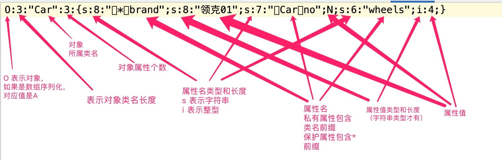
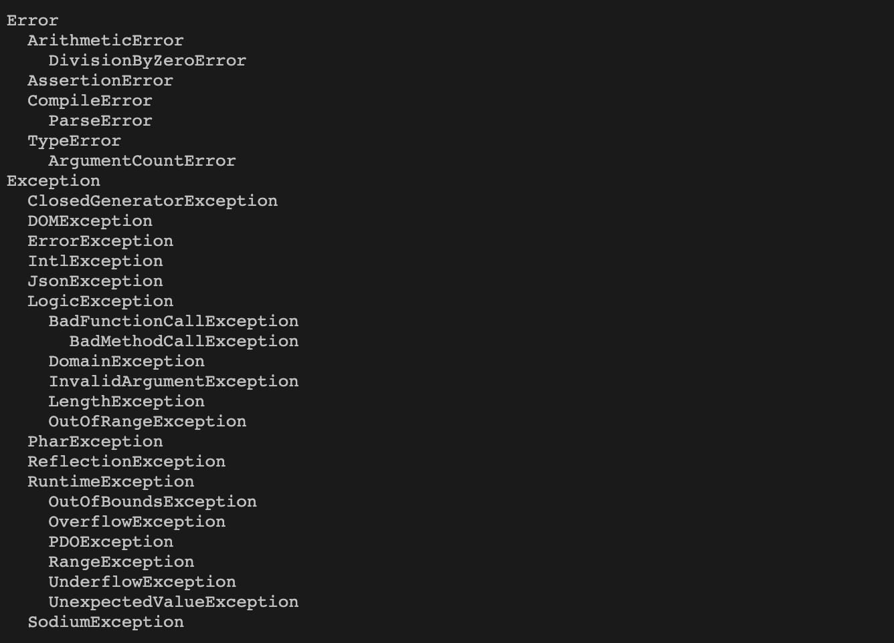
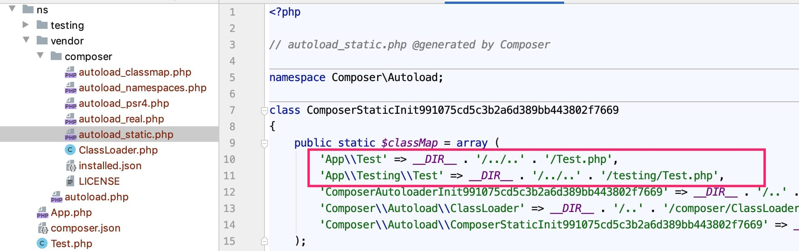

# PHP入门到实战教程

https://laravelacademy.org/books/php-tutorial

## OOP

### 匿名函数和作用域

匿名函数（或者叫闭包函数）的一个强大功能是支持在函数体中直接引用上下文变量(继承父作用域的变量)。

如果不是通过匿名函数的话，只能基于 global 关键字通过全局变量引用函数体外部定义的变量。

从父作用域中继承变量与使用全局变量是不同的，全局变量存在于一个全局的范围，无论当前在执行的是哪个函数，而闭包的父作用域是定义该闭包的函数，不一定是调用它的函数。

实际编码中，尽量避免使用 global 关键字，因为一旦声明了全局变量，就可以在任何位置获取到这些全局变量，非常容易导致系统被攻击。
匿名函数则有效规避了这种安全隐患。

此外，匿名函数的另一个典型应用场景就是兜底处理（fallback）。


### Trait 🔖

Trait 其实也是一种通过组合水平扩展类功能的机制。

Trait 和类相似，支持定义方法和属性，但不是类，不支持定义构造函数，因而不能实例化，只能被其他类使用。`use`


### 静态属性和静态方法

#### 后期静态绑定

后期静态绑定（Late Static Bindings）针对的是静态方法的调用，使用该特性时不再通过 `self::` 引用静态方法，而是通过 `static::`，
如果是在定义它的类中调用，则指向当前类，此时和 self 功能一样，如果是在子类或者其他类中调用，则指向调用该方法所在的类，我们通过后期静态绑定改写上述代码：


### PHP 魔术方法、序列化与对象复制

对象序列化

`__sleep()` 如果在类中存在的话，会在序列化方法 `serialize` 执行之前调用，以便在序列化之前对对象进行清理工作，相对的，`__wakeup()` 如果在类中存在的话，会在反序列化方法 `unserialize` 执行之前调用，以便准备必要的对象资源。

```php
class Car
{
    protected $brand;
    private $no;
    public $wheels = 4;
    /**
     * @return mixed
     */
    public function getBrand()
    {
        return $this->brand;
    }
    /**
     * @return mixed
     */
    public function getNo()
    {
        return $this->no;
    }

    /**
     * @param mixed $brand
     */
    public function setBrand($brand): void
    {
        $this->brand = $brand;
    }

    public function __sleep()
    {
        return ['brand', 'no', 'wheels'];
    }

    public function __wakeup()
    {
        $this->no = 10001;
    }
}

$car = new Car();
$car->setBrand("领克01");

// 将对象序列化为字符串后保存到文件
$string = serialize($car);
echo $string . PHP_EOL;
file_put_contents("car", $string);

// 从文件读取对象字符串反序列化为对象
$content = file_get_contents("car");
$object = unserialize($content);
echo "汽车品牌：" . $object->getBrand() . PHP_EOL;
echo "汽车No.：" . $object->getNo() . PHP_EOL;
echo "汽车轮子：" . $object->wheels . PHP_EOL;
```

```
O:3:"Car":3:{s:8:"*brand";s:8:"领克01";s:7:"Carno";N;s:6:"wheels";i:4;}
汽车品牌：领克01
汽车No.：10001
汽车轮子：4
```

序列化字符串中，保护属性会加上 `*` 前缀，私有属性加上类名前缀，公开属性 `wheels` 前面没有任何前缀。



🔖


当在指定对象上调用一个不存在的成员方法时，如果该对象包含 `__call` 魔术方法，则尝试调用该方法作为兜底，与之类似的，当在指定类上调用一个不存在的静态方法，如果该类包含 `__callStatic` 方法，则尝试调用该方法作为兜底。


`__set()` 方法会在给不可访问属性赋值时调用；`__get()` 方法会在读取不可访问属性值时调用；当对不可访问属性调用 `isset()` 或 `empty()` 时，`__isset()` 会被调用；当对不可访问属性调用 `unset()` 时，`__unset()` 会被调用。


`__invoke` 魔术方法会在以函数方式调用对象时执行。


当以 `clone` 关键字执行对象复制时，会调用 `__clone()`

### 错误和异常处理 


#### 错误 vs. 异常

错误与异常可以看作一对孪生兄弟，从严格的面向对象编程角度来说，错误指的是致命错误（Fatal Error，比如编译错误和语法错误），出现运行时错误后，程序应该无法继续往后执行，需要执行一些清理工作并记录日志后退出当前处理流程。

而异常指的是程序中出现的可预测的、可恢复的中轻度问题，比如数空对象引用、文件不存在、除数为零、数组越界等，当程序运行时出现异常后，我们可以对其进行捕获，或者抛给上层的业务代码处理，和错误报告类似，如果通过 [set_exception_hanlder](https://www.php.net/manual/zh/function.set-exception-handler.php) 函数定义了全局异常处理器，则所有未处理异常会集中到这里处理，如果没有定义任何处理异常的代码，最终会抛出一个 Fatal Error（也就是说，所有未处理异常都会被当作错误进行兜底处理）。程序出现异常后，应该可以继续往后执行。

但是我们在 PHP 中可以看到两者的边界并不明显，因为异常是 PHP 5 之后实现完整面向对象机制后引入的，之前的 PHP 中只有错误，没有异常，所以你可以看到那么多的错误级别，比如 Notice、Warning、Deprecated 这些中轻度错误，实际上完全可以通过异常进行处理。


在 PHP 7 中，所有错误都归属于 `Error` 类，所有异常都归属于 `Exception` 类，两者是并列关系，并且最新 PHP 内置错误和异常类型如下表所示：



而 Error 和 Exception 类又都实现了 Throwable 接口。


## HTTP

### PHP 发送 HTTP 响应与文件下载

在 PHP 中可以通过内置的 header 函数设置状态行及响应头，而对于响应实体，也就是我们通常看到的 API 响应数据或者 Web 页面响应视图（HTML 文档），
通过 PHP 的打印函数输出即可，比如 echo、printf、var_dump 等，如果 HTML 和 PHP 脚本混合在一起，则也会解析其中的 PHP 代码，然后渲染对应的 HTML 文档作为响应实体。

如果没有用header设置状态码，成功后php底层自动设置为200，也可以显示的设置：
```php
header("HTTP/1.1 200 OK");
echo 'hello';
```

#### 响应状态码

```php
header('HTTP/1.1 200 OK');
```

#### 重定向

```php
header('HTTP/1.1 301 Move Permanently');
header('Location: https://xueyuanjun.com');
```


#### HTTP 基本认证

```php
// HTTP Basic 认证简单实现
if (empty($_SERVER['PHP_AUTH_USER'])) {
    header('WWW-Authenticate: Basic');
} else {
    $name = $_SERVER['PHP_AUTH_USER'];
    $pass = $_SERVER['PHP_AUTH_PW'];
    if ($name == 'jack' && $pass == '123456') {
        echo '用户认证成功，可以访问该页面';
    } else {
        header('HTTP/1.1 401 Unauthorized');
        echo '用户认证失败，请刷新页面重试';
    }
}
```

#### JSON 响应

在 API 接口中，通常返回的是 JSON 格式数据，JSON 本质上也就是对象字符串，所以在请求处理代码的最后，通过 echo 输出对应的 JSON 对象字符串即可，
在 PHP 中，可以通过 PHP 内置的 `json_encode` 函数快速将对象、数组等格式数据转化为对应的 JSON 字符串。


## 实战myblog

https://github.com/nonfu/master-laravel-code/tree/master/practice/blog


### PHP 命名空间与类自动加载实现

对于类文件的引入，反复编写 `require_once`/`include_once` 语句太麻烦，可以借助 [spl_auto_register](https://www.php.net/manual/zh/function.spl-autoload-register.php) 函数注册自动加载器，实现系统**未定义类或接口的自动加载**。

比如我们将上述 `bootstrap.php` 中的通过 `require_once` 引入 `Container` 类代码调整为通过 `spl_autoload_register` 函数自动注册：

```php
spl_autoload_register(function ($className) {
    require_once 'core/' . $className. '.php';
});
```

这样，我们只需要通过 `spl_autoload_register` 全局注册这个匿名函数即可，当 `Container` 类找不到时，会根据这个自动加载器进行加载。

#### 命名空间及其使用

`spl_autoload_register` 这种自动类加载机制存在一个问题，那就是不同库/组件类名冲突问题，因此，从 PHP 5.3 开始，引入了命名空间的概念，通过命名空间，可以很好的解决这个问题，而且相较于前者，代码可读性更好。

可以借助 `spl_autoload_register` 函数，将类名所属命名空间解析为对应的目录路径（这就是为什么要根据目录来组织命名空间），然后把通过 `require_once`/`include_once` 引入：

```php
<?php
namespace App;
use App\testing\Test as SubTest;

spl_autoload_register(function ($className) {
    $path = explode('\\', $className);
    if ($path[0] == 'App') {
        $base = __DIR__;
    }
    $filename = $path[count($path) - 1] . '.php';
    $filePath = $base;
    foreach ($path as $key => $val) {
        if ($key == 0 || $key == count($path) - 1) {
            continue;
        }
        $filePath .= DIRECTORY_SEPARATOR . strtolower($val);
    }
    $filePath .= DIRECTORY_SEPARATOR . $filename;
    require_once $filePath;
});

Test::print();
SubTest::print();
```


#### 通过 Composer 管理命名空间

实际项目开发时，手动编写这段 `spl_autoload_register` 代码有点麻烦，尤其是项目除了自己编写的代码外，还要引入各种第三方库。

可以借助 PHP 的包管理工具 [Composer](https://getcomposer.org/) 帮我们管理这种**命名空间与目录路径的映射**。

```
vendor/autoload.php   ->   autoload_real.php  ->  vendor/composer/autoload_static.php
```

`autoload_php` 是所有 Composer 管理类自动加载的入口文件，所以我们只需要在代码中引入这个文件即可通过 Composer 来管理所有类的自动加载。



> 实际上，Composer 底层也是通过 `spl_autoload_register` 函数实现类的自动加载的，只是在此之前，还会建立命令空间与类脚本路径的映射。


在 `composer.json` 中配置需要维护命名空间路径映射的目录：

```json
  "autoload": {  
    "classmap": [
      "app"
    ]
  }
```

然后运行 `composer dump-auto` 让新增的命名空间类映射关系生效。


🔖  public/   resources/


### 基于 Laravel Eloquent 组件编写 ORM 模型类

#### ORM 及其实现模式

模型类负责与数据库进行交互，这里的模型指的是数据表的模型，一个模型类对应一张数据表，数据表的字段会映射为模型类的属性，我们可以通过模型类提供的方法实现对应数据表记录的增删改查，这样一来，我们就将原来面向过程的数据库操作转化为面向对象风格的编程，将对数据表的 SQL 执行转化为对模型类的方法调用。

这种对象与数据表的映射称之为对象关系映射（Object Relational Mapping），简称 **ORM**。ORM 两种最常见的实现方式是 ==Active Record== 和 ==Data Mapper==，Active Record 尤其流行，在很多框架中都能看到它的身影，比如 Laravel 框架使用的 [Eloquent ORM](https://laravelacademy.org/post/21546) 使用的就是 Active Record 模式，而 Symfony 框架使用的 [Doctrine ORM](https://www.doctrine-project.org/) 使用的则是 Data Mapper 模式。

两者的主要区别是：

- 在 Active Record 模式中，模型类与数据表一一对应，一个模型实例对应一行数据表记录，操作模型实例等同于操作表记录；
- 而在 Data Mapper 模式中，业务领域（Domain）和数据持久层是完全分离的，模型类操作与数据表更新之间通过 EntityManager 来维护，上层操作的模型类完全不需要和数据库有任何关联。

所以 Active Record 模式更加简单，容易上手，但是与数据库的直接关联使其性能和灵活性不及 Data Mapper 模式，但是相对的，Data Mapper 模式理解和实现起来更加复杂，不利于快速上手。


```sh
# Eloquent ORM 扩展包
composer require illuminate/database
# 独立事件扩展包
composer require illuminate/events
```


```mysql
CREATE TABLE `albums` (
  `id` int NOT NULL AUTO_INCREMENT,
  `title` varchar(200) NOT NULL,
  `summary` text NOT NULL,
  `image` varchar(200) NOT NULL,
  PRIMARY KEY (`id`)
) ENGINE=InnoDB DEFAULT CHARSET=utf8mb4 COLLATE=utf8mb4_general_ci COMMENT='专辑表';

CREATE TABLE `posts` (
  `id` int NOT NULL AUTO_INCREMENT,
  `title` varchar(200) COLLATE utf8mb4_general_ci NOT NULL,
  `image` varchar(200) COLLATE utf8mb4_general_ci NOT NULL,
  `html` text COLLATE utf8mb4_general_ci,
  `text` text COLLATE utf8mb4_general_ci,
  `album_id` int NOT NULL DEFAULT '0',
  `created_at` varchar(100) COLLATE utf8mb4_general_ci DEFAULT NULL,
  PRIMARY KEY (`id`),
  KEY `alum_id` (`album_id`)
) ENGINE=InnoDB DEFAULT CHARSET=utf8mb4 COLLATE=utf8mb4_general_ci COMMENT='专辑表';
```


🔖 https://laravelacademy.org/post/21690