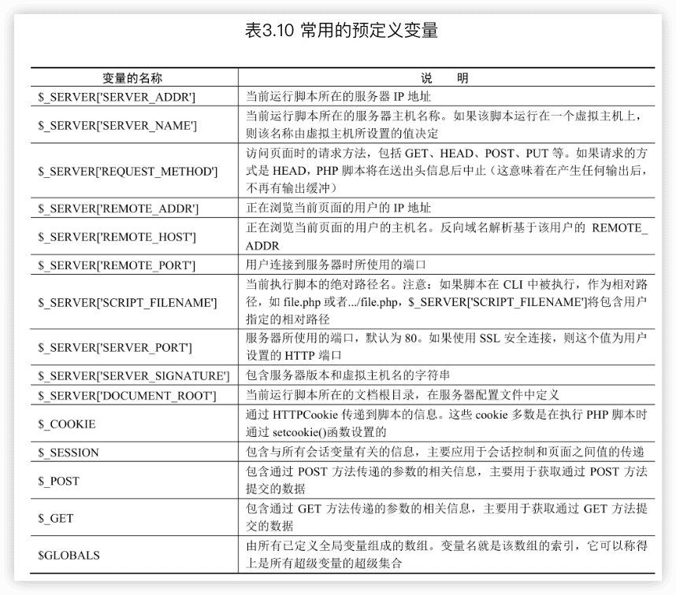
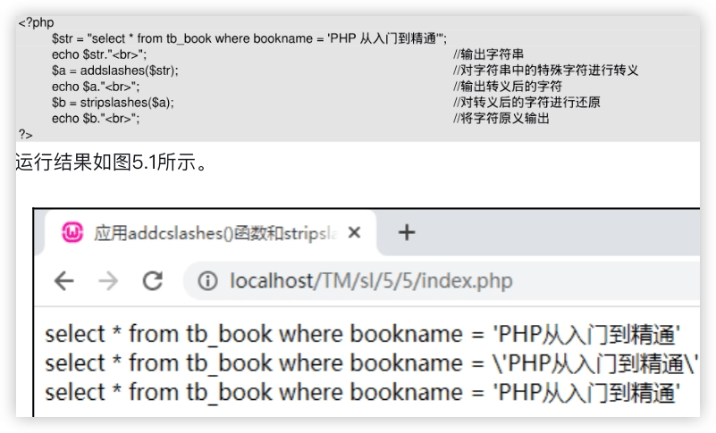

php从入门到精通
---


# 一、基础知识

## 1 初识php

PHP是PHP:Hypertext Preprocessor（超文本预处理器）的缩写，是一种服务器端、跨平台、HTML嵌入式的脚本语言，其独特的语法混合了C语言、Java语言和Perl语言的特点，是一种被广泛应用的开源式的多用途脚本语言，尤其适合Web开发。

PHP是B/S（Browser/Server的简写，即浏览器/服务器结构）体系结构，属于三层结构。服务器启动后，用户可以不使用相应的客户端软件，只使用IE浏览器即可访问，既保持了图形化的用户界面，又大大减少了应用维护量。


### PHP 7的新特性

- 标量类型与返回值类型声明。
- NULL合并运算符。
- 太空船运算符（组合比较符）。
- 常量数组。
- 匿名类。
- Closure::call()。
- PHP过滤unserialize()。
- IntlChar()。
- CSPRNG。
- 异常。
- use语句。
- 错误处理。
- intdiv()函数。
- Session选项。
- 废弃特性。
- 移除的扩展。
- 移除的SAPI。


### PHP 8版本新增加的特性

- 命名参数。
- 联合类型。
- 注解优化。
- 即时编译。
- 构造器属性提升。
- Match表达式优化。
- Nullsafe运算符优化。
- 字符串与数字的比较逻辑。
- 内部函数类型错误的一致性。[

新的类、接口、函数：

- Weak Map类。
- Stringable接口。
- fdiv()函数。
- get_debug_type()函数。
- get_resource_id()函数。
- token_get_all()函数。
- New DOM Traversal and Manipulation APIs接口。
- str_contains()、str_starts_with()、str_ends_with()函数。

类型系统与错误处理的改进：

- Mixed类型。
- 私有方法继承。
- Static返回类型。
- 确保魔术方法签名正确。
- Abstract trait方法的验证。
- 内部函数的类型Email thread。
- 操作符@不再抑制fatal错误。
- 算术／位运算符更严格的类型检测。
- 不兼容的方法签名导致fatal错误。
- PHP引擎warning警告的重新分类。
- 扩展Curl、Gd、Sockets、OpenSSL、XMLWriter、XML，以Opaque对象替换resource。

其他语法调整和改进：

- 变量语法的调整。
- 无变量捕获的catch。
- 允许对象的::class。
- 现在throw是一个表达式。
- Namespace名称作为单个Token。
- 允许参数列表中的末尾逗号、闭包use列表中的末尾逗号。


### PHP 8的执行原理

几个关键术语：

1. `Token`是PHP代码被切割成的有意义的标识。PHP提供了`token_get_all()`函数来获取PHP代码被切割后的Token。二维数组的每个成员数组的第一个值为Token对应的枚举值，第二个值为Token对应的原始字符串内容，第三个值为代码对应的行号，可见Token就是一个个的“词块”。但是单独存在的词块不能表达完整的语义，还需要借助规则进行组织串联。语法分析器就是这个组织者，它会检查语法，匹配Token，并对Token进行关联。
2. ==抽象语法树（简称AST）==是PHP 7版本的新特性。在这之前的版本中，PHP代码的执行过程中是没有生成AST这一步的。AST的结点分为多种类型，对应着PHP语法。通常使用PHP-Parser工具查看PHP代码生成的AST。注意，PHP-Parser是《PHP 7内核》作者之一Nikic编写的将PHP源码生成AST的工具，其源码参见https://github.com/nikic/PHP-Parser。

3. `opcodes`

   opcode只是单条指令，opcodes是opcode的集合形式，是PHP执行过程中的中间代码。opcode生成之后，由虚拟机执行。PHP工程优化措施中有一个比较常见的“开启opcache”，指的就是这里的opcodes的缓存(opcodes cache)。通过省去从源码到opcode的阶段，引擎可以直接执行缓存的opcode，以此提升性能。借助vld插件，可以直观地看到一段PHP代码生成的opcode。opcode是PHP 7定义的一组指令标识，指令对应着相应的handler（处理函数）。当虚拟机调用opcode时，会找到opcode背后的处理函数，执行真正的处理程序。


在PHP 5中，从PHP脚本到opcodes的执行过程如下：

1. 词法分析。源代码首先进行词法分析，切割为多个字符串单元，得到Token。
2. 语法分析。独立的Token无法表达完整语义，因此需经过语法分析，将Token转换为opcodes。

在PHP 7和PHP 8中，执行原理：

1. 词法分析。源代码首先进行词法分析，切割为多个字符串单元，得到Token。
2. 语法分析。独立的Token无法表达完整语义，因此需经过语法分析，将Token转换为AST。
3. 编译。抽象语法树被转换为机器指令并执行。在PHP中，这些指令被称为opcode，由PHP解释执行。


## 3 PHP语言基础


### 3.1 PHP的标记风格

PHP支持4种标记风格，分别是XML风格、脚本风格、简短风格和ASP风格。

### 3.2 PHP注释

单行注释、多行注释和#风格的注释。

单行注释中不要出现“`?>`”，否则解释器会认为PHP脚本到此已结束。

### 3.3 PHP的数据类型

PHP支持8种数据类型，

- 包括4种标量数据类型，即boolean（布尔型）、string（字符串型）、integer（整型）和float/double（浮点型）；
- 2种复合数据类型，即array（数组）和object（对象）；
- 2种特殊数据类型，即resource（资源）和null（空值）。

> PHP中变量的类型通常不是由程序员设定的，确切地说，是PHP根据该变量使用的上下文在运行时决定的。

#### 标量数据类型


在PHP中，不是只有false值才为假，一些特殊情况下，boolean值也被认为是false，这些特殊情况有0、0.0、"0"、空白字符串("")、只声明没有赋值的数组等。


“`$`”是变量标识符，所有变量都以“`$`”开头，无论是声明变量还是调用变量，都应使用“`$`”标识。

在PHP中，有3种定义字符串的方式，分别是单引号(`'`)、双引号(`"`)和定界符(`<<<`)。双引号中所包含的变量会自动被替换成实际数值，而单引号中包含的变量则按普通字符输出。

定义简单字符串时使用单引号更加合适，使用双引号PHP将花费一些时间来处理字符串的转义和变量的解析。因此，如果没有特别的要求，定义字符串时应尽量使用单引号。

在定界符后接一个标识符，然后是字符串，最后以同样的标识符结束字符串。


如果给定的数值超出了integer型所能表示的最大范围，将会被当作float型处理，这种情况称为整数溢出。同样，如果表达式的最后运算结果超出了integer型的范围，也会返回float型。

float和double在PHP中没有什么区别。

浮点型的数值只是一个近似值，所以要尽量避免在浮点型数值之间比较大小，因为最后的结果往往是不准确的。

#### 复合数据类型


#### 特殊数据类型

==资源（resource）==是一种特殊变量，又叫作句柄，保存了到外部资源的一个引用。资源是通过专门的函数来建立和使用的。使用资源时，系统会自动启用垃圾回收机制，释放不再使用的资源，避免内存消耗殆尽。因此，资源很少需要手工释放。

==空值（null）==，特殊的值，表示变量没有值，唯一的值就是null。空值(null)不区分大小写，null和NULL效果是一样的。被赋予空值的情况有3种：==未被赋任何值、被赋值为null、被unset()函数处理过==。

> isset()函数用于判断变量是否为null，该函数返回一个boolean型，如果变量为null，则返回true，否则返回false。unset()函数用来销毁指定的变量。


#### 数据类型转换


在进行数据类型转换的过程中应该注意：转换成boolean型时，null、0以及未赋值的变量和数组会被转换为false，其他的转换为true；转换成整型时，布尔型的false转换为0，true转换为1，浮点型的小数部分被舍去，字符型如果以数字开头就截取到非数字位，否则输出0。


类型转换还可以通过settype()函数来完成：

```php
bool settype(mixed var, string type)
```


#### 检测数据类型


### 3.4 PHP常量

#### 常量的定义和使用

```php
define(string constant_name, mixed value)
```

获取常量的值有两种方法：一种是使用常量名直接获取值；另一种是使用constant()函数。

判断一个常量是否已经被定义，可以使用defined()函数：

```php
bool defined(string constant_name);
```

> 在PHP 8.0以前，使用一个未定义的常量，可能会被解析为常量名称组成的字符串，并产生一个E_NOTICE级别的错误，在PHP 8.0之后，会产生E_ERROR。


#### 预定义常量


`__FILE__`和`__LINE__`中的“`__`”是两条下画线，而不是一条“`_`”。

以E_开头的预定义常量用于PHP的错误调试，如需详细了解，请参考`error_reporting()`函数。

### 3.5 PHP变量


#### 变量的作用域


静态变量在很多地方都能用到。例如，在博客中使用静态变量记录来访人数，在聊天室中使用静态变量记录用户的聊天内容等。


#### 可变变量

可变变量是一种独特的变量，它允许动态改变某个变量的名称。其工作原理是该变量的名称由另外一个变量的值来确定，实现过程就是在变量的前面再多加一个符号“`$`”。

#### PHP预定义变量



### 3.6 PHP运算符

算术运算符、字符串运算符、赋值运算符、递增／递减运算符、位运算符、逻辑运算符、比较运算符和条件运算符

#### 运算符的优先级


### 3.7 PHP表达式


### 3.8 PHP函数


#### 在函数间传递参数

调用函数时，需要向函数传递参数，被传入的参数称为实参。而函数定义时的参数称为形参。参数传递的方式有==值传递、引用传递和默认参数（可选参数）==3种。


==引用传递==就是将实参的内存地址传递到形参中。这时，在函数内部的所有操作都会影响实参的值，返回后，实参的值会发生变化。引用传递方式就是传值时在值传递基础上加“`&`”符号即可。

当使用默认参数时，默认参数必须放在非默认参数的右侧，否则函数可能出错。


#### 从函数中返回值

通常，函数将返回值传递给调用者的方式是使用关键字`return`。return将函数的值返回给函数的调用者，即将程序控制权返回调用者的作用域。如果在全局作用域内使用return关键字，那么将终止脚本的执行。


#### 变量函数


### 3.9 PHP编码规范

遵守编码规范的好处：

- 编码规范是对团队开发成员的基本要求。
- 开发人员可以了解任何代码，厘清程序的状况。
- 提高程序的可读性，有利于相关设计人员交流，提高软件质量。
- 防止刚接触PHP的人出于节省时间的需要，自创一套风格并养成终生的习惯。
- 有助于程序的维护，降低软件成本。
- 有利于团队管理，实现团队后备资源的可重用。

#### PHP的书写规则


#### PHP的命名规范

1. 类命名的要求和规范：
   - 使用大写字母作为词的分隔，其他字母均使用小写。
   - 名字的首字母使用大写。
   - 不要使用下画线(_)。

2. 类属性命名的要求和规范如下。
   - 属性命名应该以字符m为前缀。
   - 前缀m后采用与类命名一致的规则。
   - m总是在名字的开头起修饰作用，就像以r开头表示引用一样。

3. 方法命名的要求和规范如下。方法用于执行一个动作，达到某个目的，因此方法名应清晰说明方法是干什么用的。一般名称的前缀和后缀都有一定的规律，如Is（判断）、Get（得到）、Set（设置）等。方法的命名规范和类命名是一致的。

4. 方法中参数命名的要求和规范如下。
   - 第一个字符使用小写字母。
   - 首字符后的所有字符参照类命名规则，首字符大写。

5. 变量命名的要求和规范如下。
   - 所有字母都使用小写。
   - 使用“_”作为每个词的分界。

6. 引用变量前要带前缀r。

7. 全局变量前应带前缀g，如`global` `$gTest`、`global $g`等。
8. 常量／全局常量应该全部使用大写字母，单词之间用“_”来分隔。
9. 静态变量前应带前缀s
10. 函数命名时，所有单词都要使用小写字母，单词间使用“_”进行分隔。


## 4 流程控制语句


switch语句根据变量或表达式的值，依次与case中常量表达式的值相比较，如果不相等，则继续查找下一个case；如果相等，就执行对应的语句，直到switch语句结束或遇到break。一般来说，switch语句最终都有一个默认值default，如果在前面的case中没有找到相符的条件，则输出默认语句，和else语句类似。


foreach语句用于其他数据类型或者未初始化的变量时会产生错误。为了避免这个问题，最好使用is_array()函数先来判断变量是否为数组类型。如果是，再进行其他操作。

## 5 字符串操作 


### 5.1 字符串的定义方法

单引号字符串和双引号字符串在PHP中的处理是不同的。双引号字符串中的内容可以被解释和替换，而单引号字符串中的内容将被作为普通字符串进行处理。

在定界符内不允许添加注释，否则程序将运行出错。结束标识符所在的行不能包含任何其他字符，而且不能被缩进，在标识符前后不能有任何空白字符或制表符。如果破坏了这条规则，则程序不会将其视为结束标识符，PHP将继续寻找下去。如果找不到合适的结束标识符，将会在脚本最后一行提示语法错误。

定界符中的字符串支持单引号、双引号，无须转义，并支持字符变量替换。

### 5.2 字符串操作

#### 去除字符串首尾空格和特殊字符

```php
 string trim(string str [,string charlist]);
ltrim()
rtrim()
```

#### 转义还原字符串数据

- `\`

- `addslashes()`和`stripslashes()`



> 所有数据在插入数据库之前，有必要应用addslashes()函数进行字符串转义，以免特殊字符未经转义在插入数据库时出现错误。另外，对于使用addslashes()函数实现的自动转义字符串可以使用stripslashes()函数进行还原，但数据在插入数据库之前必须再次进行转义。

- `string addcslashes(string str, string charlist)`   指定字符charlist前加反斜线。
- `string stripcslashes(string str)`   将应用addcslashes()函数转义的字符串str还原。


> 在缓存文件中，一般对缓存数据的值采用addcslashes()函数进行指定范围的转义。

#### 获取字符串的长度

`int strlen(string str)`

strlen()函数在获取字符串长度的同时，也可以用来检测字符串的长度。

汉字占两个字符，数字、英文、小数点、下画线和空格占一个字符。

#### 截取字符串

`string substr(string str, int start [, int length])`


#### 比较字符串

1. 按字节进行字符串比较

`strcmp()`

`strcasecmp()`  不区分字母大小写

2. 按自然排序法进行字符串比较

`strnatcmp()`

`strnatcasecmp()`

3. 从字符串的指定位置开始比较

`int strncmp(string str1, string str2, int len)`

#### 检索字符串

1. 使用strstr()函数查找指定字符串

`string|false strstr(string haystack, string needle)`

strstr()函数用于检索指定字符串（即待查关键字）在原始字符串中第一次出现的位置，并返回从该位置到字符串结尾的所有字符。

haystack表示待搜索、查找的原始字符串；needle表示要查找的关键字，如果是数字，则搜索与其ASCII值相匹配的字符。

> 英语中有句谚语：Find a needle in haystack（大海捞针）。在搜索查找类算法中，haystack通常用于表示源数据，needle则用于表示搜索目标。

`strrchr()`函数正好相反，用于检索指定字符串在原始字符串中最后一次出现的位置，并返回从该位置到字符串结尾的所有字符。

2. `substr_count()`函数用于检索指定字符串（即待查关键字）在原始字符串中出现的次数。

#### 替换字符串 🔖

1. `str_ireplace()`函数用于替换原始字符串中的指定字符，不区分字母大小写

`mixed str_ireplace(mixed search, mixed replace, mixed str [, int &count])`

str：待搜索、查找的原始字符串或数组。

search：待查找且将被替换的指定字符串。

replace：用于替换的新字符串。

count：可选参数，表示执行字符串替换操作的次数。

> `str_replace()`区分大小写

2. `substr_replace()`函数用于对原始字符串中的部分内容进行替换。

`mixed substr_replace(mixed str, mixed replace, mixed start, [mixed length])`

#### 格式化字符串

在PHP中，字符串和数字都可以被格式化，其中数字的格式化最为常用。

数字格式化函数：

`string number_format(float number[, int decimals [, string dec_point[, string thousands_ sep]]])`

其中，number为要格式化的数字，decimals为要保留的小数位数，dec_ point为表示小数点的字符，thousands_sep为表示千位分隔符的字符。

number_format()函数可以有1个、2个或4个参数，但不能有3个参数。如果只有1个参数number，number的小数部分会被去掉，千位分隔符为英文逗号“,”；如果有2个参数，number将保留小数点后的位数到设定的值，千位分隔符为英文逗号“,”；如果有4个参数，number将保留decimals个长度的小数部分，小数点替换为dec_ point，千位分隔符替换为thousands_sep。

#### 分割合并字符串

1. 分割字符串

`array explode(string delimiter, string str[, int limit])`

2. 合并字符串

`string implode(string glue, array pieces)`

## 6 正则表达式

### PCRE兼容正则表达式函数

PHP提供了两套支持正则表达式的函数库，但由于PCRE函数库在执行效率上要略优于POSIX函数库，所以这里只讲解PCRE函数库中的函数。

```php
array preg_grep(string pattern, array input)
int preg_match/preg_match_all(string pattern, string subject [, array matches])
string preg_quote(string str [, string delimiter])
mixed preg_replace(mixed pattern, mixed replacement, mixed subject [, int limit])
mixed preg_replace_callback(mixed pattern, callback callback, mixed subject [, int limit])
array preg_split(string pattern, string subject [, int limit])
```


## 7 PHP数组


### 遍历数组

foreach

```php
$array = array("tom", 'andy', 'jack');
list($a, $b, $c) = $array;
```

### 数组应用函数

#### 1 字符串与数组的转换

explode()和implode()

#### 2 统计数组元素个数

```php
int count(mixed array [, int mode])
```

#### 3 查询数组中指定的元素

```php
mixed array_search(mixed needle, array haystack [, bool strict])
```

用于在数组中搜索指定的值，找到后返回键名，否则返回false。

其中，needle表示数组中待搜索的值；haystack表示被搜索的数组；strict为可选参数，如果值为true，表示将在数组中检查给定值的类型。


#### 4 获取数组中最后一个元素

```php
 array_pop(array array)
```

#### 5 向数组中添加元素

```php
array_push(array array, mixed var [, mixed ...])
```

#### 6 删除数组中重复的元素

```php
array array_unique(array array)
```

将值作为字符串排序，对每个值只保留第一个键名，忽略所有后面的键名，即删除数组中重复的元素。

## 8 PHP与Web页面交互


### 对URL传递的参数进行编／解码

urlencode()

urldecode()

## 9 PHP与JavaScript交互


## 10 日期和时间


### 10.1 系统时区设置

- php.ini文件中[date]下的“;date.timezone =”选项

- `date_default_timezone_set(timezone);`

### 10.2 PHP日期和时间函数

#### 获得本地化时间戳

`int mktime(int hour, int minute, int second, int month, int day, int year, int [is_dst])`

#### 获取当前时间戳

time()

#### 获取当前日期和时间

`date(string format, int timestamp)`


#### 获取日期信息

`array getdate(int timestamp)`


#### 检验日期的有效性

`bool checkdate(int month, int day, int year)`

#### 输出格式化的日期和时间

`date(string $format, ?int $timestamp = null): string`


#### 显示本地化的日期和时间

`string setlocale(string category, string locale)`

`string strftime(string format, int timestamp)`

#### 将日期和时间解析为UNIX时间戳

`int strtotime(string time [, int now])`

### 10.3 日期和时间的应用

#### 比较时间的先后


#### 实现倒计时功能


#### 计算页面脚本的运行时间


# 二、核心技术

## 11 Cookie与Session

```php
bool setcookie(string name[, string value[, int expire[, string path[, string domain[, int secure]]]]])
$_COOKIE[]
setcookie("name", "", time()-1);

bool session_start(void);
$_SESSION
unset($_SESSION['user']);
session_destroy();
session_set_cookie_params();
session_save_path();
// 数据库存储
bool session_set_save_handler(string open, string close, string read, string write, string destroy, string gc)
```


## 12 图形图像处理技术

GD2函数库及[JpGraph](https://jpgraph.net/)类库🔖


## 13 文件系统


### 13.1 文件处理


```php
resource fopen(string filename, string mode [, bool use_include_path]);
bool fclose(resource handle);

int readfile(string filename);
array file(string filename);
string file_get_contents(string filename[, int offset[, int maxlen]]);
string fgets(int handle [, int length]);
string fgetc(resource handle);
string fread(int handle, int length);
int fwrite(resource handle, string string [, int length]);
int file_put_contents(string filename, string data [, int flags]);

```

#### 操作文件


在读写文件时，除file()、readfile()等少数几个函数外，其他操作必须要先使用fopen()函数打开文件，最后使用fclose()函数关闭文件。文件的信息函数（如filesize、filemtime等）则都不需要打开文件，只要文件存在即可。

## 13.2 目录处理

```php
resource opendir(string path);
void closedir(resource handle);
array scandir(string directory [, int sorting_order]);
```

#### 操作目录

目录是一种特殊的文件，因此，对文件的操作处理函数（如重命名）多数同样适用于目录。但还有一些特殊的函数是只针对目录的。


### 13.3 文件处理的高级应用

对文件指针进行查找、定位，对正在读取的文件进行锁定等操作

#### 远程文件的访问

php.ini文件中配置`allow_url_ fopen`选项

`fopen('http://127.0.0.1/tm/sl/index.php', 'rb');`

#### 文件指针

rewind()、fseek()、feof()和ftell()

#### 锁定文件

向文本文件写入内容时，需要先锁定该文件，以防止其他用户同时修改文件内容。

`bool flock(int handle, int operation)`


### 13.4 文件上传

#### 配置php.ini文件

- file_uploads：如果值是on，说明服务器支持文件上传；如果为off，则不支持。
- upload_tmp_dir：上传文件临时目录。在文件被成功上传之前，首先将文件存放到服务器端的临时目录中。如果要指定位置，可在这里设置，否则使用系统默认目录即可。
- upload_max_filesize：服务器允许上传的文件的最大值，以MB为单位。系统默认为2MB，用户可以自行设置。

除了File Uploads项，还有几个属性也会影响上传文件的功能。

- max_execution_time：PHP中一个指令所能执行的最长时间，单位是秒。
- memory_limit：PHP中一个指令所分配的内存空间，单位是MB。

#### 预定义变量$_FILES


#### 文件上传函数

`bool move_uploaded_file(string filename, string destination)`


#### 多文件上传


## 14 面向对象


### 14.1 面向对象编程


### 14.2 PHP与对象

#### 成员方法

类中的函数和成员方法唯一的区别就是，==函数实现的是某个独立的功能，而成员方法用于实现类中的一个行为，是类的一部分==。

调用：`对象->成员方法`


​     `对象名->成员变量`


#### 类常量

`const`


类名和常量名之间的两个冒号“::”称为作用域操作符，使用这个操作符可以在不创建对象的情况下调用类中的常量、变量和方法。


#### 构造方法

```php
void __construct([mixed args [,…]])
```

构造方法是初始化对象时使用的。如果类中没有构造方法，那么PHP会自动生成一个。自动生成的构造方法没有任何参数和操作。

#### 析构方法

```php
void __destruct(void)
```


PHP使用的是一种“垃圾回收”机制，自动清除不再使用的对象，释放内存。也就是说，即使不使用unset()函数，析构方法也会自动被调用，这里只是为了明确析构方法在何时被调用。一般情况下是不需要手动创建析构方法的。


#### 继承和多态的实现


#### “$this->”和“::”的使用

“$this->”只可以在类的内部使用。

`get_class()`函数返回对象所属类的名字，如果不是对象，则返回false。

伪变量$this只能在类的内部使用，但操作符“::”可以在没有声明任何实例的情况下访问类中的成员方法或成员变量。

`关键字::变量名/常量名/方法名`

关键字分为以下3种情况：

- `parent`：可以调用父类中的成员变量、成员方法和常量。
- `self`：可以调用当前类中的静态成员和常量。
- `类名`：可以调用本类中的变量、常量和方法。


#### 数据隐藏

成员变量和成员方法在关键字的使用上都是一样的。

`public`、`private`、`protected`


#### 静态变量（方法）


### 14.3 面向对象的高级应用

#### final

被final修饰过的类和方法不可以再被继承。


#### 抽象类


#### 接口

不要用public以外的关键字来修饰接口中的成员。对于方法，不写关键字也可以，这是由接口自身的属性决定的。


#### 复制对象

##### 1 关键字clone


##### 2 __clone方法

__clone方法的作用是在复制对象的过程中自动调用__clone方法，使复制出来的对象保持自己的一些行为及属性。

#### 对象比较

“`==`”用于比较两个对象的内容，“`===`”用于比较对象的引用地址。


#### 对象类型检测

`ObjectName instanceof ClassName`


#### 魔术方法

PHP 8中保留了所有以“`__`”开头的方法，用户只能在PHP文档中使用已有的魔术方法，不能自行创建。

##### 1 `__set`和`__get`方法


##### 2 `__call`方法

当程序试图调用不存在或不可访问（使用protected或private修饰的方法）的成员方法时，PHP会先调用__call方法来存储方法名及其参数。


##### 3 `__sleep`和`__wakeup`方法

使用serialize()函数可以实现序列化对象，就是将对象中的变量全部保存下来，对象中的类则只保存类名。在使用serialize()函数时，如果实例化的对象包含`__sleep`方法，则会先执行`__sleep`方法。该方法可以清除对象并返回一个该对象中所有变量的数组。使用`__sleep`方法的目的是关闭对象可能具有的数据库连接等类似的善后工作。

unserialize()函数可以重新还原一个被serialize()函数序列化的对象，`__wakeup`方法则用于恢复在序列化中丢失的数据库连接及相关工作。

4 `__toString`方法

将一个对象当作一个字符串来使用时，会自动调用魔术方法`__toString`。在该方法中可以返回一个字符串，表示该对象转换为字符串之后的结果。


### 中文字符串的截取 🔖

为了避免截取中文字符串出现乱码的问题，可以在类中定义一个截取字符串的方法，在该方法中对要截取字符串的每个字符进行遍历，在遍历时使用`ord()`函数返回字符的ASCII值，如果该值大于`0xa0`，则说明该字符为汉字，这时就使用substr()函数从当前位置截取3个字符，这样就能防止在截取中文字符串时出现乱码的情况。

## 15 PHP加密技术

### 15.1 PHP加密函数

数据加密的基本原理就是**对原来为明文的文件或数据按某种算法进行处理，使其成为不可读的一段代码**，通常称为“密文”，通过这样的途径来保护数据，防止数据泄露。

#### crypt()

`string crypt(string str, string salt);`

str是需要加密的字符串，salt为加密时使用的干扰串。


#### md5()

md5()把不同长度的数据信息经过一系列的算法转换成一个128位的数值，即把一个任意长度的==字节串==变换成一个定长的大整数。

`string md5(string str [, bool raw_output]);`

#### sha1()


### 15.2 PHP加密扩展库

`Hash`扩展库允许使用各种散列算法直接或增量处理任意长度的信息。【5.1后为内置并且默认启用】

`OpenSSL`扩展库使用加密扩展包封装了多个用于加密和解密的函数，极大方便了对数据进行加密和解密的操作。

#### Hash

`array hash_algos()`

`string hash(string algo, string data, bool binary, array options = [])`

#### OpenSSL

OpenSSL扩展库用于实现对数据进行对称或非对称的加密或解密操作。

`string openssl_encrypt ( string data , string method , string password, int options, string iv )`

`string openssl_decrypt ( string data , string method , string password, int options, string iv )`

`array openssl_get_cipher_methods ( bool aliases )`

`int|false openssl_cipher_iv_length (string cipher_algo )`

`string openssl_random_pseudo_bytes ( int length, bool strong_result )`


## 16 MySQL数据库基础


## 17 phpMyAdmin图形化管理工具


## 18 PHP操作MySQL数据库 


### 18.1 PHP操作MySQL数据库的方法

```php
// 连接数据库
// 选择数据库
mysqli mysqli_connect([string server [, string username [, string password [, string dbname [, int port [, string socket]]]]]]);

// 选择数据库
bool mysqli_select_db(mysqli link, string dbname);

// 执行SQL语句
mixed mysqli_query(mysqli link, string query [, int resultmode]);
```


```php
// 将结果集返回数组中
array mysqli_fetch_array(resource result [, int result_type])
```

- `result`：资源类型的参数，要传入的是由mysqli_query()函数返回的数据指针。
- `result_type`：可选项，设置结果集数组的表述方式，有以下3种取值。
  - `MYSQLI_ASSOC`：返回一个关联数组，数组下标由表的字段名组成。
  - `MYSQLI_NUM`：返回一个索引数组，数组下标由数字组成。
  - `MYSQLI_BOTH`：返回一个同时包含关联和数字索引的数组，默认值是MYSQLI_BOTH。

> mysqli_fetch_array()函数返回的字段名区分字母大小写。


```php
// 从结果集中获取一行作为对象
mixed mysqli_fetch_object(resource result)
```


```php
// 从结果集中获取一行作为枚举数组
mixed mysqli_fetch_row(resource result)

// 从结果集中获取一行作为关联数组
mixed mysqli_fetch_assoc(resource result)
  
// 获取查询结果集中的记录数
int mysqli_num_rows(resource result)
  
// 释放内存
void mysqli_free_result(resource result);

// 关闭连接
bool mysqli_close(mysqli link)
```

> PHP中与数据库的连接是非持久连接，系统会自动回收，一般不用设置关闭。但如果一次性返回的结果集比较大，或网站访问量比较多，则最好使用mysqli_close()函数手动进行释放。


### 18.2 管理MySQL数据库中的数据

## 19 PDO数据库抽象层🔖

PDO是PHP data object（PHP数据对象）的简称，目前支持的数据库包括Firebird、FreeTDS、Interbase、MySQL、MS SQL Server、ODBC、Oracle、Postgre SQL、SQLite和Sybase。

因为PHP默认使用PDO连接数据库，因此所有非PDO扩展在PHP 6中已被移除。PDO扩展提供了PHP内置类PDO来对数据库进行访问，通过不同数据库使用相同的方法名，解决了数据库连接不统一的问题。


PDO的特点：

- PDO通过数据库访问抽象层，其作用是统一各数据库的访问接口。与MySQL和MS SQL Server函数库相比，PDO让跨数据库的使用更具有亲和力；与ADODB和MDB2相比，PDO更高效。
- PDO将通过一种轻型、清晰、方便的函数，统一各种不同RDBMS库的共有特性，最大限度地实现PHP脚本的抽象性和兼容性。
- PDO吸取现有数据库扩展成功和失败的经验教训，可以轻松地与各种数据库进行交互。
- PDO扩展是模块化的，能够在运行时为数据库后端加载驱动程序，而不必重新编译或重新安装整个PHP程序。例如，PDO_MySQL扩展会替代PDO扩展实现MySQL数据库API。还有一些用于Oracle、PostgreSQL、ODBC和Firebird的驱动程序，更多的驱动程序尚在开发。

### 19.2 PDO连接数据库


```php
__construct(string $dsn[, string $username[, string $password[, array $driver_options]]])
```


### 19.3 PDO中执行SQL语句


```php
int PDO::exec(string statement)
PDOStatement PDO::query(string statement)
PDOStatement PDO::prepare(string statement [, array driver_options])
bool PDOStatement::execute([array input_parameters])
mixed PDOStatement::fetch([int fetch_style [, int cursor_orientation [, int cursor_offset]]])
array PDOStatement::fetchAll([int fetch_style [, int column_index]])
```


### 19.4 PDO中获取结果集


### 19.5 PDO中捕获SQL语句中的错误

要想在PDO中捕获SQL语句中的错误，可以使用3种错误处理模式，分别是PDO::ERRMODE_SILENT、PDO::ERRMODE_WARNING和PDO::ERRMODE_EXCEPTION


### 19.6 PDO错误处理

在PDO中有两个获取程序中错误信息的方法，一个是errorCode方法，另一个是errorInfo方法。

- beginTransaction方法：用于开启事务。beginTransaction方法将关闭自动提交(autocommit)模式，直到事务提交或者回滚以后才恢复。
- commit方法：用于完成事务的提交操作，成功则返回true，否则返回false。
- rollBack方法：用于事务回滚。

### 19.7 PDO事务处理


### 19.8 PDO存储过程


## 20 ThinkPHP框架🔖

https://www.thinkphp.cn/

### 20.1 简介

ThinkPHP 6

```sh
$ composer create-project topthink/think tp6
```


#### 路由

ThinkPHP并不强制使用路由。如果没有定义路由，可以直接使用“控制器／操作”的方式进行访问。如果定义了路由，则该路由对应的路由地址就不能直接访问了。一旦开启强制路由参数，就必须为每个请求定义路由（包括首页）。

使用路由有一定的性能损失，但随之也会更加安全。因为每个路由都有自己的生效条件，如果请求不满足条件，将会被过滤掉。这远比用户在控制器操作中进行各种判断要实用得多。路由的作用不只是规范URL，还可以实现验证、权限、参数绑定及响应设置等功能。

其实路由的作用远非URL规范这么简单，还可以实现验证、权限、参数绑定及响应设置等功能。


#### 容器

ThinkPHP使用（对象）容器统一管理对象实例及依赖注入。容器类的工作由think\Container类完成，但大多数情况下都是通过应用类（think\App类）或是app助手函数来完成容器操作。可以为容器中的对象实例绑定一个对象标识，如果没有绑定则使用类名作为容器标识。

#### 系统服务

系统服务的概念是指在执行框架的某些组件或者功能的时候需要依赖的一些基础服务，服务类通常可以继承系统的think\Service类，但并不强制。可以在系统服务中向容器中注册一个对象，或者对某些对象进行相关的依赖注入。由于系统服务的执行优先级问题，可以确保相关组件在执行的时候已经完成相关依赖注入。


#### 控制器

每个应用都拥有独立的类库及配置文件，一个应用下面有多个控制器负责响应请求。控制器其实就是一个独立的控制器类，主要负责请求的接收，并调用相关的模型处理，最终通过视图输出。严格来说，控制器不应该过多地介入业务逻辑处理。

> 说明：事实上，控制器是可以被跳过的。通过路由可以把请求直接调度到某个模型或者其他的类进行处理。

#### 模型

模型类通常完成实际的业务逻辑和数据封装，并返回和格式无关的数据。模型类并不一定要访问数据库，而且在ThinkPHP的架构设计中，只有在进行实际的数据库查询操作时，才会进行数据库连接，是真正的惰性连接。

ThinkPHP的模型层支持多层设计，可以对模型层进行更细化的设计和分工。例如，把模型层分为逻辑层、服务层、事件层等。


### 20.3 ThinkPHP的配置


#### 多应用模式


```sh
composer require topthink/think-multi-app

php think build admin
```


不要在public目录之外的任何位置放置资源文件，包括app目录。

### 20.4 路由


# 三、高级应用

## 21 Smarty模板技术


## 22 PHP与XML技术


### SimpleXML类库

PHP对XML格式的文档进行操作有很多方法，如XML语法解析函数、DOMXML函数和SimpleXML函数等。

#### 创建SimpleXML对象

- `Simplexml_load_file()`函数，将指定的文件解析到内存中。
- `Simplexml_load_string()`函数，将创建的字符串解析到内存中。
- `Simplexml_import_dom()`函数，将一个使用DOM函数创建的DomDocument对象导入内存中。

```php
/*  第一种方法  */
$xml_1 = simplexml_load_file("5.xml");
print_r($xml_1);
/*  第二种方法  */
$str = <<<XML
<?xml version='1.0' encoding='utf-8'?>
<Object>
    <ComputerBook>
        <title>PHP从入门到精通</title>
    </ComputerBook>
</Object>
XML;
$xml_2 = simplexml_load_string($str);
echo '<br>';
print_r($xml_2);
/*  第三种方法  */
$dom = new domDocument();
$dom -> loadXML($str);
$xml_3 = simplexml_import_dom($dom);
echo '<br>';
print_r($xml_3);
```

第一行中的header()函数设置了HTML编码。虽然在XML文档中设置了编码格式，但只是针对XML文档的，在HTML输出时也要设置编码格式。

#### 遍历所有子元素

`children()`

```php
<?php
header('Content-Type:text/html;charset=utf-8');

$str = <<<XML
<?xml version='1.0' encoding='utf-8'?>
<object>
    <book>
        <computerbook>PHP从入门到精通</computerbook>
    </book>
    <book>
        <computerbook>PHP项目开发全程实录</computerbook>
    </book>
</object>
XML;
$xml = simplexml_load_string($str);
foreach($xml->children() as $layer_one){
    print_r($layer_one);
    echo '<br>';
    foreach($layer_one->children() as $layer_two){
        print_r($layer_two);
        echo '<br>';
    }
}
?>
```

#### 遍历所有属性

`attributes()`

```php
<?php
header('Content-Type:text/html;charset=utf-8');

$str = <<<XML
<?xml version='1.0' encoding='utf-8'?>
<object name='commodity'>
    <book type='computerbook'>
        <bookname name='PHP从入门到精通'/>
    </book>
    <book type='historybook'>
        <bookname name='上下五千年'/>
    </book>
</object>
XML;
$xml = simplexml_load_string($str);
foreach($xml->children() as $layer_one){
    foreach($layer_one->attributes() as $name => $vl){
        echo $name.'::'.$vl;
    }
    echo '<br>';
    foreach($layer_one->children() as $layer_two){
        foreach($layer_two->attributes() as $nm => $vl){
            echo $nm."::".$vl;
        }
        echo '<br>';
    }
}
?>
```


#### 访问特定结点元素和属性

```php
$str = <<<XML
<?xml version='1.0' encoding='utf-8'?>
<object name='商品'>
    <book>
        <computerbook>PHP从入门到精通</computerbook>
    </book>
    <book>
        <computerbook name='PHP项目开发全程实录'/>
    </book>
</object>
XML;
$xml = simplexml_load_string($str);
echo $xml['name'].'<br>';
echo $xml->book[0]->computerbook.'<br>';
echo $xml->book[1]->computerbook['name'].'<br>';
```

#### 修改XML数据


#### 保存XML文档

```php
$xml = simplexml_load_file('10.xml');
$xml->book->computerbook['type'] = 'PHP程序员必备工具';
$xml->book->computerbook = 'PHP函数参考大全';
$modi = $xml->asXML();
file_put_contents('10.xml',$modi);
$str = file_get_contents('10.xml');
echo $str;
```

### 动态创建XML文档

使用SimpleXML对象可以十分方便地读取和修改XML文档，但无法动态建立XML，为了动态创建XML文档就需要使用DOM（document object model，文档对象模型）。DOM通过树形结构模式来遍历XML文档。使用DOM遍历文档的好处是不需要标记即可显示全部内容，但缺点同样明显，就是十分消耗内存。

PHP中的DOM函数库十分庞大，这里只给出一个常用的创建XML文档的实例。

```php
<?php
$dom = new DomDocument('1.0','utf-8');
$object = $dom->createElement('object');
$dom->appendChild($object);
$book = $dom->createElement('book');
$object->appendChild($book);
$computerbook = $dom->createElement('computerbook');
$book->appendChild($computerbook);
$type = $dom->createAttribute('type');
$computerbook->appendChild($type);
$type_value = $dom->createTextNode('computer');
$type->appendChild($type_value);
$bookname = $dom->createElement('bookname');
$computerbook->appendChild($bookname);
$bookname_value = $dom->createTextNode('PHP从入门到精通');
$bookname->appendChild($bookname_value);
echo $dom->save('index.xml')?'保存成功':'保存失败';
?>
```


## 23 PHP与Ajax技术

### Ajax概述

Ajax是Asynchronous JavaScript And XML的缩写，由Jesse James Garrett创造，含义是异步JavaScript和XML技术。Ajax是JavaScript、XML、CSS、DOM等多种已有技术的组合，可以实现客户端的异步请求操作，在不需要刷新页面的情况下与服务器进行通信，从而减少用户的等待时间。


### Ajax使用的技术

Ajax是XMLHttpRequest对象和JavaScript、XML语言、DOM、CSS等多种技术的组合。


### XMLHttpRequest对象

XMLHttpRequest是Ajax最核心的技术，它是一个具有应用程序接口的JavaScript对象，能够使用超文本传输协议(HTTP)连接一个服务器，是微软公司为了满足开发者的需要，于1999年在IE 5.0浏览器中率先推出的。现在许多浏览器都对其提供了支持。使用XMLHttpRequest对象，Ajax可以像桌面应用程序一样只同服务器进行数据层面的交换，而不用每次都刷新页面，也不用每次都将数据处理的工作交给服务器来做，这样既减轻了服务器负担又加快了响应速度、缩短了用户等待的时间。


### Ajax开发需要注意的几个问题

#### 1 XMLHttpRequest对象封装问题

Ajax技术的实现主要依赖于XMLHttpRequest对象，但在调用其进行异步数据传输时，因为XMLHttpRequest对象的实例在处理事件完成后就会被销毁，所以如果不对该对象进行封装处理，在下次需要调用它时就要重新构建，而且每次调用都需要编写一大段代码，使用起来很不方便。现在很多开源的Ajax框架都提供了对XMLHttpRequest对象的封装方案。

#### 2 性能问题

3种优化Ajax应用执行速度的方法。

- 优化for循环。
- 将DOM结点附加到文档上。
- 尽量减少点操作符“.”的使用。

#### 3 中文编码问题

Ajax不支持多种字符集，它默认的字符集是utf-8，所以在应用Ajax技术的程序中应及时进行编码转换，否则程序中出现的中文字符将变成乱码。一般情况下，以下两种情况将产生中文乱码。

PHP发送中文，Ajax接收。只需在PHP顶部添加如下语句，XMLHttpRequest就会正确解析其中的中文。

```php
header('Content-type: text/html; charset=utf-8');              //指定发送数据的编码格式
```

Ajax发送中文，PHP接收。这个比较复杂，需要在Ajax中先用encodeURIComponent对提交的中文进行编码，然后在PHP页面添加如下代码：

```
$GB2312string=iconv('UTF-8', 'gb2312//IGNORE', $RequestAjaxString);
```

PHP选择MySQL数据库时，使用如下语句设置数据库的编码类型：

```
mysqli_query($conn, "set names gb2312");
```


### PHP中Ajax技术的典型应用

#### 检测用户名是否已被占用

```php
<?php
    header('Content-type: text/html;charset=utf-8');        //指定发送数据的编码格式为GB2312
    $link=mysqli_connect("localhost","root","111");
    mysqli_select_db($link,"db_database23");
    mysqli_query($link,"set names utf8");
    $username=$_GET['username'];
    $sql=mysqli_query($link,"select * from tb_user where name='".$username."'");
    $info=mysqli_fetch_array($sql);
    if ($info){
        echo "很报歉！用户名[".$username."]已经被注册！";
    }else{
        echo "祝贺您！用户名[".$username."]没有被注册！";
    }
?>

```

```php
<html>
<head>
<title>在PHP中应用AJAX技术检测用户名</title>
<meta http-equiv="Content-Type" content="text/html; charset=utf-8">
<style type="text/css">
</style>
</head>
<body>
<script type="text/javascript">
var http_request = false;
function createRequest(url) {
    //初始化对象并发出XMLHttpRequest请求
    http_request = false;
    http_request = new XMLHttpRequest();
    if (!http_request) {
        alert("不能创建XMLHTTP实例!");
        return false;
    }
    http_request.onreadystatechange = alertContents;                     //指定响应方法
    
    http_request.open("GET", url, true);                                 //发出HTTP请求
    http_request.send(null);
}
function alertContents() {                                               //处理服务器返回的信息
    if (http_request.readyState == 4) {
        if (http_request.status == 200) {
            alert(http_request.responseText);
        } else {
            alert('您请求的页面发现错误');
        }
    }
}
</script>
<script type="text/javascript">
function checkName() {
    var username = form1.username.value;
    if(username=="") {
        window.alert("请填写用户名!");
        form1.username.focus();
        return false;
    }
    else {
        createRequest('checkname.php?username='+username+'&nocache='+new Date().getTime());
    }
}
</script>
<form name="form1" method="post" action="">
  <table width="1003" height="628" border="0" align="center" cellpadding="0" cellspacing="0">
    <tr>
      <td valign="top" background="images/bg.JPG"><table width="1003" border="0" cellspacing="0" cellpadding="0">
          <tr>
            <td width="242" height="346">&nbsp;</td>
            <td width="532" height="30" align="center" valign="bottom" class="style5"><span class="style2">用户注册<span class="style3"> <span class="style4"></span></span></span></td>
            <td width="229">&nbsp;</td>
          </tr>
          <tr>
            <td>&nbsp;</td>
            <td align="center"><table width="92%"  border="0" cellpadding="0" cellspacing="0">
                <tr>
                  <td width="29%" height="30" align="center">用 户 名：</td>
                  <td width="71%" height="24"><input name="username" type="text" id="username" size="20">
                      <a href="#" onClick="checkName();">[检测用户名]</a> </td>
                </tr>
                <tr>
                  <td height="24" align="center">真实姓名：</td>
                  <td height="24"><input name="truename" type="text" id="truename" size="20">
                  *</td>
                </tr>
                <tr>
                  <td height="24" align="center">密&nbsp;&nbsp;&nbsp;&nbsp;码：</td>
                  <td height="24"><input name="pwd1" type="password" id="pwd1" size="20">
                  *</td>
                </tr>
                <tr>
                  <td height="24" align="center">确认密码：</td>
                  <td height="24"><input name="pwd2" type="password" id="pwd2" size="20">
                  * </td>
                </tr>
                <tr>
                  <td height="24" align="center">性&nbsp;&nbsp;&nbsp;&nbsp;别：</td>
                  <td height="24"><input name="sex" type="radio" value="男" checked>
                  男
                    <input type="radio" name="sex" value="女">
                  女</td>
                </tr>
                <tr>
                  <td height="24" align="center" style="padding-left:10px">Email：</td>
                  <td height="24" class="word_grey"><input name="email" type="text" id="email" size="28">
                  *</td>
                </tr>
                <tr>
                  <td height="24" align="center">个人主页：</td>
                  <td height="24" class="word_grey"><input name="homepage" type="text" id="homepage" size="28"></td>
                </tr>
                <tr>
                  <td height="40" colspan="2">&nbsp;&nbsp;&nbsp;&nbsp;&nbsp;&nbsp;&nbsp;&nbsp;&nbsp;&nbsp;&nbsp;&nbsp;&nbsp;&nbsp;&nbsp;&nbsp;&nbsp;&nbsp;
                    <input name="imageField" type="image" src="images/submit.gif" width="64" height="20" border="0">
&nbsp;
                  <input name="imageField2" type="image" src="images/reset.gif" width="64" height="20" border="0"></td>
                </tr>
            </table></td>
            <td>&nbsp;</td>
          </tr>
      </table></td>
    </tr>
  </table>
</form>
</body>
</html>

```


#### 博客文章类别添加


## 24 PHP与Swoole技术

PHP这门语言从诞生到现在，一直被作为Web领域快速开发的首选语言之一，然而在某些应用中却具有局限性，如即时通信类（需要维持长链接）项目、直播类项目、游戏类项目等，使用传统的PHP不借助其他应用就无法开发。此外，PHP是==同步阻塞式==语言，在Web应用I/O密集型领域，编写高并发、高性能应用存在很大的阻碍。有了Swoole之后，PHP语言在异步I/O和网络通信领域开疆拓土，不再局限于Web领域。

### 1 Swoole概述

#### 什么是Swoole

Swoole是一个使用纯C语言编写的（Swoole 4开始逐渐改为通过C++编写），基于异步事件驱动和协程的并行网络通信引擎，为PHP提供协程、高性能网络编程支持。它提供了多种通信协议的网络服务器和客户端模块，可以方便快速地实现TCP/UDP服务、高性能Web、WebSocket服务、物联网、实时通信、游戏、微服务等，使PHP不再局限于传统的Web领域。

Swoole**以PHP扩展**的方式来运行，即Swoole是运行在PHP下的一个extesion扩展。它与普通的扩展不同。普通的扩展只是提供一个库函数，而Swoole扩展在==运行后会接管PHP的控制权，进入事件循环==。当I/O事件发生后，Swoole会自动回调指定的PHP函数。PHP通过Swoole系列函数调用Swoole的API来启动Swoole服务、注册回调函数等。Swoole提供了PHP语言的异步多线程服务器、异步TCP/UDP网络客户端、异步MySQL、异步Redis、数据库连接池、AsyncTask、消息队列、毫秒定时器、异步文件读写、异步DNS查询等功能。

Swoole比较适合用于服务器端开发，也可以应用于互联网、实时通信、云计算、网络游戏、物联网、车联网、智能家居、微服务、数据库连接池等领域。使用PHP+Swoole作为网络通信框架，可以使企业IT研发团队的效率大大提升，从而更加专注于开发创新产品。


#### Swoole框架简介

Swoole有两个部分。一个是Swoole扩展，用C/C++开发，是基础与核心。另一个是框架，像ThinkPHP、Laravel、Yii一样，都是用PHP代码写的。

##### Swoole扩展与Swoole框架的区别

- Swoole扩展本身提供了Web服务器功能，可以替代php-fpm。而如果仅用Swoole框架，则只能运行在Nignx、Apache等Web服务器中。
- Swoole框架同PHP框架一样，适用于Web开发。而Swoole扩展提供了更底层的服务器通信机制，可以使用UDP、TCP等协议，而不仅是HTTP协议。
- 安装方式上，Swoole扩展同其他PHP扩展一样，可以用pecl安装，也可以编译安装。而Swoole框架用composer引入之后安装即可，或者下载源码后手动引入。
- 基于Swoole扩展，可以做出多种框架，而不仅是Web框架。而Swoole框架依赖Swoole扩展，是Swoole扩展的应用实例。

##### 基于Swoole常用框架

Hyperf——高性能的企业级协程框架

Easyswoole——企业级分布式协程框架

Swoft——高性能PHP微服务框架

imi——PHP长连接微服务分布式开发框架

MixPHP——单线程协程PHP微服务框架


http://pecl.php.net/package/swoole


### Thinkphp+Swoole应用

传统的FPM框架，在每次请求时都要重新加载大量文件，而且每次加载的文件几乎都是相同的，因此影响了效率，降低了接口的响应速度。

使用Swoole可以解决此问题。Swoole可以将加载的文件放到内存中，后面无须重复加载，做到了只加载一次，以后直接读取内存即可。Swoole使PHP开发人员可以编写高性能高并发的TCP、UDP、Unix Socket、HTTP、WebSocket等服务。随着Swoole的应用越来越广泛，ThinkPHP也推出了最新的扩展think-swoole。


# 四、项目实战

## 25 应用Smarty模板开发电子商务网站

e-business


## 26 tpk开发e学网

e-learning


