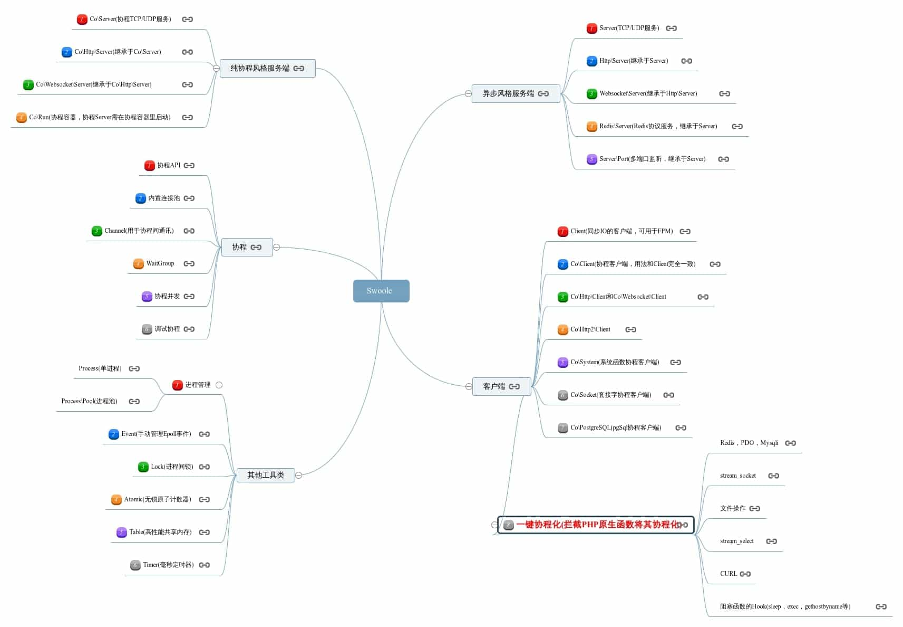

# Swoole文档


[swoole-src](https://github.com/swoole/swoole-src/)

[swoole中文文档](https://wiki.swoole.com/#/)

> 🚀 Coroutine-based concurrency library for PHP
>
> Coroutine   协同程序
>
> concurrency   并发

Swoole（发音：思握）是一个使用C++语言编写的基于**异步事件驱动**和**协程**的并行网络通信引擎，为PHP提供[协程](https://wiki.swoole.com/#/coroutine)、[高性能](https://wiki.swoole.com/#/question/use?id=swoole性能如何)网络编程支持。提供了多种通信协议的网络服务器和客户端模块，可以方便快速的实现TCP/UDP服务、高性能Web、WebSocket服务、物联网、实时通讯、游戏、微服务等，使PHP不再局限于传统的 Web 领域。




## 安装

https://github.com/swoole/swoole-src/blob/master/README-CN.md

```sh
pecl install swoole
```


> ```shell
> cd swoole-v5.1.2
> phpize
> ./configure
> sudo make && sudo make install
> ```
>
> make时有些包缺失，安装
>
> php.ini中添加，`extension=/Users/andyron/myfield/env/swoole-v5.1.2/modules/swoole.so`
>
> 重启php，`brew services restart php`

## 简单示例

> phpstorm 安装 swoole ide helper 插件 

### TCP服务器

```sh
php tcpServer.php
```


```sh
telnet 127.0.0.1 9501
hello
Server: hello
```


使用 `netstat -an | grep 端口`，查看端口是否已经被打开处于 `Listening` 状态。


### UDP 服务器


```sh
netcat -u 127.0.0.1 9502
hello
Server: hello

```


### Http


### WebSocket 服务器


### MQTT (物联网) 服务器


### 执行异步任务 (Task)


### 协程初探


## 服务端 (异步风格)


## 服务端 (协程风格)


## 客户端

### 同步阻塞客户端


### 协程客户端


TCP/UDP客户端
Socket客户端
HTTP/WebSocket客户端
HTTP2客户端
PostgreSQL客户端
FastCGI客户端
MySQL客户端
Redis客户端


## 协程（Coroutine）❤️

协程可以简单理解为线程，只不过这个线程是用户态的，不需要操作系统参与，创建销毁和切换的成本非常低，和线程不同的是协程没法利用多核 CPU 的，想利用多核 CPU 需要依赖 `Swoole` 的多进程模型。


## 其他工具类

### 毫秒定时器（Timer）


### 线程（Thread）


### 进程管理（Process）


### 事件管理


